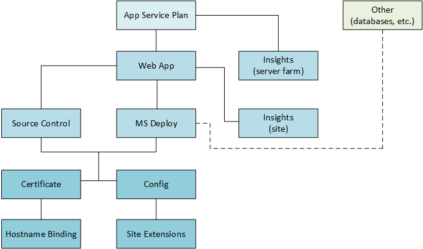

---
title: Guidance on deploying Azure web apps with templates | Microsoft Docs 
description: Recommendations for creating Azure Resource Manager templates to deploy web apps.
services: app-service
documentationcenter: app-service
author: tfitzmac
manager: timlt

ms.service: app-service
ms.workload: na
ms.tgt_pltfrm: na
ms.devlang: na
ms.topic: article
ms.date: 02/23/2018
ms.author: tomfitz

---
# Guidance on deploying web apps with Azure Resource Manager templates

This article provides recommendations for creating Azure Resource Manager templates to deploy App Service solutions. These recommendations can help you avoid common problems.

## Define dependencies

Defining dependencies for Web Apps requires an understanding of how the resources within a Web App interact. If you specify dependencies in an incorrect order, you may cause deployment errors or create a race condition that stalls the deployment.

> [!WARNING]
> If you include an MS Deploy site extension in your template, you must set any cofiguration resources as dependent on the MS Deploy resource. Configuration changes cause the site to restart asynchronously. By making the configuration resources dependent on MS Deploy, you ensure MS Deploy finishes before the site restarts. Without these dependencies, the site might restart during MS Deploy's deployment process. For an example template, see [Wordpress Template with Web Deploy Dependency](https://github.com/davidebbo/AzureWebsitesSamples/blob/master/ARMTemplates/WordpressTemplateWebDeployDependency.json).

The following image shows the dependency order for various App Service resources.



You deploy resources in the following order:

**Tier 1**
* App Service Plan
* Any other related resources like databases or storage accounts

**Tier 2**
* Web app (depends on app service plan)
* Application Insights that target the server farm (depends on app service plan)

**Tier 3**
* Source control (depends on web app)
* MSDeploy site extension (depends on web app)
* Application Insights that target the server farm (depends on web app)

**Tier 4**
* App Service Certificate (depends on source control or MSDeploy if either is present; otherwise, depends on web app)
* Configuration settings (depends on source control or MSDeploy if either is present; otherwise, depends on web app)

**Tier 5**
* Host name bindings (depends on certificate if present; otherwise, a higher-level resource)
* Site extensions (depends on configuration settings if present; otherwise, a higher-level resource)

Typically, your solution includes only some of these resources and tiers. For missing tiers, map lower resources to the next higher tier.

The following example shows part of a template. The connection string configuration value depends on the MSDeploy extension. The MSDeploy extension depends on the web app and database.

```json
{
    "name": "[parameters('name')]",
    "type": "Microsoft.Web/sites",
    "resources": [
      {
          "name": "MSDeploy",
          "type": "Extensions",
          "dependsOn": [
            "[concat('Microsoft.Web/Sites/', parameters('name'))]",
            "[concat('SuccessBricks.ClearDB/databases/', parameters('databaseName'))]"
          ],
          ...
      },
      {
          "name": "connectionstrings",
          "type": "config",
          "dependsOn": [
            "[concat('Microsoft.Web/Sites/', parameters('name'), '/Extensions/MSDeploy')]"
          ],
          ...
      }
    ]
}
```

## Unique web app name

The name for your web app must be globally unique. You can use a naming convention that is likely to be unique, or you can use the [uniqueString function](../azure-resource-manager/resource-group-template-functions-string.md#uniquestring) to assist with generating a unique name.

```json
{
  "apiVersion": "2016-08-01",
  "name": "[concat(parameters('siteNamePrefix'), uniqueString(resourceGroup().id))]",
  "type": "Microsoft.Web/sites",
  ...
}
```

## Next steps

* For a tutorial on deploying web apps with a template, see [Provision and deploy microservices predictably in Azure](app-service-deploy-complex-application-predictably.md).