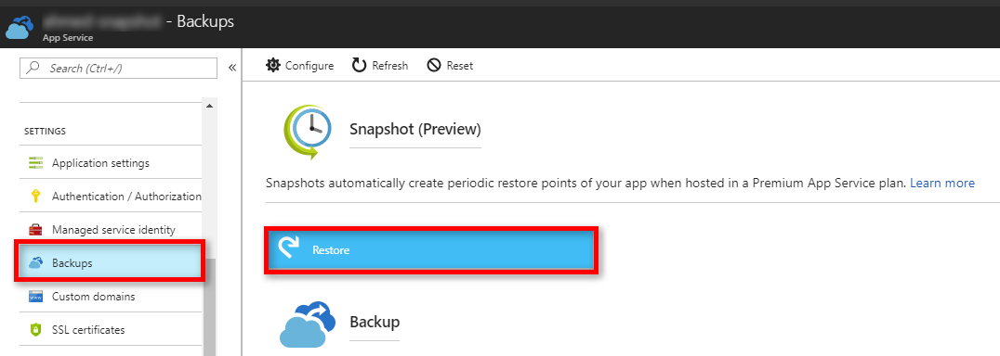

# Restore an app in Azure from a snapshot
This article shows you how to restore an app in [Azure App Service](../app-service/app-service-web-overview.md) from a snapshot. You can restore your app to a previous state, based on one of your app's snapshots. Azure App Service creates and manages snapshots automatically without the need to configure your app.

Snapshots are incremental shadow copies, and they offer several advantages over regular [backups](web-sites-backup.md):
- No file copy errors due to file locks.
- No storage size limitation.
- No configuration required.

Restoring from snapshots is available to apps running in **Premium** tier. For information about scaling
up your app, see [Scale up an app in Azure](web-sites-scale.md).

## Limitations

- The feature is currently in preview.
- You can only restore to the same site or to a slot belonging to that site.
- App Service stops the target site while doing the restore.
- App Service keeps 3 months worth of snapshots:
    - Snapshots maximum of every 6 hours for the last 4 weeks.
    - Snapshots every 12 hours for 1 to 3 months.

## Restore an app from a snapshot

1. On the **Settings** blade of your app in the Azure Portal, click **Backups** to display the **Backups** blade. Then click **Restore** under the **Snapshot(Preview)** section.
   
    

2. In the **Restore** blade, first select the snapshot to restore.
   
    
   
3. Then, specify the destination for the app restore in **Restore destination**.
   
    
   
   > [!WARNING]
   > If you choose **Overwrite**, all existing data in your current app is erased and overwritten. Before you click **OK**,
   > make sure that it is exactly what you want to do.
   > 
   > 
   
    You can select **Existing App** to restore to a slot. Before you use this option, you should have already created a slot in your app.

4. Then, you can choose to restore your site configuration.
   
    

5. Click **OK**.