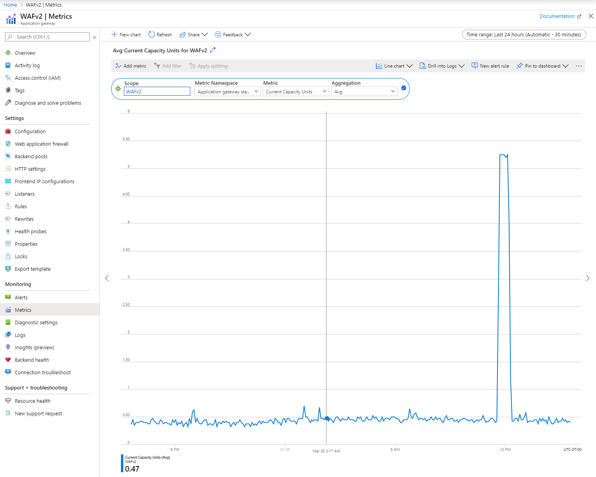

# Application Gateway COVID-19 update 

This article describes a few suggested guidelines to help you set up your Application Gateway to handle extra traffic due to the COVID-19 pandemic. You can use Application Gateway with Web Application Firewall (WAF) for a scalable and secure way to manage traffic to your web applications. 

The following suggestions are to help organizations have the best set up possible for their Application Gateways with WAF. 

## Use the v2 SKUs over v1 for their autoscaling capabilities and performance benefits
The v2 SKUs offer autoscaling to ensure that your Application Gateway can scale up as traffic increases and offers other significant performance benefits such as 5x better SSL offload performance, quicker deployment and update times, zone redundancy, and more when compared to v1. For more information, see our [v2 documentation](https://docs.microsoft.com/azure/application-gateway/application-gateway-autoscaling-zone-redundant). 

## Set maximum instance count to the maximum possible (125) 
Assuming you have an Application Gateway v2 SKU, setting the maximum instance count to the maximum possible value of 125 allows the Application Gateway to scale out as needed and will allow it to handle the possible increase in traffic to your applications. You will only be charged for the Capacity Units (CUs) you use.  

## Set your minimum instance count based on your average CU usage 
Assuming you have an Application Gateway v2 SKU, autoscaling will take 6-7 minutes to scale out, and by having a higher minimum instance count, the Application Gateway will be better able to handle your traffic when load is increased, as every spike in traffic won't require an autoscaling operation.  

## Alert if a certain metric surpasses 75% of average CU utilization 
See the [Application Gateway Metrics documentation](https://docs.microsoft.com/azure/application-gateway/application-gateway-metrics#metrics-visualization) for a detailed explanation of our metrics and other walkthroughs. 

### Example: Setting up an alert on 75% of average CU usage
This example shows setting up an alert when 75% of average CU usage is reached via Portal. 
1. Navigate to your **Application Gateway**.
2. On the left panel, select **Metrics** under the **Monitoring** tab. 
3. Add a metric for **Average Current Compute Units**. 

4. If you've set your minimum instance count to be your average CU usage, go ahead and set an alert for if 75% of your minimum instances are in use. For example, if your average usage is 10 CUs, set an alert on 7.5 CUs. This will alert you if usage is increasing and give you time to respond and raise the minimum if you think this traffic will be sustained and will give you an alert that traffic may be increasing. 

> [!NOTE]
> You can set the alert to occur at a lower or higher CU utilization percentage depending on how sensitive you want to be to potential traffic spikes.

## Set up WAF with geofiltering and bot protection to stop attacks
If you want an extra layer of security in front of your application, use the Application Gateway WAF_v2 SKU for WAF capabilities. Assuming you are using an Application Gateway WAF_v2 SKU, if you only want your applications to be accessed from a given country or countries, you can set up a WAF custom rule to explicitly allow or block traffic based on their geolocation. For more information, see [geofiltering custom rules](https://docs.microsoft.com/azure/web-application-firewall/ag/geomatch-custom-rules) and [how to configure custom rules on Application Gateway WAF_v2 SKU through PowerShell](https://docs.microsoft.com/azure/web-application-firewall/ag/configure-waf-custom-rules).

Enabling bot protection will block known bad bots, and should reduce the amount of traffic getting to your application. For more information, see [bot protection with set up instructions](https://docs.microsoft.com/azure/web-application-firewall/ag/configure-waf-custom-rules).

## Turn on diagnostics on Application Gateway and WAF
Diagnostic logs allow you to view firewall logs, performance logs, and access logs. You can use these logs in Azure to manage and troubleshoot Application Gateways. For instructions on how to set up these logs, see our [diagnostics documentation](https://docs.microsoft.com/azure/application-gateway/application-gateway-diagnostics#diagnostic-logging). 

## Set up an SSL policy for extra security
Ensure you're using the latest version of SSL policy ([AppGwSslPolicy20170401S](https://docs.microsoft.com/azure/application-gateway/application-gateway-ssl-policy-overview#appgwsslpolicy20170401s)) which enforces TLS 1.2 and stronger ciphers. See [configuring SSL policy versions and cipher suites via PowerShell](https://docs.microsoft.com/azure/application-gateway/application-gateway-configure-ssl-policy-powershell).
