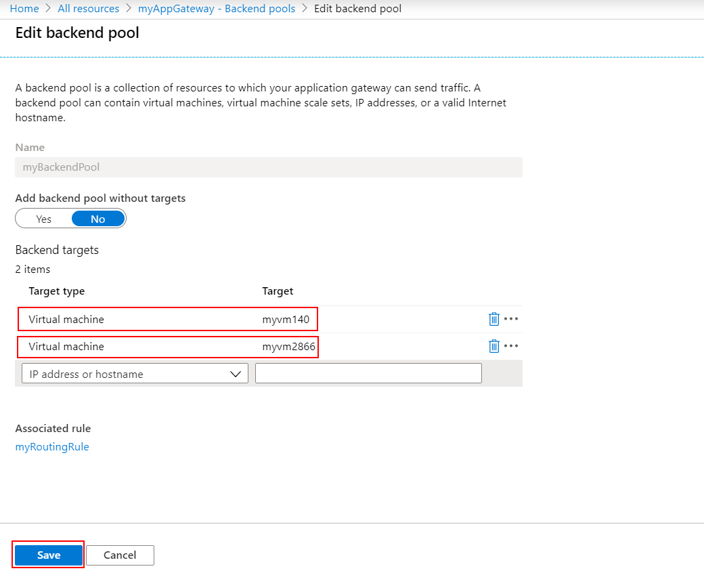
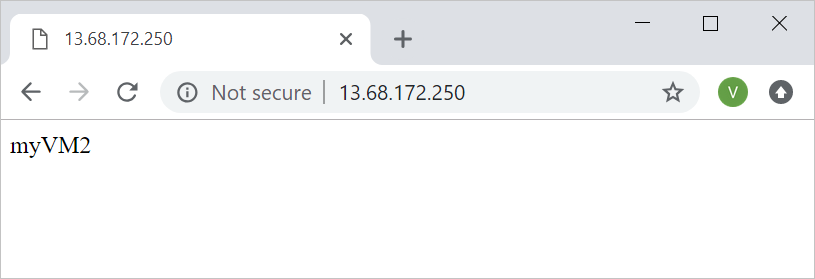

# Create an application gateway using the Azure portal

You can use the Azure portal to create or manage application gateways. This article shows you how to create network resources, backend servers, and an application gateway.

If you don't have an Azure subscription, create a [free account](https://azure.microsoft.com/free/?WT.mc_id=A261C142F) before you begin.

## Sign in to Azure

Sign in to the Azure portal at [http://portal.azure.com](http://portal.azure.com)

## Create an application gateway

A virtual network is needed for communication between the resources that you create. Two subnets are created in this example: one for the application gateway, and the other for the backend servers. You can create a virtual network at the same time that you create the application gateway.

1. Click **Create a resource** found on the upper left-hand corner of the Azure portal.
2. Click **Networking** and then click **Application Gateway** in the Featured list.
### Basics
1. Enter these values for the application gateway:

    - *myAppGateway* - for the name of the application gateway.
    - *myResourceGroupAG* - for the new resource group.

    

4. Accept the default values for the other settings and then click **OK**.

### Settings

1. Click **Choose a virtual network**, click **Create new**, and then enter these values for the virtual network:

    - *myVNet* - for the name of the virtual network.
    - *10.0.0.0/16* - for the virtual network address space.
    - *myAGSubnet* - for the subnet name.
    - *10.0.0.0/24* - for the subnet address range.

    

6. Click **OK** to go back to the Settings page.
7. Under **Frontend IP configuration** ensure **IP address type** is set to **public**, and under **Public IP address**, ensure **Create new** is selected. Type *myAGPublicIPAddress* for the public IP address name. Accept the default values for the other settings and then click **OK**.

### Summary

Review the settings on the summary page, and then click **OK** to create the virtual network, the public IP address, and the application gateway. It may take several minutes for the application gateway to be created. Wait until the deployment finishes successfully before moving on to the next section.

## Add a subnet

1. Click **All resources** in the left-hand menu, and then click **myVNet** from the resources list.
2. Click **Subnets**, and then click **+ Subnet**.

    

3. Enter *myBackendSubnet* for the name of the subnet and then click **OK**.

## Create backend servers

In this example, you create two virtual machines that are used as backend servers for the application gateway. You also install IIS on the virtual machines to verify that the application gateway was successfully created.

### Create a virtual machine

1. On the Azure portal, click **Create a resource**.
2. Click **Compute** and then select **Windows Server 2016 Datacenter** in the Featured list.
3. Enter these values for the virtual machine:

    - *myResourceGroupAG* for the resource group.
    - *myVM* - for the name of the virtual machine.
    - *azureuser* - for the administrator user name.
    - *Azure123456!* for the password.

   Accept the other defaults and click **Next: Disks**.
4. Accept the disk defaults and click **Next: Networking**.
5. Make sure that **myVNet** is selected for the virtual network and the subnet is **myBackendSubnet**.
6. Accept the other defaults and click **Next: Management**.
7. Click **Off** to disable boot diagnostics. Accept the other defaults and click **Review + create**.
8. Review the settings on the summary page, and then click **Create**.
9. Wait for the virtual machine creation to complete before continuing.

### Install IIS

1. Open the interactive shell and make sure that it's set to **PowerShell**.

    

2. Run the following command to install IIS on the virtual machine: 

    ```azurepowershell-interactive
    Set-AzureRmVMExtension `
      -ResourceGroupName myResourceGroupAG `
      -ExtensionName IIS `
      -VMName myVM `
      -Publisher Microsoft.Compute `
      -ExtensionType CustomScriptExtension `
      -TypeHandlerVersion 1.4 `
      -SettingString '{"commandToExecute":"powershell Add-WindowsFeature Web-Server; powershell Add-Content -Path \"C:\\inetpub\\wwwroot\\Default.htm\" -Value $($env:computername)"}' `
      -Location EastUS
    ```

3. Create a second virtual machine and install IIS using the steps that you just finished. Enter *myVM2* for its name and for VMName in Set-AzureRmVMExtension.

### Add backend servers

1. Click **All resources**, and then click **myAppGateway**.
4. Click **Backend pools**. A default pool was automatically created with the application gateway. Click **appGatewayBackendPool**.
5. Under **Targets**, click **IP address or FQDN** select **Virtual machine**.
6. Under **Virtual Machine**, add myVM and myVM2 virtual machines and their associated network interfaces.

    

6. Click **Save**.

## Test the application gateway

1. Find the public IP address for the application gateway on the Overview screen. Click **All resources** and then click **myAGPublicIPAddress**.

    

2. Copy the public IP address, and then paste it into the address bar of your browser.

    

## Clean up resources

When no longer needed, delete the resource group, application gateway, and all related resources. To do so, select the resource group that contains the application gateway and click **Delete**.

## Next steps

In this article, you created a resource group, network resources, and backend servers. You then used those resources to create an application gateway. To learn more about application gateways and their associated resources, see [What is Azure Application Gateway?](overview.md)
