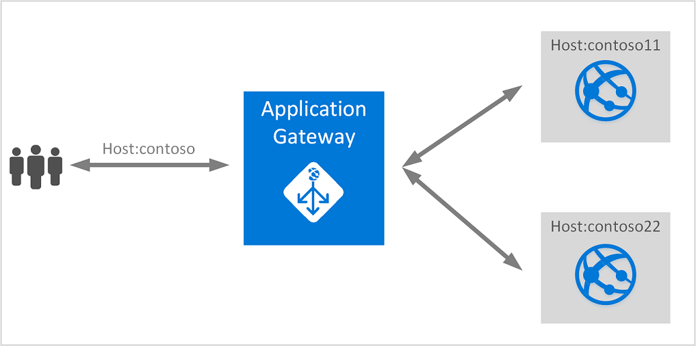
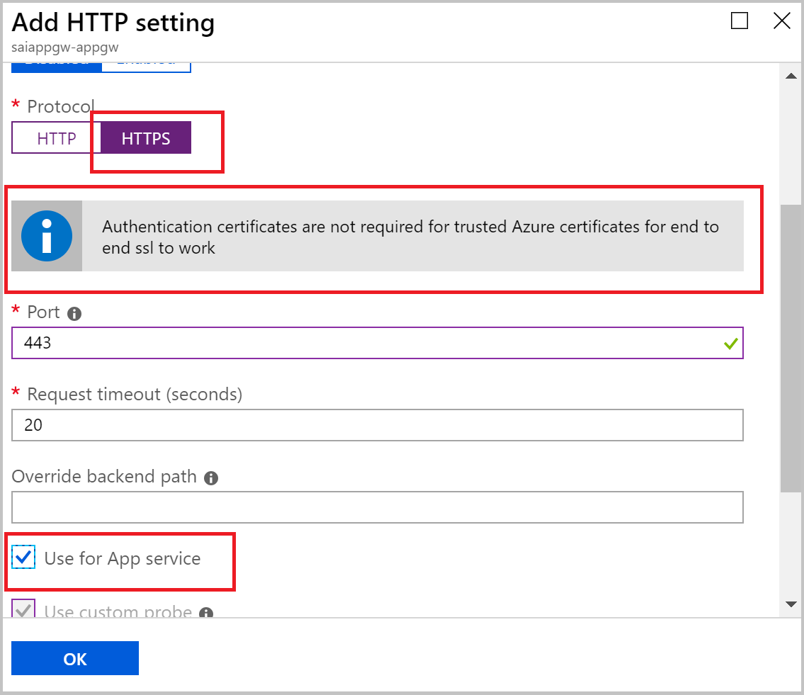

# Application Gateway support for multi-tenant back ends such as App service

In multi-tenant architectural designs in web servers, multiple websites are running on the same web server instance. Hostnames are used to differentiate between the different applications which are hosted. By default, application gateway does not change the incoming HTTP host header from the client and sends the header unaltered to the back end. This works well for backend pool members such as NICs, virtual machine scale sets, public IP addresses, internal IP addresses and FQDN as these do not rely on a specific host header or SNI extension to resolve to the correct endpoint. However, there are many services such as Azure App service web apps and Azure API management that are multi-tenant in nature and rely on a specific host header or SNI extension to resolve to the correct endpoint. Usually,  the DNS name of the application, which in turn is the DNS name associated with the application gateway, is different from the domain name of the backend service. Therefore, the host header in the original request received by the application gateway is not the same as the host name of the backend service. Because of this, unless the host header in the request from the application gateway to the backend is changed to the host name of the backend service, the multi-tenant backends are not able to resolve the request to the correct endpoint. 

Application gateway provides a capability which allows users to override the HTTP host header in the request based on the host name of the back-end. This capability enables support for multi-tenant back ends such as Azure App service web apps and API management. This capability is available for both the v1 and v2 standard and WAF SKUs. 

> [!NOTE]
> This is not applicable to Azure App service environment (ASE) since ASE is a dedicated resource unlike Azure App service which is a multi-tenant resource.

## Override host header in the request

The ability to specify a host override is defined in the [HTTP settings](./configuration-overview.md#http-settings) and can be applied to any back-end pool during rule creation. The following two ways of overriding host header and SNI extension for multi-tenant back ends is supported:

- The ability to set the host name to a fixed value explicitly entered in the HTTP settings. This capability ensures that the host header is overridden to this value for all traffic to the back-end pool where the particular HTTP settings are applied. When using end to end TLS, this overridden host name is used in the SNI extension. This capability enables scenarios where a back-end pool farm expects a host header that is different from the incoming customer host header.

- The ability to derive the host name from the IP or FQDN of the back-end pool members. HTTP settings also provide an option to dynamically pick the host name from a back-end pool member's FQDN if configured with the option to derive host name from an individual back-end pool member. When using end to end TLS, this host name is derived from the FQDN and is used in the SNI extension. This capability enables scenarios where a back-end pool can have two or more multi-tenant PaaS services like Azure web apps and the request's host header to each member contains the host name derived from its FQDN. For implementing this scenario, we use a switch in the HTTP Settings called [Pick hostname from backend address](./configuration-overview.md#pick-host-name-from-back-end-address) which will dynamically override the host header in the original request to the one mentioned in the backend pool.  For example, if your backend pool FQDN contains “contoso11.azurewebsites.net” and “contoso22.azurewebsites.net”, the original request’s host header which is contoso.com will be overridden to contoso11.azurewebsites.net or contoso22.azurewebsites.net when the request is sent to the appropriate backend server. 

  

With this capability, customers specify the options in the HTTP settings and custom probes to the appropriate configuration. This setting is then tied to a listener and a back-end pool by using a rule.

## Special considerations

### TLS termination and end to end TLS with multi-tenant services

Both TLS termination and end to end TLS encryption is supported with multi-tenant services. For TLS termination at the application gateway, TLS certificate continues to be required to be added to the application gateway listener. However, in case of end to end TLS, trusted Azure services such as Azure App service web apps do not require allowing the backends in the application gateway. Therefore, there is no need to add any authentication certificates. 

Notice that in the above image, there is no requirement to add authentication certificates when App service is selected as backend.

### Health probe

Overriding the host header in the **HTTP settings** only affects the request and its routing. it does not impact the health probe behavior. For end to end functionality to work, both the probe and the HTTP settings must be modified to reflect the correct configuration. In addition to providing the ability to specify a host header in the probe configuration, custom probes also support the ability to derive the host header from the currently configured HTTP settings. This configuration can be specified by using the `PickHostNameFromBackendHttpSettings` parameter in the probe configuration.

### Redirection to App Service’s URL scenario

There can be scenarios where the hostname in the response from the App service may direct the end-user browser to the *.azurewebsites.net hostname instead of the domain associated with the Application Gateway. This issue may happen when:

- You have redirection configured on your App Service. Redirection can be as simple as adding a trailing slash to the request.
- You have Azure AD authentication which causes the redirection.

To resolve such cases, see [Troubleshoot redirection to App service’s URL issue](./troubleshoot-app-service-redirection-app-service-url.md).

## Next steps

Learn how to set up an application gateway with a multi-tenant app such as Azure App service web app as a back-end pool member by visiting [Configure App Service web apps with Application Gateway](./configure-web-app-portal.md)