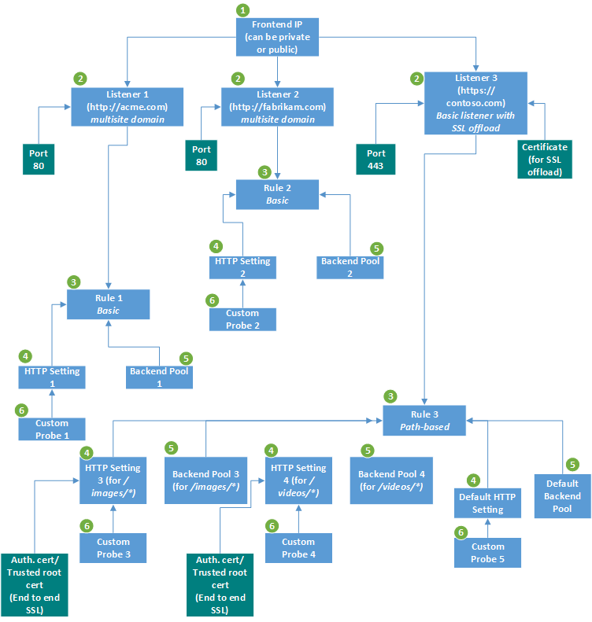

# Application Gateway configuration overview

Azure Application Gateway consists of several components that you can configure in various ways for different scenarios. This article shows you how to configure each component.

This image illustrates an application that has three listeners. The first two are multi-site listeners for `http://acme.com/*` and `http://fabrikam.com/*`, respectively. Both listen on port 80. The third is a basic listener that has end-to-end Transport Layer Security (TLS) termination, previously known as Secure Sockets Layer (SSL) termination.

## Infrastructure

The Application Gateway infrastructure includes the virtual network, subnets, network security groups, and user defined routes.

For more information, see [Application Gateway infrastructure configuration](configuration-infrastructure.md).

## Front-end IP address

You can configure the application gateway to have a public IP address, a private IP address, or both. A public IP is required when you host a back end that clients must access over the Internet via an Internet-facing virtual IP (VIP).

For more information, see [Application Gateway front-end IP address configuration](configuration-front-end-ip.md).

## Listeners

A listener is a logical entity that checks for incoming connection requests by using the port, protocol, host, and IP address. When you configure the listener, you must enter values for these that match the corresponding values in the incoming request on the gateway.

For more information, see [Application Gateway listener configuration](configuration-listeners.md).

## Request routing rules

When you create an application gateway by using the Azure portal, you create a default rule (*rule1*). This rule binds the default listener (*appGatewayHttpListener*) with the default back-end pool (*appGatewayBackendPool*) and the default back-end HTTP settings (*appGatewayBackendHttpSettings*). After you create the  gateway, you can edit the settings of the default rule or create new rules.

For more information, see [Application Gateway request routing rules](configuration-request-routing-rules.md).

## HTTP settings

The application gateway routes traffic to the back-end servers by using the configuration that you specify here. After you create an HTTP setting, you must associate it with one or more request-routing rules.

For more information, see [Application Gateway HTTP settings configuration](configuration-http-settings.md).

## Back-end pool

You can point a back-end pool to four types of backend members: a specific virtual machine, a virtual machine scale set, an IP address/FQDN, or an app service. 

After you create a back-end pool, you must associate it with one or more request-routing rules. You must also configure health probes for each back-end pool on your application gateway. When a request-routing rule condition is met, the application gateway forwards the traffic to the healthy servers (as determined by the health probes) in the corresponding back-end pool.

## Health probes

An application gateway monitors the health of all resources in its back end by default. But we strongly recommend that you create a custom probe for each back-end HTTP setting to get greater control over health monitoring. To learn how to configure a custom probe, see [Custom health probe settings](application-gateway-probe-overview.md#custom-health-probe-settings).

> [!NOTE]
> After you create a custom health probe, you need to associate it to a back-end HTTP setting. A custom probe won't monitor the health of the back-end pool unless the corresponding HTTP setting is explicitly associated with a listener using a rule.

## Next steps

Now that you know about Application Gateway components, you can:

- [Create an application gateway in the Azure portal](quick-create-portal.md)
- [Create an application gateway using PowerShell](quick-create-powershell.md)
- [Create an application gateway using the Azure CLI](quick-create-cli.md)
