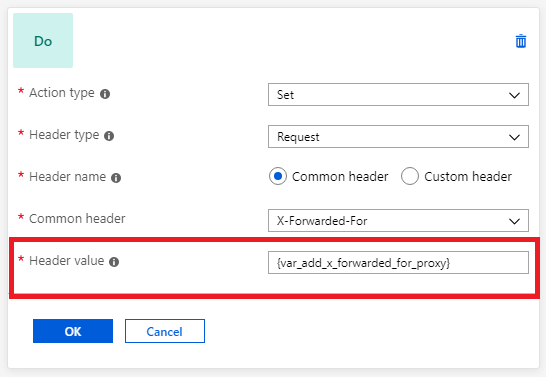
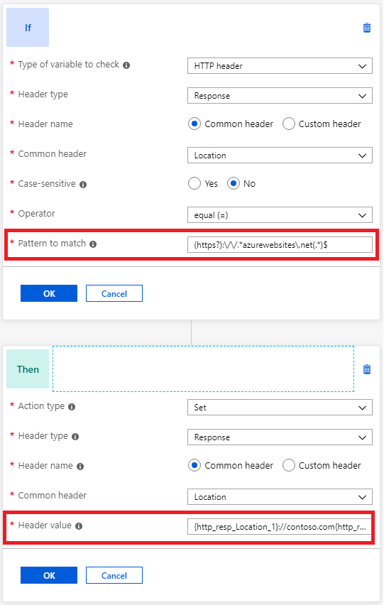
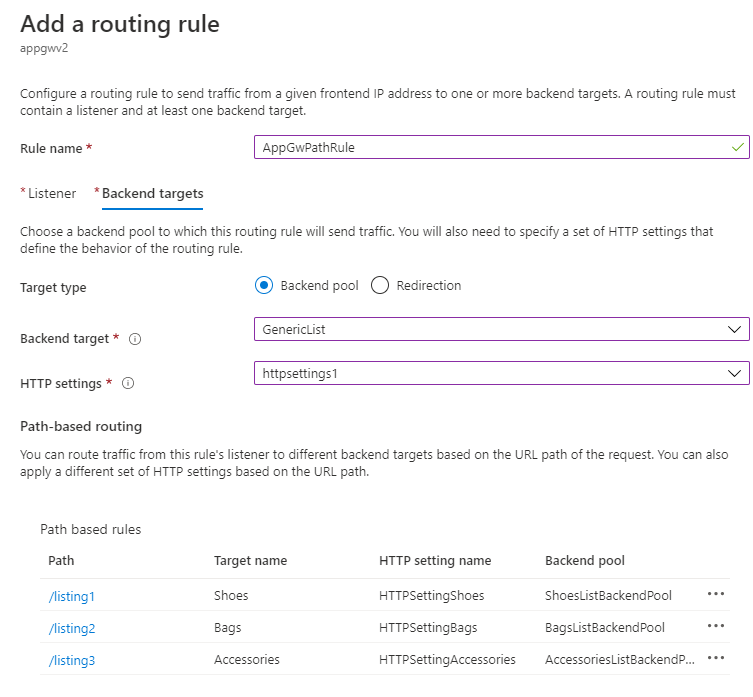
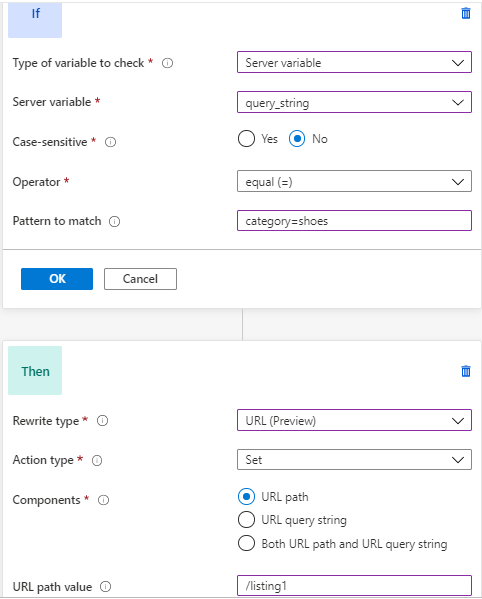
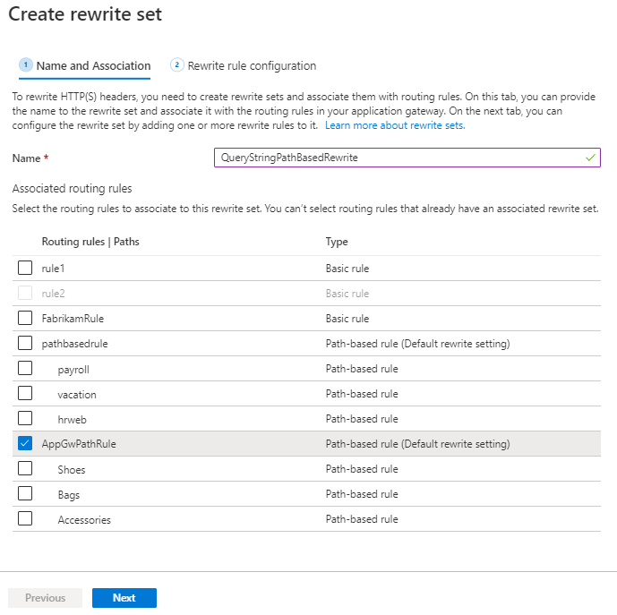
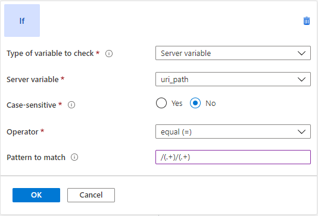
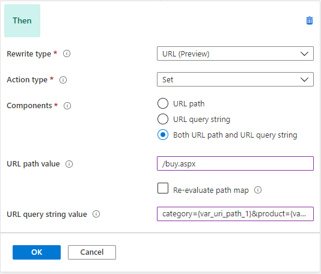
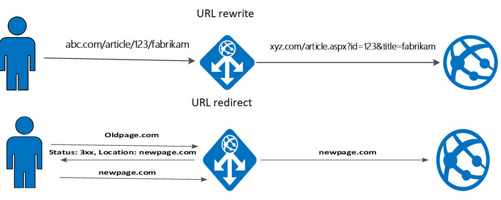

# Rewrite HTTP headers and URL with Application Gateway

 Application Gateway allows you to rewrite selected content of requests and responses. With this feature, you can translate URLs, query string parameters as well as modify request and response headers. It also allows you to add conditions to ensure that the URL or the specified headers are rewritten only when certain conditions are met. These conditions are based on the request and response information.

Note: HTTP header and URL rewrite features are only available for the [Application Gateway v2 SKU](application-gateway-autoscaling-zone-redundant.md)

# Rewrite types supported

## Request and response headers

HTTP headers allow a client and server to pass additional information with a request or response. By rewriting these headers, you can accomplish important tasks, such as adding security-related header fields like HSTS/ X-XSS-Protection, removing response header fields that might reveal sensitive information, and removing port information from X-Forwarded-For headers.

Application Gateway allows you to add, remove, or update HTTP request and response headers while the request and response packets move between the client and back-end pools.

**Supported headers**

You can rewrite all headers in requests and responses, except for the Connection, and Upgrade headers. You can also use the application gateway to create custom headers and add them to the requests and responses being routed through it.

## URL path and query string (Preview)

With URL rewrite capability in Application Gateway, you can:

* Rewrite the host name, path and query string of the request URL 

* Choose to rewrite URL of all requests on a listener or only those requests which match one or more of the conditions you set. These conditions are based on the request and response properties (request, header, response header and server variables).

* Choose to route the request (select the backend pool) based on either the original URL or the rewritten URL

  

# Rewrite actions

You use rewrite actions to specify the URL, request headers or response headers that you want to rewrite and the new value to which you intend to rewrite them to. The value of a URL or a new or existing header can be set to these types of values:

* Text
* Request header. To specify a request header, you need to use the syntax {http_req_*headerName*}
* Response header. To specify a response header, you need to use the syntax {http_resp_*headerName*}
* Server variable. To specify a server variable, you need to use the syntax {var_*serverVariable*}. See the list of supported server variables
* A combination of text, a request header, a response header, and a server variable. 

# Rewrite Conditions

You can use rewrite conditions, an optional configuration, to evaluate the content of HTTP(S) requests and responses and perform a rewrite only when one or more conditions are met. The application gateway uses these types of variables to evaluate the content of requests and responses:

* HTTP headers in the request
* HTTP headers in the response
* Application Gateway server variables

You can use a condition to evaluate whether a specified variable is present, whether a specified variable matches a specific value, or whether a specified variable matches a specific pattern. 

# Pattern Matching 

Application Gateway uses regular expressions for pattern matching in the condition. You can use the [Perl Compatible Regular Expressions (PCRE) library](https://www.pcre.org/) to set up regular expression pattern matching in the conditions. To learn about regular expression syntax, see the [Perl regular expressions main page](https://perldoc.perl.org/perlre.html).

# Capturing

To capture a substring for later use, put parentheses around the subpattern that matches it in the condition regex definition. The first pair of parentheses stores its substring in 1, the second pair in 2, and so on. You may use as many parentheses as you like; Perl just keeps defining more numbered variables for you to represent these captured strings. Some examples from [ref](docstore.mik.ua/orelly/perl/prog3/ch05_07.htm): 

*  /(\d)(\d)/ # Match two digits, capturing them into groups 1 and 2 

* /(\d+)/ # Match one or more digits, capturing them all into group 1 

* /(\d)+/ # Match a digit one or more times, capturing the last into group 1

Once captured, you can reference them in the action set using the following format:

* For a request header capture, you must use {http_req_headerName_groupNumber}. For example, {http_req_User-Agent_1} or {http_req_User-Agent_2}
* For a response header capture, you must use {http_resp_headerName_groupNumber}. For example, {http_resp_Location_1} or {http_resp_Location_2}
* For a server variable, you must use {var_serverVariableName_groupNumber}. For example, {var_uri_path_1} or {var_uri_path_2}

If you want to use the whole value, you should not mention the number. Simply use the format {http_req_headerName}, etc. without the groupNumber.

# Server variables

Application Gateway uses server variables to store useful information about the server, the connection with the client, and the current request on the connection. Examples of information stored include the client’s IP address and the web browser type. Server variables change dynamically, for example, when a new page loads or when a form is posted. You can use these variables to evaluate rewrite conditions and rewrite headers. In order to use the value of server variables to rewrite headers, you will need to specify these variables in the syntax {var_*serverVariableName*}

Application gateway supports the following server variables:

|       |                                                              |
| ------------------------- | ------------------------------------------------------------ |
| **Variable name**         | **Description**                                              |
| add_x_forwarded_for_proxy | The X-Forwarded-For client request header field with the `client_ip` variable   (see explanation later in this table) appended to it in the format IP1, IP2,   IP3, and so on. If the X-Forwarded-For field isn't in the client request header,   the `add_x_forwarded_for_proxy` variable   is equal to the `$client_ip` variable.   This variable is particularly useful when you want to rewrite the   X-Forwarded-For header set by Application Gateway so that the header contains   only the IP address without the port information. |
| ciphers_supported         | A list of the ciphers supported by the client.               |
| ciphers_used              | The string of ciphers used for an established TLS   connection. |
| client_ip                 | The IP address of the client from which the application   gateway received the request. If there's a reverse proxy before the   application gateway and the originating client, *client_ip* will   return the IP address of the reverse proxy. |
| client_port               | The client port.                                             |
| client_tcp_rtt            | Information about the client TCP connection. Available on   systems that support the TCP_INFO socket option. |
| client_user               | When HTTP authentication is used, the user name supplied   for authentication. |
| host                      | In this order of precedence: the host name from the   request line, the host name from the Host request header field, or the server   name matching a request. Example: in the request *http://contoso.com:8080/article.aspx?id=123&title=fabrikam*,   host value will be is *contoso.com* |
| cookie_*name*             | The *name* cookie.                                           |
| http_method               | The method used to make the URL request. For example, GET   or POST. |
| http_status               | The session status. For example, 200, 400, or 403.           |
| http_version              | The request protocol. Usually HTTP/1.0, HTTP/1.1, or   HTTP/2.0. |
| query_string              | The list of variable/value pairs that follows the   "?" in the requested URL. Example: in the request *http://contoso.com:8080/article.aspx?id=123&title=fabrikam*,   query_string value will be *id=123&title=fabrikam* |
| received_bytes            | The length of the request (including the request line,   header, and request body). |
| request_query             | The arguments in the request line.                           |
| request_scheme            | The request scheme: http or https.                           |
| request_uri               | The full original request URI (with arguments). Example:   in the request *http://contoso.com:8080/article.aspx?id=123&title=fabrikam*,   request_uri value will be */article.aspx?id=123&title=fabrikam* |
| sent_bytes                | The number of bytes sent to a client.                        |
| server_port               | The port of the server that accepted a request.              |
| ssl_connection_protocol   | The protocol of an established TLS connection.               |
| ssl_enabled               | “On” if the connection operates in TLS mode. Otherwise, an   empty string. |
| uri_path                  | Identifies the specific resource in the host that the web   client wants to access. This is the part of the request URI without the   arguments. Example: in the request *http://contoso.com:8080/article.aspx?id=123&title=fabrikam*,   uri_path value will be */article.aspx* |

 

# Rewrite configuration

To configure a rewrite rule, you need to create a rewrite rule set and add the rewrite rule configuration in it.

A rewrite rule set contains:

1. **Request routing rule association:** The rewrite configuration is associated to the source listener via the routing rule. When you use a basic routing rule, the rewrite configuration is associated with a source listener and is a global header rewrite. When you use a path-based routing rule, the rewrite configuration is defined on the URL path map. In that case, it applies only to the specific path area of a site. You can create multiple rewrite sets and apply each rewrite set to multiple listeners. But you can apply only one rewrite set to a specific listener.

2. **Rewrite Condition**: It is an optional configuration. Rewrite conditions evaluate the content of the HTTP(S) requests and responses. The rewrite action will occur if the HTTP(S) request or response matches the rewrite condition. If you associate more than one condition with an action, the action occurs only when all the conditions are met. In other words, the operation is a logical AND operation.

3. **Rewrite type**:  There are 3 types of rewrites available:
   1. Rewriting request headers 
   2. Rewriting response headers.
   3. Rewriting URL: URL rewrite type has 3 components
      1. **URL path**: The value to which the path is to be rewritten to. 
      2. **URL Query String**: The value to which the query string is to be rewritten to. 
      3. **Re-evaluate path map**: Used to determine whether the URL path map is to be re-evaluated or not. If kept unchecked, the original URL path will be used to match the path-pattern in the URL path map. If set to true, the URL path map will be re-evaluated to check the match with the rewritten path. Enabling this switch helps in routing the request to a different backend pool post rewrite.

## Common scenarios for header rewrite

### Remove port information from the X-Forwarded-For header

Application Gateway inserts an X-Forwarded-For header into all requests before it forwards the requests to the backend. This header is a comma-separated list of IP ports. There might be scenarios in which the back-end servers only need the headers to contain IP addresses. You can use header rewrite to remove the port information from the X-Forwarded-For header. One way to do this is to set the header to the add_x_forwarded_for_proxy server variable. Alternatively, you can also use the variable client_ip:

### Modify a redirection URL

When a back-end application sends a redirection response, you might want to redirect the client to a different URL than the one specified by the back-end application. For example, you might want to do this when an app service is hosted behind an application gateway and requires the client to do a redirection to its relative path. (For example, a redirect from contoso.azurewebsites.net/path1 to contoso.azurewebsites.net/path2.)

Because App Service is a multitenant service, it uses the host header in the request to route the request to the correct endpoint. App services have a default domain name of *.azurewebsites.net (say contoso.azurewebsites.net) that's different from the application gateway's domain name (say contoso.com). Because the original request from the client has the application gateway's domain name (contoso.com) as the hostname, the application gateway changes the hostname to contoso.azurewebsites.net. It makes this change so that the app service can route the request to the correct endpoint.

When the app service sends a redirection response, it uses the same hostname in the location header of its response as the one in the request it receives from the application gateway. So the client will make the request directly to contoso.azurewebsites.net/path2 instead of going through the application gateway (contoso.com/path2). Bypassing the application gateway isn't desirable.

You can resolve this issue by setting the hostname in the location header to the application gateway's domain name.

Here are the steps for replacing the hostname:

1. Create a rewrite rule with a condition that evaluates if the location header in the response contains azurewebsites.net. Enter the pattern `(https?):\/\/.*azurewebsites\.net(.*)$`.
2. Perform an action to rewrite the location header so that it has the application gateway's hostname. Do this by entering `{http_resp_Location_1}://contoso.com{http_resp_Location_2}` as the header value. Alternatively, you can also use the server variable `host` to set the hostname to match the original request.

### Implement security HTTP headers to prevent vulnerabilities

You can fix several security vulnerabilities by implementing necessary headers in the application response. These security headers include X-XSS-Protection, Strict-Transport-Security, and Content-Security-Policy. You can use Application Gateway to set these headers for all responses.

### Delete unwanted headers

You might want to remove headers that reveal sensitive information from an HTTP response. For example, you might want to remove information like the back-end server name, operating system, or library details. You can use the application gateway to remove these headers:

### Check for the presence of a header

You can evaluate an HTTP request or response header for the presence of a header or server variable. This evaluation is useful when you want to perform a header rewrite only when a certain header is present.

## Common scenarios for URL rewrite

### Parameter based path selection

To accomplish scenarios where you want to choose the backend pool based on the value of a header, part of the URL, or query string in the request, you can use the combination of URL Rewrite capability and  path-based routing.  For example, if you have a shopping website, and the product category is passed as query string in the URL and you want to route the request to backend based on the query string ,then:

**Step1:**  Create a path-map as shown in the image below

**Step 2 (a):** Create a rewrite set which has 3 rewrite rules: 

* The first rule has a condition that checks the *query_string*  variable for *category=shoes* and has an action that rewrites the URL path to /*listing1* and has **Re-evaluate path map** enabled

* The second rule has a condition that checks the *query_string*  variable for *category=bags* and has an action that rewrites the URL path to /*listing2*  and has **Re-evaluate path map** enabled

* The third rule has a condition that checks the *query_string*  variable for *category=accessories* and has an action that rewrites the URL path to /*listing3* and has **Re-evaluate path map** enabled

 

**Step 2 (b):** Associate this rewrite set with the default path of the above path-based rule

Now, if the user requests *contoso.com/listing?category=any*, then it will be matched with the default path since none of the path patterns in the path map (/listing1, /listing2, /listing3) will match. Since you associated the above rewrite set with this path, this rewrite set will be evaluated. As the query string will not match the condition in any of the 3 rewrite rules in this rewrite set, no rewrite action will take place and therefore, the request will be routed unchanged to the backend associated with the default path (which is *GenericList*).

 If the user requests *contoso.com/listing?category=shoes,* then again the default path will be matched. However, in this case the condition in the first rule will match and therefore, the action associated with the condition will be executed which will rewrite the URL path to /*listing1*  and re-evaluate the path-map. When the path-map is re-evaluated, the request will now match the path associated with pattern */listing1* and the request will be routed to the backend associated with this pattern, which is ShoesListBackendPool

**Note:** This scenario can be extended to any header or cookie value, URL path, query string or server variables based on the condition defined and essentially enables you to route requests based on those conditions.

### Rewrite query string parameters based on the URL

Consider a scenario of a shopping website where the user visible link should be simple and legible, but the backend server needs the query string parameters to show the right content.

In that case, Application Gateway can capture parameters from the URL and add query string key-value pairs from those from the URL. For example, let's say the user wants to rewrite, https://www.contoso.com/fashion/shirts to https://www.contoso.com/buy.aspx?category=fashion&product=shirts, it can be achieved through the following URL rewrite configuration.

**Condition** - If server variable `uri_path` equals to the pattern `/(.+)/(.+)`

**Action** - Set URL path to `buy.aspx` and query string to `category={var_uri_path_1}&product={var_uri_path_2}`

For a step-by-step guide to achieve the scenario described above, see [Rewrite URL with Application Gateway using Azure portal](rewrite-url-portal.md)

## URL rewrite vs URL redirect

In case of URL rewrite, Application Gateway rewrites the URL before the request is sent to the backend. This will not change what users see in the browser because the changes are hidden from the user.

In case of URL redirect, Application Gateway sends a redirect response to the client with the new URL. That, in turn, requires the client to resend its request to the new URL provided in the redirect. URL that user sees in the browser will update to the new URL

## Limitations

- If a response has more than one header with the same name, then rewriting the value of one of those headers will result in dropping the other headers in the response. This can usually happen with Set-Cookie header since you can have more than one Set-Cookie header in a response. One such scenario is when you are using an app service with an application gateway and have configured cookie-based session affinity on the application gateway. In this case the response will contain two Set-Cookie headers: one used by the app service, for example: `Set-Cookie: ARRAffinity=ba127f1caf6ac822b2347cc18bba0364d699ca1ad44d20e0ec01ea80cda2a735;Path=/;HttpOnly;Domain=sitename.azurewebsites.net` and another for application gateway affinity, for example, `Set-Cookie: ApplicationGatewayAffinity=c1a2bd51lfd396387f96bl9cc3d2c516; Path=/`. Rewriting one of the Set-Cookie headers in this scenario can result in removing the other Set-Cookie header from the response.
- Rewrites are not supported when the application gateway is configured to redirect the requests or to show a custom error page.
- Header names can contain any alphanumeric characters and specific symbols as defined in [RFC 7230](https://tools.ietf.org/html/rfc7230#page-27). We don't currently support the underscore (_) special character in Header names.
- Connection header cannot be rewritten

## Next steps

- [Learn how to rewrite HTTP headers with Application Gateway using Azure portal](rewrite-http-headers-portal.md)
- [Learn how to rewrite URL with Application Gateway using Azure portal](rewrite-url-portal.md)