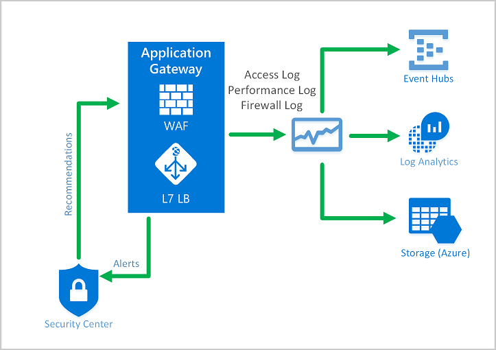
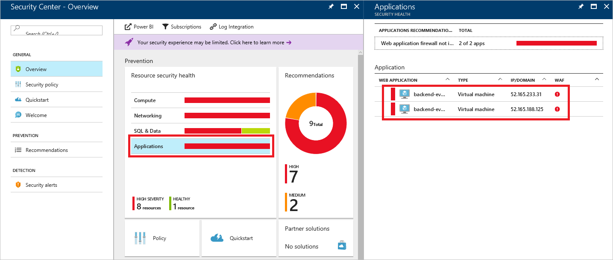

# Web application firewall (WAF)

Web application firewall (WAF) is a feature of Application Gateway that provides centralized protection of your web applications from common exploits and vulnerabilities.

Web applications are increasingly targets of malicious attacks that exploit common known vulnerabilities. Common among these exploits are SQL injection attacks, and cross site scripting attacks to name a few. 

Preventing such attacks in application code can be challenging and may require rigorous maintenance, patching and monitoring at multiple layers of the application topology. A centralized web application firewall helps make security management much simpler and gives better assurance to application administrators against threats or intrusions. A WAF solution can also react to a security threat faster by patching a known vulnerability at a central location, instead of securing each of individual web applications. Existing application gateways can be converted to a web application firewall enabled application gateway easily.

WAF is based on rules from the [OWASP core rule sets](https://www.owasp.org/index.php/Category:OWASP_ModSecurity_Core_Rule_Set_Project) 3.0 or 2.2.9. It automatically updates to include protection against new vulnerabilities, with no additional configuration needed.


Application Gateway operates as an application delivery controller (ADC) and offers SSL termination, cookie-based session affinity, round-robin load distribution, content-based routing, ability to host multiple websites, and security enhancements.

Security enhancements offered by Application Gateway include SSL policy management, and end to end SSL support. Application security is now strengthened by WAF (web application firewall) being directly integrated into the ADC offering. This provides an easy to configure central location to manage and protect your web applications against common web vulnerabilities.

## Benefits

The following are the core benefits that Application Gateway and web application firewall provide:

### Protection

* Protect your web application from web vulnerabilities and attacks without modification to backend code.

* Protect multiple web applications at the same time behind an application gateway. Application gateway supports hosting up to 20 websites behind a single gateway that could all be protected against web attacks with WAF.

### Monitoring

* Monitor your web application against attacks using a real-time WAF log. This log is integrated with [Azure Monitor](../monitoring-and-diagnostics/monitoring-overview.md) to track WAF alerts and logs and easily monitor trends.

* WAF is integrated with Azure Security Center. Azure Security Center allows for a central view of the security state of all your Azure resources.

### Customization

* The ability to customize WAF rules and rule groups to suit your application requirements and eliminate false positives.

## Features

- SQL injection protection
- Cross site scripting protection
- Common Web Attacks Protection such as command injection, HTTP request smuggling, HTTP response splitting, and remote file inclusion attack
- Protection against HTTP protocol violations
- Protection against HTTP protocol anomalies such as missing host user-agent and accept headers
- Prevention against bots, crawlers, and scanners
- Detection of common application misconfigurations (for example, Apache, IIS, and so on)

### Public preview features

The current WAF public preview SKU includes the following features:

- **Request size limits** - Web Application Firewall allows users to configure request size limits within lower and upper bounds.
- **Exclusion lists** - WAF exclusion lists allow users to omit certain request attributes from a WAF evaluation. A common example is Active Directory inserted tokens that are used for authentication or password fields.

For more information about the WAF public preview, see [Web application firewall request size limits and exclusion lists (Public Preview)](application-gateway-waf-configuration.md).


### Core rule sets

Application Gateway supports two rule sets, CRS 3.0, and CRS 2.2.9. These core rules sets are collections of rules that protect your web applications for malicious activity.

Web application firewall comes preconfigured with CRS 3.0 by default or you can choose to use 2.2.9. CRS 3.0 offers reduced false positives over 2.2.9. The ability to [customize rules to suit your needs](application-gateway-customize-waf-rules-portal.md) is provided. Some of the common web vulnerabilities which web application firewall protects against includes:

- SQL injection protection
- Cross site scripting protection
- Common Web Attacks Protection such as command injection, HTTP request smuggling, HTTP response splitting, and remote file inclusion attack
- Protection against HTTP protocol violations
- Protection against HTTP protocol anomalies such as missing host user-agent and accept headers
- Prevention against bots, crawlers, and scanners
- Detection of common application misconfigurations (for example, Apache, IIS, etc.)

For a more detailed list of rules and their protections, see [Core rule sets](#core-rule-sets).


#### OWASP_3.0

The 3.0 core rule set provided has 13 rule groups as shown in the following table. Each of these rule groups contains multiple rules, which can be disabled.

|RuleGroup|Description|
|---|---|
|**[REQUEST-911-METHOD-ENFORCEMENT](application-gateway-crs-rulegroups-rules.md#crs911)**|Contains rules to lock down methods (PUT, PATCH)|
|**[REQUEST-913-SCANNER-DETECTION](application-gateway-crs-rulegroups-rules.md#crs913)**| Contains rules to protect against port and environment scanners.|
|**[REQUEST-920-PROTOCOL-ENFORCEMENT](application-gateway-crs-rulegroups-rules.md#crs920)**|Contains rules to protect against protocol and encoding issues.|
|**[REQUEST-921-PROTOCOL-ATTACK](application-gateway-crs-rulegroups-rules.md#crs921)**|Contains rules to protect against header injection, request smuggling, and response splitting|
|**[REQUEST-930-APPLICATION-ATTACK-LFI](application-gateway-crs-rulegroups-rules.md#crs930)**|Contains rules to protect against file and path attacks.|
|**[REQUEST-931-APPLICATION-ATTACK-RFI](application-gateway-crs-rulegroups-rules.md#crs931)**|Contains rules to protect against Remote File Inclusion (RFI)|
|**[REQUEST-932-APPLICATION-ATTACK-RCE](application-gateway-crs-rulegroups-rules.md#crs932)**|Contains rules to protect again Remote Code Execution.|
|**[REQUEST-933-APPLICATION-ATTACK-PHP](application-gateway-crs-rulegroups-rules.md#crs933)**|Contains rules to protect against PHP injection attacks.|
|**[REQUEST-941-APPLICATION-ATTACK-XSS](application-gateway-crs-rulegroups-rules.md#crs941)**|Contains rules for protecting against cross site scripting.|
|**[REQUEST-942-APPLICATION-ATTACK-SQLI](application-gateway-crs-rulegroups-rules.md#crs942)**|Contains rules for protecting against SQL injection attacks.|
|**[REQUEST-943-APPLICATION-ATTACK-SESSION-FIXATION](application-gateway-crs-rulegroups-rules.md#crs943)**|Contains rules to protect against Session Fixation Attacks.|

#### OWASP_2.2.9

The 2.2.9 core rule set provided has 10 rule groups as shown in the following table. Each of these rule groups contains multiple rules, which can be disabled.

|RuleGroup|Description|
|---|---|
|**[crs_20_protocol_violations](application-gateway-crs-rulegroups-rules.md#crs20)**|Contains rules to protect against protocol violations (invalid characters, GET with a request body, etc.)|
|**[crs_21_protocol_anomalies](application-gateway-crs-rulegroups-rules.md#crs21)**|Contains rules to protect against incorrect header information.|
|**[crs_23_request_limits](application-gateway-crs-rulegroups-rules.md#crs23)**|Contains rules to protect against arguments or files that exceed limitations.|
|**[crs_30_http_policy](application-gateway-crs-rulegroups-rules.md#crs30)**|Contains rules to protect against restricted methods, headers, and file types. |
|**[crs_35_bad_robots](application-gateway-crs-rulegroups-rules.md#crs35)**|Contains rules to protect against web crawlers and scanners.|
|**[crs_40_generic_attacks](application-gateway-crs-rulegroups-rules.md#crs40)**|Contains rules to protect against generic attacks (session fixation, remote file inclusion, PHP injection, etc.)|
|**[crs_41_sql_injection_attacks](application-gateway-crs-rulegroups-rules.md#crs41sql)**|Contains rules to protect against SQL injection attacks|
|**[crs_41_xss_attacks](application-gateway-crs-rulegroups-rules.md#crs41xss)**|Contains rules to protect against cross site scripting.|
|**[crs_42_tight_security](application-gateway-crs-rulegroups-rules.md#crs42)**|Contains a rule to protect against path traversal attacks|
|**[crs_45_trojans](application-gateway-crs-rulegroups-rules.md#crs45)**|Contains rules to protect against backdoor Trojans.|

### WAF Modes

Application Gateway WAF can be configured to run in the following two modes:

* **Detection mode** – When configured to run in detection mode, Application Gateway WAF monitors and logs all threat alerts to a log file. Logging diagnostics for Application Gateway should be turned on using the **Diagnostics** section. You also need to ensure that the WAF log is selected and turned on. When running in detection mode web application firewall does not block incoming requests.
* **Prevention mode** – When configured to run in prevention mode, Application Gateway actively blocks intrusions and attacks detected by its rules. The attacker receives a 403 unauthorized access exception and the connection is terminated. Prevention mode continues to log such attacks in the WAF logs.

### Anomaly Scoring Mode 
 
OWASP has two modes for deciding whether blocking traffic or not. There is a Traditional mode, and an Anomaly Scoring mode. In the Traditional mode, any rule matching traffic is considered independently of whether other rules have matched too. While easier to understand, the lack of information on how many rules are fired by a specific request is one of the limitations of this mode. Hence the Anomaly Scoring mode was introduced, which has become the default with OWASP 3.x. 

In Anomaly Scoring Mode, the fact that one of the rules described in the previous section matches on traffic does not immediately mean that the traffic is going to be blocked, assuming the firewall is in Prevention mode. Rules have a certain severity (Critical, Error, Warning and Notice), and depending on that severity they will increase a numeric value for the request called the Anomaly Score. For example, one matching Warning rule will contribute a value of 3, but one matching Critical rule will contribute a value of 5. 

There is a threshold for the Anomaly Score under which traffic is not dropped, that threshold is set to 5. That means, a single matching Critical rule is enough so that Azure WAF blocks a request in Prevention mode (since the Critical rule increases the anomaly score by 5, according to the previous paragraph). However, one matching rule with a level of Warning will only increase the anomaly score by 3. Since 3 is still lower than the threshold 5, no traffic will be blocked, even if the WAF is in Prevention mode. 

Note that the message logged when a WAF rules matches traffic will include the field action_s as "Blocked", but that does not necessarily mean that the traffic has actually been blocked. An anomaly score of 5 or higher is required to actually block traffic.  

### <a name="application-gateway-waf-reports"></a>WAF Monitoring

Monitoring the health of your application gateway is important. Monitoring the health of your web application firewall and the applications that it protects are provided through logging and integration with Azure Monitor, Azure Security Center, and Log Analytics.



#### Azure Monitor

Each application gateway log is integrated with [Azure Monitor](../monitoring-and-diagnostics/monitoring-overview.md).  This allows you to track diagnostic information including WAF alerts and logs.  This capability is provided within the Application Gateway resource in the portal under the **Diagnostics** tab or through the Azure Monitor service directly. To learn more about enabling diagnostic logs for application gateway, see [Application Gateway diagnostics](application-gateway-diagnostics.md)

#### Azure Security Center

[Azure Security Center](../security-center/security-center-intro.md) helps you prevent, detect, and respond to threats with increased visibility into and control over the security of your Azure resources. Application gateway now [integrates into Azure Security Center](application-gateway-integration-security-center.md). Azure Security Center scans your environment to detect unprotected web applications. It can now recommend application gateway WAF to protect these vulnerable resources. You can directly create application gateway WAF from the Azure Security Center.  These WAF instances are integrated with Azure Security Center and will send alerts and health information back to Azure Security Center for reporting.



#### Logging

Application Gateway WAF provides detailed reporting on each threat it detects. Logging is integrated with Azure Diagnostics logs and alerts are recorded in a json format. These logs can be integrated with [Log Analytics](../azure-monitor/insights/azure-networking-analytics.md).


```json
{
  "resourceId": "/SUBSCRIPTIONS/{subscriptionId}/RESOURCEGROUPS/{resourceGroupId}/PROVIDERS/MICROSOFT.NETWORK/APPLICATIONGATEWAYS/{appGatewayName}",
  "operationName": "ApplicationGatewayFirewall",
  "time": "2017-03-20T15:52:09.1494499Z",
  "category": "ApplicationGatewayFirewallLog",
  "properties": {
    "instanceId": "ApplicationGatewayRole_IN_0",
    "clientIp": "104.210.252.3",
    "clientPort": "4835",
    "requestUri": "/?a=%3Cscript%3Ealert(%22Hello%22);%3C/script%3E",
    "ruleSetType": "OWASP",
    "ruleSetVersion": "3.0",
    "ruleId": "941320",
    "message": "Possible XSS Attack Detected - HTML Tag Handler",
    "action": "Blocked",
    "site": "Global",
    "details": {
      "message": "Warning. Pattern match \"<(a|abbr|acronym|address|applet|area|audioscope|b|base|basefront|bdo|bgsound|big|blackface|blink|blockquote|body|bq|br|button|caption|center|cite|code|col|colgroup|comment|dd|del|dfn|dir|div|dl|dt|em|embed|fieldset|fn|font|form|frame|frameset|h1|head|h ...\" at ARGS:a.",
      "data": "Matched Data: <script> found within ARGS:a: <script>alert(\\x22hello\\x22);</script>",
      "file": "rules/REQUEST-941-APPLICATION-ATTACK-XSS.conf",
      "line": "865"
    }
  }
} 

```

## Application Gateway WAF SKU pricing

Web application firewall is available under a new a WAF SKU. This SKU is available only in Azure Resource Manager provisioning model and not under the classic deployment model. Additionally, the WAF SKU comes only in medium and large application gateway instance sizes. All the limits for application gateway also apply to the WAF SKU.

Pricing is based on per hour gateway instance charge and data processing charge. Per hour gateway pricing for WAF SKU is different from Standard SKU charges and can be found at [Application Gateway pricing details](https://azure.microsoft.com/pricing/details/application-gateway/). Data processing charges remain the same. There's no per rule or rule group charges. You can protect multiple web applications behind the same web application firewall and you are not charged for supporting multiple applications.

## Next steps

After learning about WAF, see [How to configure web application firewall on Application Gateway](tutorial-restrict-web-traffic-powershell.md).

