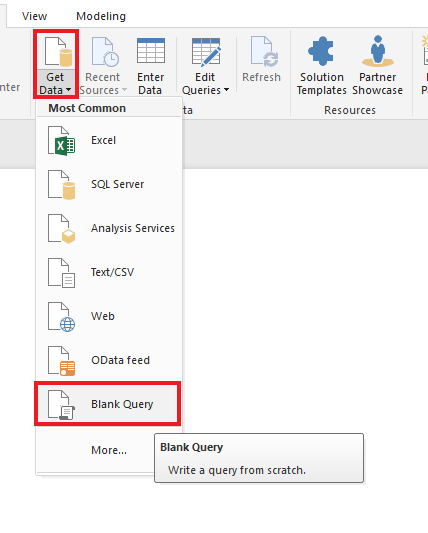
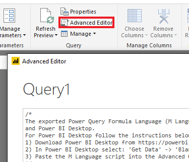

# Feed Power BI from Application Insights
[Power BI](http://www.powerbi.com/) is a suite of business analytics tools that help you analyze data and share insights. Rich dashboards are available on every device. You can combine data from many sources, including Analytics queries from [Azure Application Insights](app-insights-overview.md).

There are three recommended methods of exporting Application Insights data to Power BI. You can use them separately or together.

* [**Power BI adapter**](#power-pi-adapter) - set up a complete dashboard of telemetry from your app. The set of charts is predefined, but you can add your own queries from any other sources.
* [**Export Analytics queries**](#export-analytics-queries) - write any query you want using Analytics or from the Usage Funnels, and export it to Power BI. You can place this query on a dashboard along with any other data.
* [**Continuous export and Stream Analytics**](app-insights-export-stream-analytics.md) - This involves more work to set up. It is useful if you want to keep your data for long periods. Otherwise, the other methods are recommended.

## Power BI adapter
This method creates a complete dashboard of telemetry for you. The initial data set is predefined, but you can add more data to it.

### Get the adapter
1. Sign in to [Power BI](https://app.powerbi.com/).
2. Open **Get Data**, **Services**, **Application Insights**
   
    
3. Provide the details of your Application Insights resource.
   
    
4. Wait a minute or two for the data to be imported.
   
    

You can edit the dashboard, combining the Application Insights charts with those of other sources, and with Analytics queries. There's a visualization gallery where you can get more charts, and each chart has a parameters you can set.

After the initial import, the dashboard and the reports continue to update daily. You can control the refresh schedule on the dataset.

## Export Analytics queries
This route allows you to write any Analytics query you like or export from Usage Funnels, and then export that to a Power BI dashboard. (You can add to the dashboard created by the adapter.)

### One time: install Power BI Desktop
To import your Application Insights query, you use the desktop version of Power BI. But then you can publish it to the web or to your Power BI cloud workspace. 

Install [Power BI Desktop](https://powerbi.microsoft.com/en-us/desktop/).

### Export an Analytics query
1. [Open Analytics and write your query](app-insights-analytics-tour.md).
2. Test and refine the query until you're happy with the results.

   **Make sure that the query runs correctly in Analytics before you export it.**
3. On the **Export** menu, choose **Power BI (M)**. Save the text file.
   
    
4. In Power BI Desktop select **Get Data, Blank Query** and then in the query editor, under **View** select **Advanced Query Editor**.

    Paste the exported M Language script into the Advanced Query Editor.

    

1. You might have to provide credentials to allow Power BI to access Azure. Use 'organizational account' to sign in with your Microsoft account.
   
    

    (If you need to verify the credentials, use the Data Source Settings menu command in the Query Editor. Take care to specify the credentials you use for Azure, which might be different from your credentials for Power BI.)
2. Choose a visualization for your query and select the fields for x-axis, y-axis, and segmenting dimension.
   
    
3. Publish your report to your Power BI cloud workspace. From there, you can embed a synchronized version into other web pages.
   
    
4. Refresh the report manually at intervals, or set up a scheduled refresh on the options page.

### Export a Funnel
1. [Make your Funnel](app-insights-funnel.md)
2. Click on the Power BI Button 


3. In Power BI Desktop select **Get Data, Blank Query** and then  in the uery editor, under **View** select **Advanced Query Editor**.



Paste the exported M Language script into the Advanced Query Editor. 



4. Select items from the query and choose Funnel visualization


5. Change the title to make it meaningful and publish your report to your Power BI cloud workspace. 


## Troubleshooting

### 401 or 403 Unauthorized 
This can happen if your refesh token has not been updated. Try these steps to ensure you still have access. If you do have access and refershing the credentials does not work, please open a support ticket.

1. Log into the Azure Portal and make sure you can access the resource
2. Try to refresh the credentials for the Dashboard

### 502 Bad Gateway
This is usually caused by an Analytics query that returns too much data. You should try using a smaller time range or by using the [ago](https://docs.microsoft.com/en-us/azure/application-insights/app-insights-analytics-reference#ago) or [startofweek/startofmonth](https://docs.microsoft.com/en-us/azure/application-insights/app-insights-analytics-reference#startofweek) functions only [project](https://docs.microsoft.com/en-us/azure/application-insights/app-insights-analytics-reference#project-operator) the fields you need.

If reducing the dataset coming from the Analytics query doesn't meet your requirements you should consider using the [API](https://dev.applicationinsights.io/documentation/overview) to pull a larger dataset. Here are instructions on how to convert the M-Query export to use the API.

1. Create an [API Key](https://dev.applicationinsights.io/documentation/Authorization/API-key-and-App-ID)
2. Update the Power BI M script that you exported from Analytics by replacing the ARM URL with AI API (see example below)
   * Replace **https://management.azure.com/subscriptions/...**
   * with, **https://api.applicationinsights.io/beta/apps/...**
3. Finally, update credentials to basic, and use your API Key
  

**Existing Script**
 ```
 Source = Json.Document(Web.Contents("https://management.azure.com/subscriptions/xxxxxxxx-xxxx-xxxx-xxxx-xxxxxxxxxxxx/resourcegroups//providers/microsoft.insights/components//api/query?api-version=2014-12-01-preview",[Query=[#"csl"="requests",#"x-ms-app"="AAPBI"],Timeout=#duration(0,0,4,0)]))
 ```
**Updated Script**
 ```
 Source = Json.Document(Web.Contents("https://api.applicationinsights.io/beta/apps/<APPLICATION_ID>/query?api-version=2014-12-01-preview",[Query=[#"csl"="requests",#"x-ms-app"="AAPBI"],Timeout=#duration(0,0,4,0)]))
 ```

## About sampling
If your application sends a lot of data, the adaptive sampling feature may operate and send only a percentage of your telemetry. The same is true if you have manually set sampling either in the SDK or on ingestion. [Learn more about sampling.](app-insights-sampling.md)


## Next steps
* [Power BI - Learn](http://www.powerbi.com/learning/)
* [Analytics tutorial](app-insights-analytics-tour.md)

