# Automate custom reports with Azure Application Insights data

Periodical reports help keep a team informed on how their business critical services are doing. Developers, DevOps/SRE teams, and their managers can be productive with automated reports reliably delivering insights without requiring everyone to sign in the portal. Such reports can also help identify gradual increases in latencies, load or failure rates that may not trigger any alert rules.

Each enterprise has its unique reporting needs, such as: 

* Specific percentile aggregations of metrics, or custom metrics in a report.
* Have different reports for daily, weekly, and monthly roll-ups of data for different audiences.
* Segmentation by custom attributes like region, or environment. 
* Group some AI resources together in a single report, even if they may be in different subscriptions or resource groups etc.
* Separate reports containing sensitive metrics sent to selective audience.
* Reports to stakeholders who may not have access to the portal resources.

> [!NOTE] 
> The weekly Application Insights digest email did not allow any customization, and will be discontinued in favor of the custom options listed below. The last weekly digest email will be sent on June 11, 2018. Please configure one of the following options to get similar custom reports (use the query suggested below).

## To automate custom report emails

You can [programmatically query Application Insights](https://dev.applicationinsights.io/) data to generate custom reports on a schedule. The following options can help you get started quickly:

* [Automate reports with Microsoft Flow](app-insights-automate-with-flow.md)
* [Automate reports with Logic Apps](automate-with-logic-apps.md)
* Use the "Application Insights scheduled digest" [Azure function](https://docs.microsoft.com/azure/azure-functions/functions-create-first-azure-function) template in the Monitoring scenario. This function uses SendGrid to deliver the email. 

    

## Sample query for a weekly digest email
The following query shows joining across multiple datasets for a weekly digest email like report. Customize it as required and use it with any of the options listed above to automate a weekly report.   

```AIQL
let period=7d;
requests
| where timestamp > ago(period)
| summarize Row = 1, TotalRequests = sum(itemCount), FailedRequests = sum(toint(success == 'False')),
    RequestsDuration = iff(isnan(avg(duration)), '------', tostring(toint(avg(duration) * 100) / 100.0))
| join (
dependencies
| where timestamp > ago(period)
| summarize Row = 1, TotalDependencies = sum(itemCount), FailedDependencies = sum(success == 'False'),
    DependenciesDuration = iff(isnan(avg(duration)), '------', tostring(toint(avg(duration) * 100) / 100.0))
) on Row | join (
pageViews
| where timestamp > ago(period)
| summarize Row = 1, TotalViews = sum(itemCount)
) on Row | join (
exceptions
| where timestamp > ago(period)
| summarize Row = 1, TotalExceptions = sum(itemCount)
) on Row | join (
availabilityResults
| where timestamp > ago(period)
| summarize Row = 1, OverallAvailability = iff(isnan(avg(toint(success))), '------', tostring(toint(avg(toint(success)) * 10000) / 100.0)),
    AvailabilityDuration = iff(isnan(avg(duration)), '------', tostring(toint(avg(duration) * 100) / 100.0))
) on Row
| project TotalRequests, FailedRequests, RequestsDuration, TotalDependencies, FailedDependencies, DependenciesDuration, TotalViews, TotalExceptions, OverallAvailability, AvailabilityDuration
```

## Application Insights scheduled digest report

1. From the Azure portal, select **Create a Resource** > **Compute** > **Function App**.

   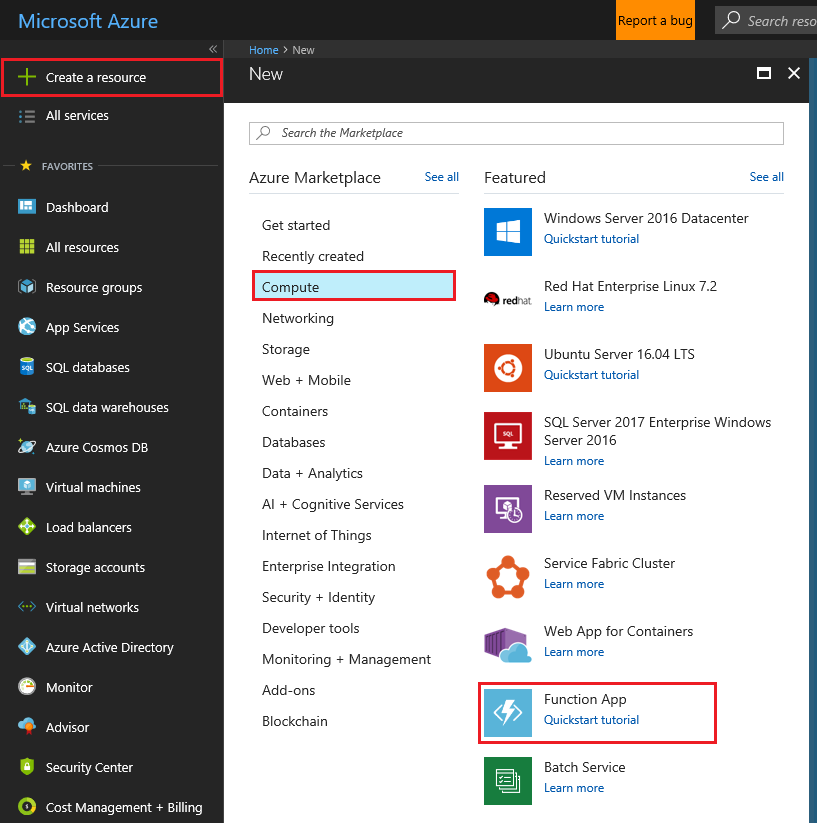

2. Enter appropriate info for your app and select _Create_. (Application Insights _On_ is required only if you want to monitor your new Function App with Application Insights)

   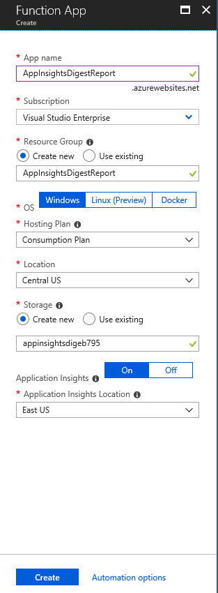

3. Once your new Function App has completed deployment, select **Go to resource**.

4. Select **New function**.

   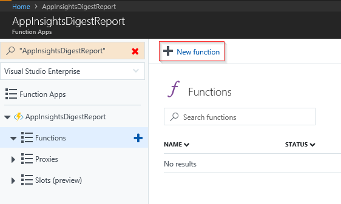

5. Select the **_Application Insights scheduled digest template_**.

   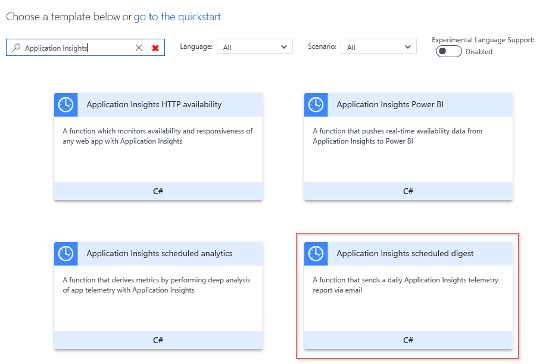

6. Enter an appropriate recipient e-mail address for your report and select **Create**.

   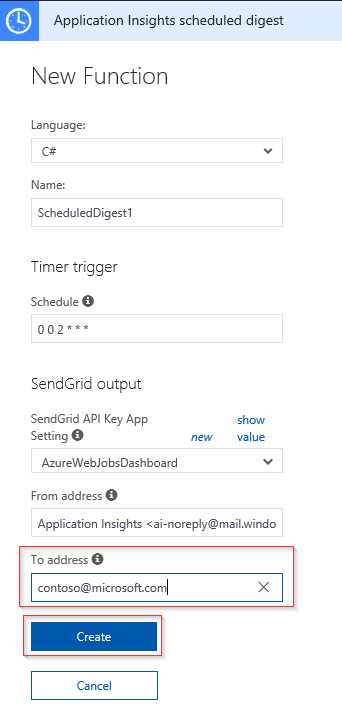

7. Select your **Function App** > **Platform features** > **Application settings**.

    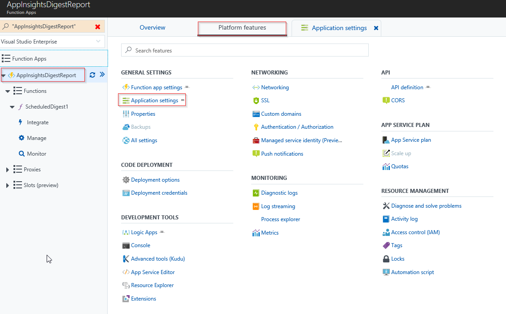

8. Create three new application settings with appropriate corresponding values ``AI_APP_ID``, ``AI_APP_KEY``, and ``SendGridAPI``. Select **Save**.

     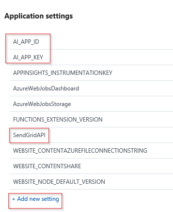
    
    (The AI_ values can be found under API Access for the Application Insights Resource you want to report on. If you don't have an Application Insights API Key, there is the option to **Create API Key**.)
    
    * AI_APP_ID = Application ID
    * AI_APP_KEY = API Key
    * SendGridAPI =SendGrid API Key

    > [!NOTE]
    > If you don't have a SendGrid account you can create one. SendGrid's documentation for Azure Functions is [here](https://docs.microsoft.com/azure/azure-functions/functions-bindings-sendgrid). If just want a minimal explanation of how to setup SendGrid and generate an API key one is provided at the end of this article. 

9. Select **Integrate** and under Outputs click **SendGrid ($return)**.

     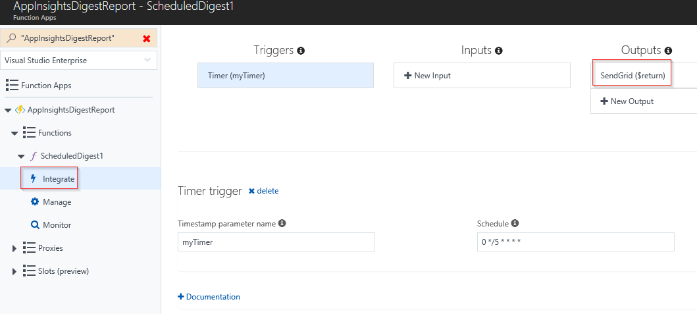

10. Under the **SendGridAPI Key App Setting**, select your newly created App Setting for **SendGridAPI**.

     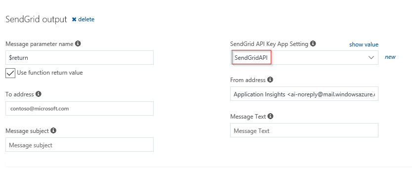

11. Run and test your Function App.

     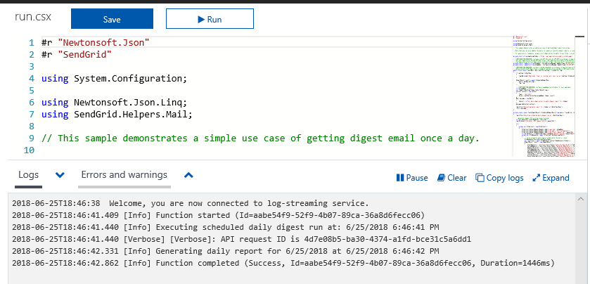

12. Check your e-mail to confirm that the message was sent/received successfully.

     

## SendGrid with Azure

These steps only apply if you don't already have a SendGrid account configured.

1. From the Azure portal select **Create a resource** search for **SendGrid Email Delivery** > Click **Create** > and fill out the SendGrid specific create instructions. 

     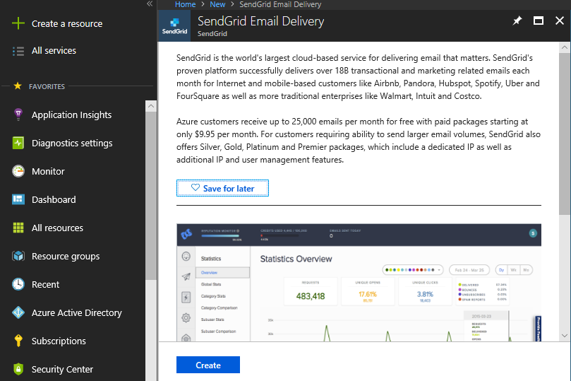

2. Once created under SendGrid Accounts select **Manage**.

     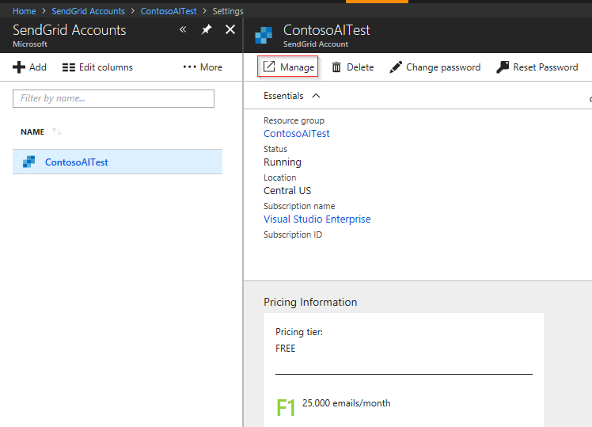

3. This will launch SendGrid's site. Select **Settings** > **API Keys**.

     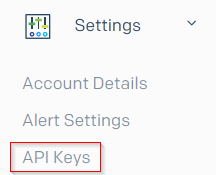

4. Create an API Key > choose **Create & View** (Please review SendGrid's documentation on restricted access to determine what level of permissions is appropriate for your API Key. Full Access is selected here for example purposes only.)

   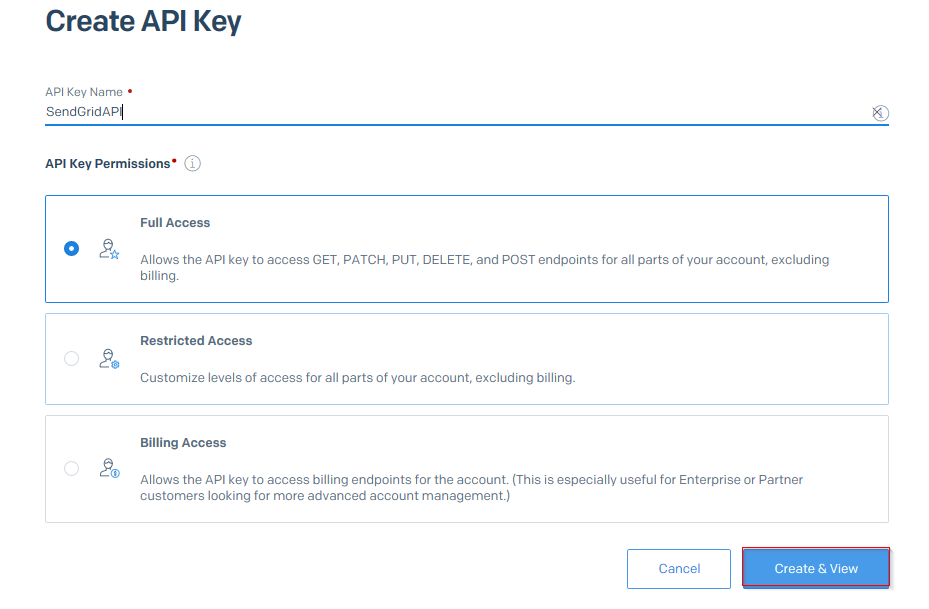

5. Copy the entire key, this value is what you need in your Function App settings as the value for SendGridAPI

   

## Next steps

* Learn more about creating [Analytics queries](../query-language/get-started-queries.md).
* Learn more about [programmatically querying Application Insights data](https://dev.applicationinsights.io/)
* Learn more about [Logic Apps](https://docs.microsoft.com/azure/logic-apps/logic-apps-what-are-logic-apps).
* Learn more about [Microsoft Flow](https://ms.flow.microsoft.com).
