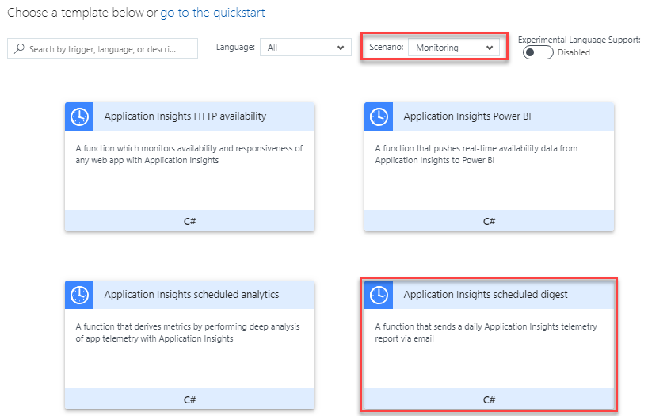

# Automate custom report emails

Periodical reports help keep a team informed on how their business critical services are doing. Developers, DevOps/SRE teams, and their managers can be productive with automated reports reliably delivering insights without requiring everyone to log on to the portal. Such reports can also help identify gradual increases in latencies, load or failure rates that may not trigger any alert rules.

Each enterprise has its unique reporting needs, such as: 

* Specific percentile aggregations of metrics, or custom metrics in a report.
* Have different reports for daily, weekly, and monthly roll-ups of data for different audiences.
* Segmentation by custom attributes like region, or environment. 
* Group some AI resources together in a single report, even if they may be in different subscriptions or resource groups etc.
* Separate reports containing sensitive metrics sent to selective audience.
* Reports to stakeholders who may not have access to the portal resources.

> [!NOTE] 
> The weekly Application Insights digest email did not allow any customization, and will be discontinued in favor of the custom options listed below. The last weekly digest email will be sent on June 11, 2018. Please configure one of the following options to get similar custom reports (use the query suggested below).


You can [programmatically query Application Insights](https://dev.applicationinsights.io/) data to generate custom reports on a schedule. The following options can help you get started quickly:

* [Automate reports with Microsoft Flow](app-insights-automate-with-flow.md)
* [Automate reports with Logic Apps](automate-with-logic-apps.md)
* Use the "Application Insights scheduled digest" [Azure function](https://azure.microsoft.com/services/functions/) template in the Monitoring scenario. This function uses SendGrid to deliver the email. The template uses the following query, which you can use with the Microsoft Flow or Logic App options above.

    

```AIQL
let period=7d;
requests
| where timestamp > ago(period)
| summarize Row = 1, TotalRequests = sum(itemCount), FailedRequests = sum(toint(success == 'False')),
    RequestsDuration = iff(isnan(avg(duration)), '------', tostring(toint(avg(duration) * 100) / 100.0))
| join (
dependencies
| where timestamp > ago(period)
| summarize Row = 1, TotalDependencies = sum(itemCount), FailedDependencies = sum(success == 'False'),
    DependenciesDuration = iff(isnan(avg(duration)), '------', tostring(toint(avg(duration) * 100) / 100.0))
) on Row | join (
pageViews
| where timestamp > ago(period)
| summarize Row = 1, TotalViews = sum(itemCount)
) on Row | join (
exceptions
| where timestamp > ago(period)
| summarize Row = 1, TotalExceptions = sum(itemCount)
) on Row | join (
availabilityResults
| where timestamp > ago(period)
| summarize Row = 1, OverallAvailability = iff(isnan(avg(toint(success))), '------', tostring(toint(avg(toint(success)) * 10000) / 100.0)),
    AvailabilityDuration = iff(isnan(avg(duration)), '------', tostring(toint(avg(duration) * 100) / 100.0))
) on Row
| project TotalRequests, FailedRequests, RequestsDuration, TotalDependencies, FailedDependencies, DependenciesDuration, TotalViews, TotalExceptions, OverallAvailability, AvailabilityDuration
```

  
## Next steps

- Learn more about creating [Analytics queries](app-insights-analytics-using.md).
- Learn more about [programmatically querying Application Insights data](https://dev.applicationinsights.io/)
- Learn more about [Logic Apps](https://docs.microsoft.com/azure/logic-apps/logic-apps-what-are-logic-apps).
- Learn more about [Microsoft Flow](https://ms.flow.microsoft.com).


