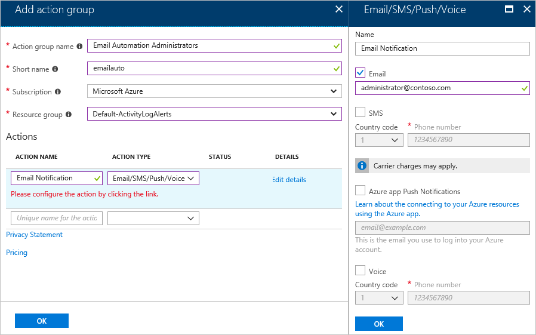

# Monitoring runbooks with Azure Activity logs

In this article we discuss how to create alerts on the completion status of runbooks. You create a test runbook and alert when it fails. Once you test the logic you can go back into the alert and change the alert to the runbook you wish to alert on.

## Log in to Azure

Log in to Azure at https://portal.azure.com

## Create alert

In the Azure portal, select **Monitor**. On the Monitor page, select **Alerts** and click **+ New Alert Rule**.

Under **1. Define alert condition**, click **+  Select target**. Under **Filter by resource type**, select **Automation Account**. Choose your Automation Account and click **Done**.

Click **+ Add criteria**. Select **Metrics** for the **Signal type**, and choose **Total Jobs** from the table.

On the **Configure signal logic** page, two dimensions are displayed **Runbook Name** and **Status**. For **Runbook Name**, select the runbook you want to alert on, for **Status** choose the status you want to alert on. The drop downs for the dimensions are based off of recent activity. If you want to alert on a status or runbook that is not shown in the dropdown, click the **+** next to the dimension. This opens a dialog that allows you to enter in a custom value which has not emitted for that dimension.

Under **2. Define alert details**, give the alert a friendly name and description. Set the **Severity** to match your alert condition.

Under **3. Define action group**, click **+ New action group**. An action group is a group of actions that you can use across multiple alerts. These can include but are not limited to, email notifications, runbooks, webhooks, and many more. To learn more about action groups, see [Create and manage action groups](../monitoring-and-diagnostics/monitoring-action-groups.md)

In the **Action group name** box, give it a friendly name and short name. The short name is used in place of a full action group name when notifications are sent using this group.

Under **Actions**, the action a friendly name like **Email Notifications** under **ACTION TYPE** select **Email/SMS/Push/Voice**. Under **DETAILS**, select **Edit details**.

On the **Email/SMS/Push/Voice** page, give it a name. Check the **Email** checkbox and enter in a valid email address to be used.

Click **OK** on the **Email/SMS/Push/Voice** page to close it and click **OK** to close the **Add action group** page.

You can customize the subject of the email sent by clicking **Email subject** under **Customize Actions** on the **Create rule** page. When complete, click **Create alert rule**. This creates the rule that alerts you when a runbook completed with a certain status.

## Understanding the alert

When the alert criteria is met, the action group runs the action defined. In this articles example an email is sent. The following image is an example of an email you receive after the alert is triggered:

Once the metric is no longer breached outside of the threshold defined, the alert is deactivated and the action group runs the action defined. In the case of an email action type, a resolution email is sent stating it has been resolved.

## Next steps

Continue to the following article to learn about other ways that you can integrate alertings into your Automation Account.

> [!div class="nextstepaction"]
> [Use an alert to trigger an Azure Automation runbook](automation-create-alert-triggered-runbook.md)