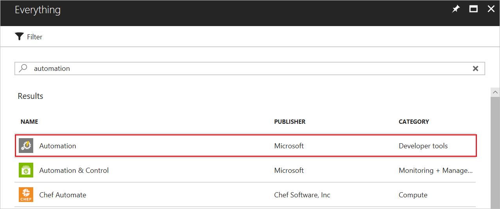
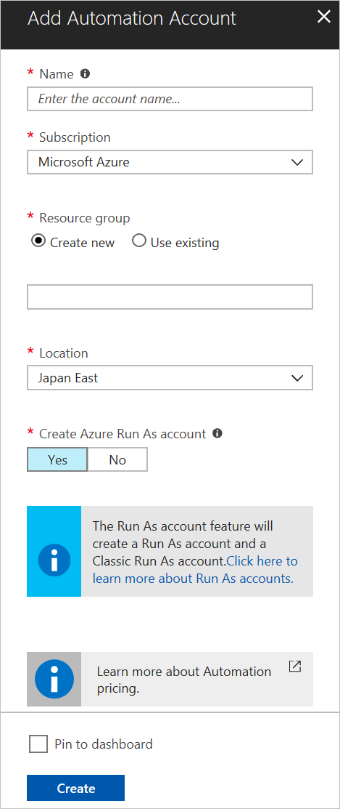
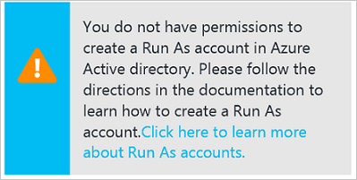
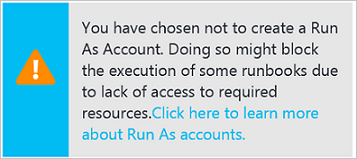

# Create a standalone Azure Automation account
This topic shows you how to create an Automation account from the Azure portal if you want to evaluate and learn Azure Automation without including the additional management solutions or integration with OMS Log Analytics to provide advanced monitoring of runbook jobs.  You can add those management solutions or integrate with Log Analytics at any point in the future.  With the Automation account, you are able to authenticate runbooks managing resources in either Azure Resource Manager or Azure classic deployment.

When you create an Automation account in the Azure portal, it automatically creates:

* Run As account, which creates a new service principal in Azure Active Directory, a certificate, and assigns the Contributor role-based access control (RBAC), which is used to manage Resource Manager resources using runbooks.   
* Classic Run As account by uploading a management certificate, which is used to manage  classic resources using runbooks.  

This simplifies the process for you and helps you quickly start building and deploying runbooks to support your automation needs.  

## Permissions required to create Automation account
To create or update an Automation account, you must have the following specific privileges and permissions required to complete this topic.   
 
* In order to create an Automation account, your AD user account needs to be added to a role with permissions equivalent to the Owner role for Microsoft.Automation resources as outlined in article [Role-based access control in Azure Automation](automation-role-based-access-control.md#contributor-role-permissions).  
* If the App registrations setting is set to **Yes**, non-admin users in your Azure AD tenant can [register AD applications](../azure-resource-manager/resource-group-create-service-principal-portal.md#check-azure-subscription-permissions).  If the app registrations setting is set to **No**, the user performing this action must be a global administrator in Azure AD. 

If you are not a member of the subscription’s Active Directory instance before you are added to the global administrator/co-administrator role of the subscription, you are added to Active Directory as a guest. In this situation, you receive a “You do not have permissions to create…” warning on the **Add Automation Account** blade. Users who were added to the global administrator/co-administrator role first can be removed from the subscription's Active Directory instance and readded to make them a full User in Active Directory. To verify this situation, from the **Azure Active Directory** pane in the Azure portal, select **Users and groups**, select **All users** and, after you select the specific user, select **Profile**. The value of the **User type** attribute under the users profile should not equal **Guest**.

## Create a new Automation Account from the Azure portal
In this section, perform the following steps to create an Azure Automation account in the Azure portal.    

1. Sign in to the Azure portal with an account that is a member of the Subscription Admins role and co-administrator of the subscription.
2. Click **New**.      
3. Search for **Automation** and then in the search results select **Automation & Control***.     
3. In the Automation Accounts blade, click **Add**.  
   
   > [!NOTE]
   > If you see the following warning in the **Add Automation Account** blade, it is because your account is not a member of the Subscription Admins role and co-admin of the subscription.  
   > 
   > 
4. In the **Add Automation Account** blade, in the **Name** box type in a name for your new Automation account.
5. If you have more than one subscription, specify one for the new account, a new or existing **Resource group** and an Azure datacenter **Location**.
6. Verify the value **Yes** is selected for the **Create Azure Run As account** option, and click the **Create** button.  
   
   > [!NOTE]
   > If you choose to not create the Run As account by selecting the option **No**, you are  presented with a warning message in the **Add Automation Account** blade.  While the account is created in the Azure portal, it doesn't have a corresponding authentication identity within your classic or Resource Manager subscription directory service and therefore, no access to resources in your subscription.  This prevents any runbooks referencing this account from being able to authenticate and perform tasks against resources in those deployment models.
   > 
   >  
   > When the service principal is not created the Contributor role is not assigned.
   > 

7. While Azure creates the Automation account, you can track the progress under **Notifications** from the menu.

### Resources included
When the Automation account is successfully created, several resources are automatically created for you.  The following table summarizes resources for the Run As account. 

| Resource | Description |
| --- | --- |
| AzureAutomationTutorial Runbook |An example Graphical runbook that demonstrates how to authenticate using the Run As account and gets all the Resource Manager resources. |
| AzureAutomationTutorialScript Runbook |An example PowerShell runbook that demonstrates how to authenticate using the Run As account and gets all the Resource Manager resources. |
| AzureRunAsCertificate |Certificate asset automatically created during Automation account creation or using the PowerShell script below for an existing account.  It allows you to authenticate with Azure so that you can manage Azure Resource Manager resources from runbooks.  This certificate has a one-year lifespan. |
| AzureRunAsConnection |Connection asset automatically created during Automation account creation or using the PowerShell script below for an existing account. |

The following table summarizes resources for the Classic Run As account. 

| Resource | Description |
| --- | --- |
| AzureClassicAutomationTutorial Runbook |An example Graphical runbook, which gets all the Classic VMs in a subscription using the Classic Run As Account (certificate) and then outputs the VM name and status. |
| AzureClassicAutomationTutorial Script Runbook |An example PowerShell runbook, which gets all the Classic VMs in a subscription using the Classic Run As Account (certificate) and then outputs the VM name and status. |
| AzureClassicRunAsCertificate |Certificate asset automatically created that is used to authenticate with Azure so that you can manage Azure classic resources from runbooks.  This certificate has a one-year lifespan. |
| AzureClassicRunAsConnection |Connection asset automatically created that is used to authenticate with Azure so that you can manage Azure classic resources from runbooks. |

## Next steps
* To learn more about Graphical Authoring, see [Graphical authoring in Azure Automation](automation-graphical-authoring-intro.md).
* To get started with PowerShell runbooks, see [My first PowerShell runbook](automation-first-runbook-textual-powershell.md).
* To get started with PowerShell workflow runbooks, see [My first PowerShell workflow runbook(automation-first-runbook-textual.md).