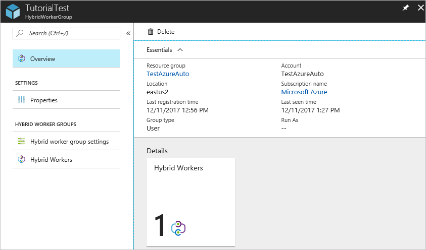

# Remove Azure Automation Hybrid Runbook Workers

You can 

## Removing Hybrid Runbook Worker

You can remove one or more Hybrid Runbook Workers from a group or you can remove the group, depending on your requirements.  To remove a Hybrid Runbook Worker from an on-premises computer, perform the following steps.

1. In the Azure portal, navigate to your Automation account.  
2. From the **Settings** blade, select **Keys** and note the values for field **URL** and **Primary Access Key**.  You need this information for the next step.
3. Open a PowerShell session in Administrator mode and run the following command - `Remove-HybridRunbookWorker -url <URL> -key <PrimaryAccessKey>`.  Use the **-Verbose** switch for a detailed log of the removal process.

> [!NOTE]
> This does not remove the Microsoft Monitoring Agent from the computer, only the functionality and configuration of the Hybrid Runbook Worker role.  

## Remove Hybrid Worker groups

To remove a group, you first need to remove the Hybrid Runbook Worker from every computer that is a member of the group using the procedure shown earlier, and then you perform the following steps to remove the group.  

1. Open the Automation account in the Azure portal.
1. Under **Process Automation** select **Hybrid Worker Groups**. Select the group you wish to delete.  After selecting the specific group, the **Hybrid worker group** properties blade is displayed.     
2. On the properties blade for the selected group, click **Delete**.  A message appears asking you to confirm this action, select **Yes** if you are sure you want to proceed.    This process can take several seconds to complete and you can track its progress under **Notifications** from the menu. 

## Next Steps

* Review [run runbooks on a Hybrid Runbook Worker](automation-hrw-run-runbooks.md) to learn how to configure your runbooks to automate processes in your on-premises datacenter or other cloud environment.
* For information on installing Windows Hybrid Runbook Workers, see [Azure Automation Windows Hybrid Runbook Worker](automation-windows-hrw-install.md).
* For information on installing Linux Hybrid Runbook Workers, see [Azure Automation Linux Hybrid Runbook Worker](automation-linux-hrw-install.md).