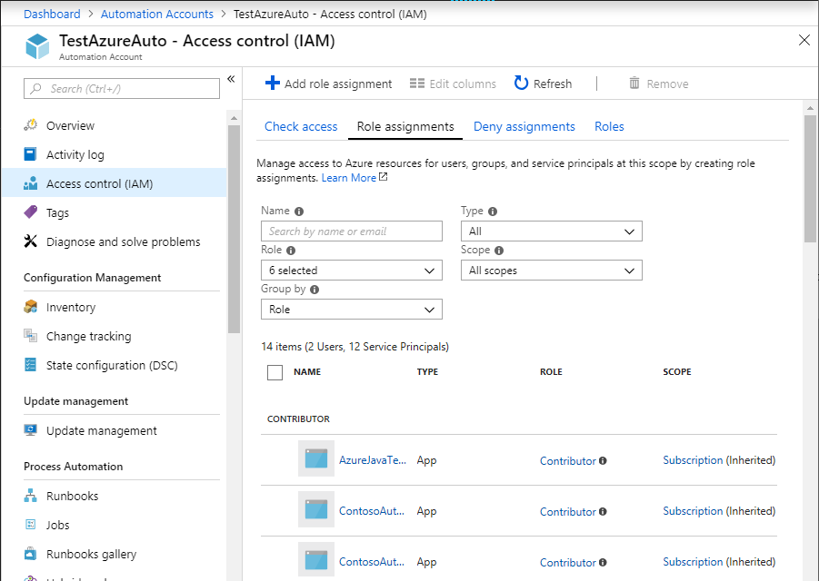
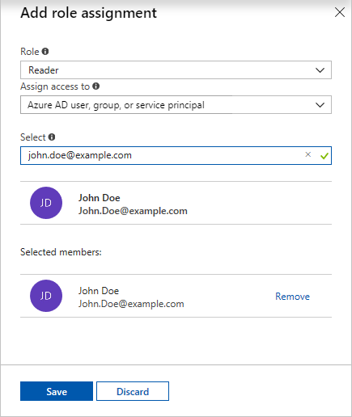
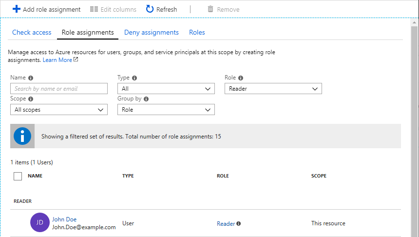
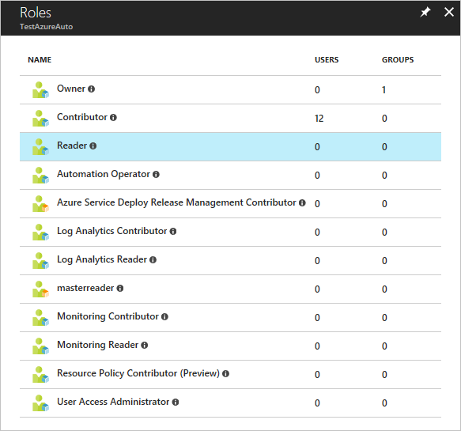
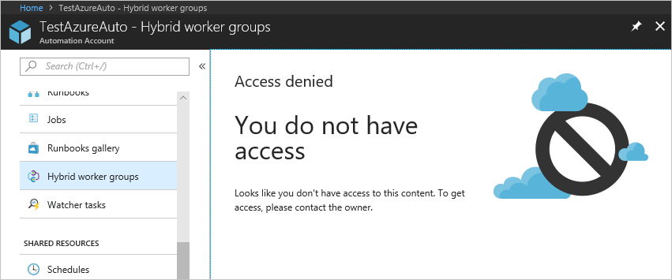

# Role-based access control in Azure Automation

Role-based access control (RBAC) enables access management for Azure resources. Using [RBAC](../active-directory/role-based-access-control-configure.md), you can segregate duties within your team and grant only the amount of access to users, groups and applications that they need to perform their jobs. Role-based access can be granted to users using the Azure portal, Azure Command-Line tools, or Azure Management APIs.

## Roles in Automation Accounts
In Azure Automation, access is granted by assigning the appropriate RBAC role to users, groups, and applications at the Automation account scope. Following are the built-in roles supported by an Automation account:

| **Role** | **Description** |
|:--- |:--- |
| Owner |The Owner role allows access to all resources and actions within an Automation account including providing access to other users, groups and applications to manage the Automation account. |
| Contributor |The Contributor role allows you to manage everything except modifying other user’s access permissions to an Automation account. |
| Reader |The Reader role allows you to view all the resources in an Automation account but cannot make any changes. |
| Automation Operator |The Automation Operator role allows you to perform operational tasks such as start, stop, suspend, resume, and schedule jobs. This role is helpful if you want to protect your Automation Account resources like credentials assets and runbooks from being viewed or modified but still allow members of your organization to execute these runbooks. |
| Log Analytics Contributor | The Log Analytics Contributor role allows you to read all monitoring data and edit monitoring settings. Editing monitoring settings includes adding the VM extension to VMs, reading storage account keys to be able to configure collection of logs from Azure stoarge, creating and configuring Automation accounts, adding solutions, and configuring Azure diagnostics on all Azure resources.|
| Log Analytics Reader | The Log Analytics Reader role allows you to view and search all monitoring data as well as view monitoring settings. This includes viewing the configuration of Azure diagnostics on all Azure resources. |
| Monitoring Contributor | The Monitoring Contributor role allows you to read all monitoring data and update monitoring settings.|
| Monitoring Reader | The Montioring Reader role allows you to read all monitoring data. |
| User Access Administrator |The User Access Administrator role allows you to manage user access to Azure Automation accounts. |

> [!NOTE]
> You cannot grant access rights to a specific runbook or runbooks, only to the resources and actions within the Automation account.

## Role permissions

The following tables describe the specific permissions given to each role. This can include Actions, which give permissions, and NotActions, which restrict them.

### Automation Job Operator

You set Automation Job Operator at the Automation account level. This allows the operator permissions to manage jobs in the account.

|**Actions**  |**Description**  |
|---------|---------|
|Microsoft.Authorization/*/read|Read authorization|
|Microsoft.Automation/automationAccounts/jobs/read|List jobs of the runbook|
|Microsoft.Automation/automationAccounts/jobs/resume/action|Resume a job that is paused|
|Microsoft.Automation/automationAccounts/jobs/stop/action|Cancel a job in progress|
|Microsoft.Automation/automationAccounts/jobs/streams/read|Read the Job Streams and Output|
|Microsoft.Automation/automationAccounts/jobs/suspend/action|Pause a job in progress|
|Microsoft.Automation/automationAccounts/jobs/write|Create jobs|
|Microsoft.Resources/subscriptions/resourceGroups/read      |  Read roles and role assignments       |
|Microsoft.Resources/deployments/*      |Create and manage resource group deployments         |
|Microsoft.Insights/alertRules/*      | Create and manage alert rules        |
|Microsoft.Support/* |Create and manage support tickets|

### Automation Runbook Operator

You set Automation Runbook Operator on a runbook to allow the operator to see the runbook name. This also gives permission for the operator to perform the Automation Job Operator actions for a job for the particular runbook.

|**Actions**  |**Description**  |
|---------|---------|
|Microsoft.Automation/automationAccounts/\<runbookInstance\>/read     | List the runbooks        |
|Microsoft.Authorization/*/read      | Read authorization        |
|Microsoft.Resources/subscriptions/resourceGroups/read      |Read roles and role assignments         |
|Microsoft.Resources/deployments/*      | Create and manage resource group deployments         |
|Microsoft.Insights/alertRules/*      | Create and manage alert rules        |
|Microsoft.Support/*      | Create and manage support tickets        |

### Owner

Can manage everything, including access
|Actions|Description|
|---|---|
|Microsoft.Automation/automationAccounts/*|Create and manage resources of all types|

## Contributor

Can manage everything except access. The following tables shows the permissions **NOT** allowed for a contributor. All other actions are permissable.

|**Actions**  |**Description**  |
|---------|---------|
|*|Create and manage resources of all types|
|**Not Actions**||
|Microsoft.Authorization/*/Delete| Delete roles and role assignments        |
|Microsoft.Authorization/*/Write     |  Create roles and role assignments       |
|Microsoft.Authorization/elevateAccess/Action    |         |

### Automation Operator

Automation Operators are able to start, stop, suspend, and resume jobs

|**Actions**  |**Description**  |
|---------|---------|
|Microsoft.Authorization/*/read|Read authorization|
|Microsoft.Automation/automationAccounts/jobs/read|List jobs of the runbook|
|Microsoft.Automation/automationAccounts/jobs/resume/action|Resume a job that is paused|
|Microsoft.Automation/automationAccounts/jobs/stop/action|Cancel a job in progress|
|Microsoft.Automation/automationAccounts/jobs/streams/read|Read the Job Streams and Output|
|Microsoft.Automation/automationAccounts/jobs/suspend/action|Pause a job in progress|
|Microsoft.Automation/automationAccounts/jobs/write|Create jobs|
|Microsoft.Resources/subscriptions/resourceGroups/read      |Read roles and role assignments         |
|Microsoft.Resources/deployments/*      |Create and manage resource group deployments         |
|Microsoft.Insights/alertRules/*      | Create and manage alert rules        |
|Microsoft.Support/* |Create and manage support tickets|

### Automation Runbook Operator

Read Runbook properties - to be able to create Jobs of the runbook.

|**Actions**  |**Description**  |
|---------|---------|
|Microsoft.Authorization/*/read|Read authorization|
|Microsoft.Automation/automationAccounts/runbooks/read|List runbooks|
|Microsoft.Resources/subscriptions/resourceGroups/read      |Read roles and role assignments         |
|Microsoft.Resources/deployments/*      |Create and manage resource group deployments         |
|Microsoft.Insights/alertRules/*      | Create and manage alert rules        |
|Microsoft.Support/* |Create and manage support tickets|

### Log Analytics Contributor

Log Analytics Contributor can read all monitoring data and edit monitoring settings. Editing monitoring settings includes adding the VM extension to VMs; reading storage account keys to be able to configure collection of logs from Azure Storage; creating and configuring Automation accounts; adding solutions; and configuring Azure diagnostics on all Azure resources.

|**Actions**  |**Description**  |
|---------|---------|
|*/read|Read resources of all types, except secrets.|
|Microsoft.Automation/automationAccounts/*|Manage automation accounts|
|Microsoft.ClassicCompute/virtualMachines/extensions/*|Create and manage virtual machine extensions|
|Microsoft.ClassicStorage/storageAccounts/listKeys/action|List classic storage account keys|
|Microsoft.Compute/virtualMachines/extensions/*|Create and manage classic virtual machine extensions|
|Microsoft.Insights/alertRules/*|Read/write/delete alert rules.|
|Microsoft.Insights/diagnosticSettings/*|Read/write/delete diagnostic settings.|
|Microsoft.OperationalInsights/*|Manage Log Analytics|
|Microsoft.OperationsManagement/*|Manage solutions in workspaces|
|Microsoft.Resources/deployments/*|Create and manage resource group deployments|
|Microsoft.Resources/subscriptions/resourcegroups/deployments/*|Create and manage resource group deployments|
|Microsoft.Storage/storageAccounts/listKeys/action|List storage account keys|
|Microsoft.Support/*|Create and manage support tickets|

### Log Analytics Reader

Log Analytics Reader can view and search all monitoring data as well as and view monitoring settings, including viewing the configuration of Azure diagnostics on all Azure resources.

|**Actions**  |**Description**  |
|---------|---------|
|*/read|Read resources of all types, except secrets.|
|Microsoft.OperationalInsights/workspaces/analytics/query/action|Manage queries in Log Analytics|
|Microsoft.OperationalInsights/workspaces/search/action|Search Log Analytics data|
|Microsoft.Support/*|Create and manage support tickets|
|**Not Actions**| |
|Microsoft.OperationalInsights/workspaces/sharedKeys/read|Not able to read the shared access keys|
## Reader role permissions
The following table presents the specific actions that can be performed by the Reader role in Automation.

### Monitoring Contributor

Can read all monitoring data and update monitoring settings.

|**Actions**  |**Description**  |
|---------|---------|
|*/read|Read resources of all types, except secrets.|
|Microsoft.AlertsManagement/alerts/*|**Insert description**|
|Microsoft.AlertsManagement/alertsSummary/*|**Insert description**|
|Microsoft.Insights/AlertRules/*|Read/write/delete alert rules.|
|Microsoft.Insights/components/*|	Read/write/delete Application Insights components.|
|Microsoft.Insights/DiagnosticSettings/*|Read/write/delete diagnostic settings.|
|Microsoft.Insights/eventtypes/*|List Activity Log events (management events) in a subscription. This permission is applicable to both programmatic and portal access to the Activity Log.|
|Microsoft.Insights/LogDefinitions/*|This permission is necessary for users who need access to Activity Logs via the portal. List log categories in Activity Log.|
|Microsoft.Insights/MetricDefinitions/*|Read metric definitions (list of available metric types for a resource).|
|Microsoft.Insights/Metrics/*|Read metrics for a resource.|
|Microsoft.Insights/Register/Action|Register the Microsoft.Insights provider.|
|Microsoft.Insights/webtests/*|Read/write/delete Application Insights web tests.|
|Microsoft.OperationalInsights/workspaces/intelligencepacks/*|Read/write/delete Log Analytics solution packs.|
|Microsoft.OperationalInsights/workspaces/savedSearches/*|Read/write/delete Log Analytics saved searches.|
|Microsoft.OperationalInsights/workspaces/search/action|Search Log Analytics workspaces.|
|Microsoft.OperationalInsights/workspaces/sharedKeys/action|List keys for a Log Analytics workspace.|
|Microsoft.OperationalInsights/workspaces/storageinsightconfigs/*|Read/write/delete Log Analytics storage insight configurations.|
|Microsoft.Support/*|Create and manage support tickets|
|Microsoft.WorkloadMonitor/workloads/*|**Insert description**|

### Monitoring Reader

Can read all monitoring data.

|**Actions**  |**Description**  |
|---------|---------|
|*/read|Read resources of all types, except secrets.|
|Microsoft.OperationalInsights/workspaces/search/action|Search Log Analytics workspaces.|
|Microsoft.Support/*|Create and manage support tickets|

## User Access Administrator

Lets you manage user access to Azure resources.

|**Actions**  |**Description**  |
|---------|---------|
|*/read|Read all resources|
|Microsoft.Authorization/*|Manage authorization|
|Microsoft.Support/*|Create and manage support tickets|

## Onboarding

The following tables show the minimum required permissions needed for onboarding virtual machines with Azure Automation.

### Onboarding from a virtual machine

|**Action**  |**Permission**  |**Minimum scope**  |
|---------|---------|---------|
|Write new deployment      | Microsoft.Resources/deployments/*          |Subscription          |
|Write new resource group      | Microsoft.Resources/subscriptions/resourceGroups/write        | Subscription          |
|Create new default Workspace      | Microsoft.OperationalInsights/workspaces/write         | Resource group         |
|Create new Account      |  Microsoft.Automation/automationAccounts/write        |Resource group         |
|Link workspace and account      |Microsoft.OperationalInsights/workspaces/write Microsoft.Automation/automationAccounts/read  Automation Account|Workspace Automation Account
|Create solution      | Microsoft.OperationalInsights/workspaces/intelligencepacks/write |Resource group          |
|Create MMA extension      | Microsoft.Compute/virtualMachines/write         | Virtual Machine         |
|Create saved search      | Microsoft.OperationalInsights/workspaces/write          | Workspace         |
|Create scope config      | Microsoft.OperationalInsights/workspaces/write          | Workspace         |
|Link solution to scope config      | Microsoft.OperationalInsights/workspaces/intelligencepacks/write         | Solution         |
|Onboarding state check - Read workspace      | Microsoft.OperationalInsights/workspaces/read         | Workspace         |
|Onboarding state check - Read linked workspace property of account     | Microsoft.Automation/automationAccounts/read      | Automation Account        |
|Onboarding state check - Read solution      | Microsoft.OperationalInsights/workspaces/intelligencepacks/read          | Solution         |
|Onboarding state check - Read VM      | Microsoft.Compute/virtualMachines/read         | Virtual Machine         |
|Onboarding state check - Read account      | Microsoft.Automation/automationAccounts/read  |  Automation Account   |

## Onboarding from Automation account

|**Action**  |**Permission** |**Minimum Scope**  |
|---------|---------|---------|
|Create new deployment     | Microsoft.Resources/deployments/*        | Subscription         |
|Create new resource group     | Microsoft.Resources/subscriptions/resourceGroups/write         | Subscription        |
|AutomationOnboarding blade - Create new workspace     |Microsoft.OperationalInsights/workspaces/write           | Resource group        |
|AutomationOnboarding blade - read linked workspace     | Microsoft.Automation/automationAccounts/read        | Automation Account       |
|AutomationOnboarding blade - read solution     | Microsoft.OperationalInsights/workspaces/intelligencepacks/read         | Solution        |
|AutomationOnboarding blade - read workspace     | Microsoft.OperationalInsights/workspaces/intelligencepacks/read        | Workspace        |
|Create link for workspace and Account     | Microsoft.OperationalInsights/workspaces/write        | Workspace        |
|Write account for shoebox      | Microsoft.Automation/automationAccounts/write        | Account        |
|Create solution      | Microsoft.OperationalInsights/workspaces/intelligencepacks/write        | Resource Group         |
|Create/edit saved search     | Microsoft.OperationalInsights/workspaces/write        | Workspace        |
|Create/edit scope config     | Microsoft.OperationalInsights/workspaces/write        | Workspace        |
|Link solution to scope config      | Microsoft.OperationalInsights/workspaces/intelligencepacks/write         | Solution         |
|**Step 2   - Onboard Multiple VMs**     |         |         |
|VMOnboarding blade - Create MMA extension     | Microsoft.Compute/virtualMachines/write           | Virtual Machine        |
|Create / edit saved search     | Microsoft.OperationalInsights/workspaces/write           | Workspace        |
|Create / edit scope config  | Microsoft.OperationalInsights/workspaces/write   | Workspace|

## Update management

Update management reaches across multiple services to provide its service. The following table shows the permissions needed to management update management deployments:

|**Resource**  |**Role**  |**Scope**  |
|---------|---------|---------|
|Automation account     | Log Analytics Contributor       | Automation account        |
|Automation account    | Virtual Machine Contributor        | Resource Group for the account        |
|Log Analytics workspace     | Log Analytics Contributor| Log Analytics workspace        |
|Solution     |Log Analytics Contributor         | Solution|
|Virtual Machine     | Virtual Machine Contributor        | Virtual Machine        |

## Configure RBAC for your Automation Account using Azure portal
1. Log in to the [Azure portal](https://portal.azure.com/) and open your Automation account from the Automation Accounts page.  
2. Click on the **Access** control at the top right corner. This opens the **Users** page where you can add new users, groups and applications to manage your Automation account and view existing roles that can be configured for the Automation Account.  
   
     

> [!NOTE]
> **Subscription admins** already exists as the default user. The subscription admins active directory group includes the service administrator(s) and co-administrator(s) for your Azure subscription. The Service admin is the owner of your Azure subscription and its resources, and will have the owner role inherited for the automation accounts too. This means that the access is **Inherited** for **service administrators and co-admins** of a subscription and it’s **Assigned** for all the other users. Click **Subscription admins** to view more details about their permissions.  
> 
> 

### Add a new user and assign a role
1. From the Users page, click **Add** to open the **Add access** page where you can add a user, group, or application, and assign a role to them.  
   
     
2. Select a role from the list of available roles. We will choose the **Reader** role, but you can choose any of the available built-in roles that an Automation Account supports or any custom role you may have defined.  
   
     
3. Click on **Add users** to open the **Add users** page. If you have added any users, groups, or applications to manage your subscription then those users are listed and you can select them to add access. If there aren’t any users listed, or if the user you are interested in adding is not listed then click **invite** to open the **Invite a guest** page, where you can invite a user with a valid Microsoft account email address such as Outlook.com, OneDrive, or Xbox Live Ids. Once you have entered the email address of the user, click **Select** to add the user, and then click **OK**. 
   
     
   
   Now you should see the user added to the **Users** page with the **Reader** role assigned.  
   
     
   
   You can also assign a role to the user from the **Roles** page. 
4. Click **Roles** from the Users page to open the **Roles** page. From here, you can view the name of the role, the number of users and groups assigned to that role.
   
      
   
   > [!NOTE]
   > Role-based access control can only be set at the Automation Account level and not at any resource below the Automation Account.
   > 
   > 
   
    You can assign more than one role to a user, group, or application. For example, if we add the **Automation Operator** role along with the **Reader role** to the user, then they can view all the Automation resources, as well as execute the runbook jobs. You can expand the dropdown to view a list of roles assigned to the user.  
   
      

### Remove a user
You can remove the access permission for a user who is not managing the Automation Account, or who no longer works for the organization. Following are the steps to remove a user: 

1. From the **Users** page, select the role assignment that you wish to remove.
2. Click the **Remove** button in the assignment details pane.
3. Click **Yes** to confirm removal. 
   
     

## Role Assigned User
When a user assigned to a role logs in to their Automation account, they can now see the owner’s account listed in the list of **Default Directories**. In order to view the Automation account that they have been added to, they must switch the default directory to the owner’s default directory.  

  

### User experience for Automation operator role
When a user, who is assigned to the Automation Operator role views the Automation account they are assigned to, they can only view the list of runbooks, runbook jobs and schedules created in the Automation account but can’t view their definition. They can start, stop, suspend, resume, or schedule the runbook job. The user does not have access to other Automation resources such as configurations, hybrid worker groups or DSC nodes.  

  

When the user clicks on the runbook, the commands to view the source or edit the runbook are not provided as the Automation operator role doesn’t allow access to them.  

  

The user has access to view and to create schedules, but does not have access to any other asset type.  

  

This user also doesn’t have access to view the webhooks associated with a runbook

  

## Configure RBAC for your Automation Account using Azure PowerShell
Role-based access can also be configured to an Automation Account using the following [Azure PowerShell cmdlets](../active-directory/role-based-access-control-manage-access-powershell.md).

• [Get-AzureRmRoleDefinition](https://msdn.microsoft.com/library/mt603792.aspx) lists all RBAC roles that are available in Azure Active Directory. You can use this command along with the **Name** property to list all the actions that can be performed by a specific role.  
    **Example:**  
      

• [Get-AzureRmRoleAssignment](https://msdn.microsoft.com/library/mt619413.aspx) lists Azure AD RBAC role assignments at the specified scope. Without any parameters, this command returns all the role assignments made under the subscription. Use the **ExpandPrincipalGroups** parameter to list access assignments for the specified user as well as the groups the user is a member of.  
    **Example:** Use the following command to list all the users and their roles within an automation account.

    Get-AzureRMRoleAssignment -scope “/subscriptions/<SubscriptionID>/resourcegroups/<Resource Group Name>/Providers/Microsoft.Automation/automationAccounts/<Automation Account Name>” 

• [New-AzureRmRoleAssignment](https://msdn.microsoft.com/library/mt603580.aspx) to assign access to users, groups and applications to a particular scope.  
    **Example:** Use the following command to assign the “Automation Operator” role for a user in the Automation Account scope.

    New-AzureRmRoleAssignment -SignInName <sign-in Id of a user you wish to grant access> -RoleDefinitionName "Automation operator" -Scope “/subscriptions/<SubscriptionID>/resourcegroups/<Resource Group Name>/Providers/Microsoft.Automation/automationAccounts/<Automation Account Name>”  

• Use [Remove-AzureRmRoleAssignment](https://msdn.microsoft.com/library/mt603781.aspx) to remove access of a specified user, group or application from a particular scope.  
    **Example:** Use the following command to remove the user from the “Automation Operator” role in the Automation Account scope.

    Remove-AzureRmRoleAssignment -SignInName <sign-in Id of a user you wish to remove> -RoleDefinitionName "Automation Operator" -Scope “/subscriptions/<SubscriptionID>/resourcegroups/<Resource Group Name>/Providers/Microsoft.Automation/automationAccounts/<Automation Account Name>”

In the above examples, replace **sign in Id**, **subscription Id**, **resource group name** and **Automation account name** with your account details. Choose **yes** when prompted to confirm before continuing to remove user role assignment.   

## Next Steps
* For information on different ways to configure RBAC for Azure Automation, refer to [manage RBAC with Azure PowerShell](../active-directory/role-based-access-control-manage-access-powershell.md).
* For details on different ways to start a runbook, see [Starting a runbook](automation-starting-a-runbook.md)
* For information about different runbook types, refer to [Azure Automation runbook types](automation-runbook-types.md)

