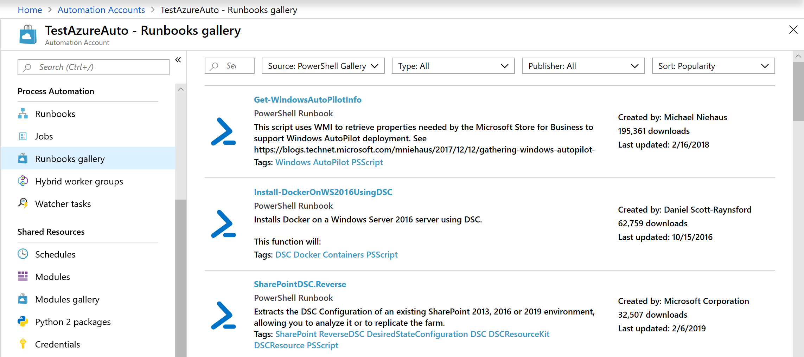
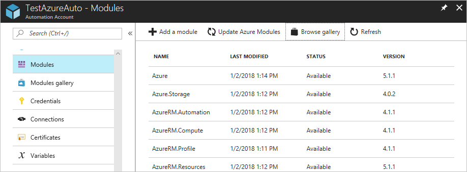

# Runbook and module galleries for Azure Automation

Rather than creating your own runbooks and modules in Azure Automation, you can access scenarios that have already been built by Microsoft and the community.

You can get runbooks from the [Runbook Gallery](#runbooks-in-runbook-gallery) and modules from the [PowerShell Gallery](#modules-in-powerShell-gallery).  You can also contribute to the community by sharing scenarios that you develop, see [Adding a runbook to the gallery](automation-runbook-gallery.md#adding-a-runbook-to-the-runbook-gallery)

## Runbooks in Runbook Gallery

The [Runbook Gallery](https://gallery.technet.microsoft.com/scriptcenter/site/search?f\[0\].Type=RootCategory&f\[0\].Value=WindowsAzure&f\[1\].Type=SubCategory&f\[1\].Value=WindowsAzure_automation&f\[1\].Text=Automation) provides a variety of runbooks from Microsoft and the community that you can import into Azure Automation. To use one, download a runbook from the gallery, which is hosted in the [TechNet Script Center](https://gallery.technet.microsoft.com/scriptcenter/site/upload), or you can directly import runbooks from the gallery in the Azure portal.

You can only import directly from the Runbook Gallery using the Azure portal. You cannot perform this function using Windows PowerShell.

> [!NOTE]
> You should validate the contents of any runbooks that you get from the Runbook Gallery and use extreme caution in installing and running them in a production environment.

### To import a runbook from the Runbook Gallery with the Azure portal

1. In the Azure portal, open your Automation account.
2. Under **Process Automation**, click on **Runbooks gallery**
3. Locate the gallery item you want and select it to view its details. On the left, you can enter additional search parameters for the publisher and type.

   

4. Click on **View source project** to view the item in the [TechNet Script Center](https://gallery.technet.microsoft.com/).
5. To import an item, click on it to view its details and then click the **Import** button.

   

6. Optionally, change the name of the runbook and then click **OK** to import the runbook.
7. The runbook appears on the **Runbooks** tab for the Automation Account.

### Adding a runbook to the runbook gallery

Microsoft encourages you to add runbooks to the Runbook Gallery that you think would be useful to other customers.  You can add a runbook by [uploading it to the Script Center](https://gallery.technet.microsoft.com/site/upload) taking into account the following details.

* You must specify *Windows Azure* for the **Category** and *Automation* for the **Subcategory** for the runbook to be displayed in the wizard.  
* The upload must be a single `.ps1` or `.graphrunbook` file.  If the runbook requires any modules, child runbooks, or assets, then you should list those items in the description of the submission and in the comments section of the runbook.  If you have a scenario requiring multiple runbooks, then upload each separately and list the names of the related runbooks in each of their descriptions. Make sure that you use the same tags so that they show up in the same category. A user will have to read the description to know that other runbooks are required the scenario to work.
* Add the tag "GraphicalPS" if you're publishing a **Graphical runbook** (not a Graphical Workflow).
* Insert either a PowerShell or PowerShell Workflow code snippet into the description using **Insert code section** icon.
* The Summary for the upload is displayed in the Runbook Gallery results so you should provide detailed information that helps a user identify the functionality of the runbook.
* You should assign one to three of the following Tags to the upload.  The runbook is listed in the wizard under the categories that match its tags.  Any tags not on this list are ignored by the wizard. If you don’t specify any matching tags, the runbook is listed under the Other category.
  
  * Backup
  * Capacity Management
  * Change Control
  * Compliance
  * Dev / Test Environments
  * Disaster Recovery
  * Monitoring
  * Patching
  * Provisioning
  * Remediation
  * VM Lifecycle Management

* Automation updates the Gallery once an hour, so you won’t see your contributions immediately.

## Modules in PowerShell Gallery

PowerShell modules contain cmdlets that you can use in your runbooks, and existing modules that you can install in Azure Automation are available in the [PowerShell Gallery](https://www.powershellgallery.com). You can launch this gallery from the Azure portal and install them directly into Azure Automation. You can also download them and install them manually.  

### To import a module from the Automation Module Gallery with the Azure portal

1. In the Azure portal, open your Automation account.
2. Select **Modules** under **Shared Resources** to open the list of modules.
3. Click **Browse gallery** from the top of the page.

   

4. On the **Browse gallery** page, you can search by the following fields:

   * Module Name
   * Tags
   * Author
   * Cmdlet/DSC resource name

5. Locate a module that you're interested in and select it to view its details.  

   When you drill into a specific module, you can view more information. This information includes a link back to the PowerShell Gallery, any required dependencies, and all of the cmdlets or DSC resources that the module contains.

   

6. To install the module directly into Azure Automation, click the **Import** button.
7. When you click the Import button, on the **Import** pane, you see the module name that you're about to import. If all the dependencies are installed, the **OK** button is activated. If you're missing dependencies, you need to import those dependencies before you can import this module.
8. On the **Import** page, click **OK** to import the module. While Azure Automation imports a module to your account, it extracts metadata about the module and the cmdlets. This action may take a couple of minutes since each activity needs to be extracted.
9.  You receive an initial notification that the module is being deployed and another notification when it has completed.
10. After the module is imported, you can see the available activities. You can use its resources in your runbooks and Desired State Configuration.

> [!NOTE]
> Modules that only support PowerShell core are not supported in Azure Automation and are unable to be imported in the Azure portal, or deployed directly from the PowerShell Gallery.

## Python Runbooks

Python Runbooks are available in the [Script Center gallery](https://gallery.technet.microsoft.com/scriptcenter/site/search?f%5B0%5D.Type=RootCategory&f%5B0%5D.Value=WindowsAzure&f%5B1%5D.Type=ProgrammingLanguage&f%5B1%5D.Value=Python&f%5B1%5D.Text=Python&sortBy=Date&username=). You can contribute Python runbooks to the Script Center gallery. When you do, ensure that you add the tag **Python** when uploading your contribution.

## Requesting a runbook or module

You can send requests to [User Voice](https://feedback.azure.com/forums/246290-azure-automation/).  If you need help with writing a runbook or have a question about PowerShell, post a question to our [forum](https://social.msdn.microsoft.com/Forums/windowsazure/home?forum=azureautomation&filter=alltypes&sort=lastpostdesc).

## Next Steps

* To get started with runbooks, see [Manage runbook in Azure Automation](manage-runbooks.md)
* To understand the differences between PowerShell and PowerShell Workflow with runbooks, see [Learning PowerShell workflow](automation-powershell-workflow.md)