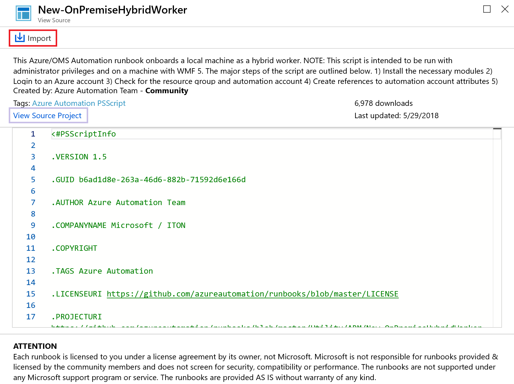
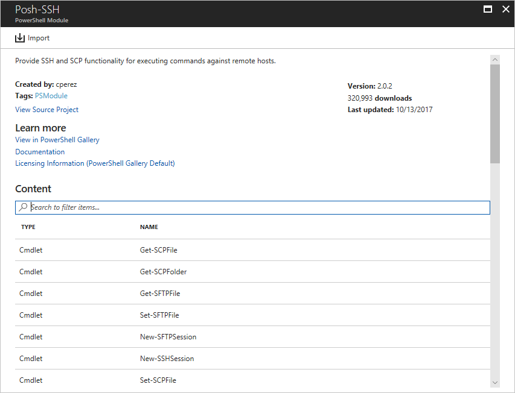

# Use runbooks and modules in PowerShell Gallery

Rather than creating your own runbooks and modules in Azure Automation, you can access scenarios that have already been built by Microsoft and the community. You can get PowerShell runbooks and [modules](#modules-in-powershell-gallery) from the PowerShell Gallery and [Python runbooks](#use-python-runbooks) from the Azure Automation Github organization. You can also contribute to the community by sharing [scenarios that you develop](#add-a-powershell-runbook-to-the-gallery).

> [!NOTE]
> The TechNet Script Center is retiring. All of the runbooks from Script Center in the Runbook gallery have been moved to our [Automation GitHub organization](https://github.com/azureautomation).

## Runbooks in PowerShell Gallery

The [PowerShell Gallery](https://www.powershellgallery.com/packages) provides a variety of runbooks from Microsoft and the community that you can import into Azure Automation. To use one, download a runbook from the gallery, or you can directly import runbooks from the gallery, or from your Automation account in the Azure portal.

> [!NOTE]
> Graphical runbooks are not supported in PowerShell Gallery.

You can only import directly from the PowerShell Gallery using the Azure portal. You cannot perform this function using PowerShell.

> [!NOTE]
> You should validate the contents of any runbooks that you get from the PowerShell Gallery and use extreme caution in installing and running them in a production environment.

## Modules in PowerShell Gallery

PowerShell modules contain cmdlets that you can use in your runbooks, and existing modules that you can install in Azure Automation are available in the [PowerShell Gallery](https://www.powershellgallery.com). You can launch this gallery from the Azure portal and install them directly into Azure Automation. You can also download them and install them manually.

## Common scenarios available in PowerShell Gallery

The list below contains a few runbooks that support common scenarios. For a full list of runbooks created by the Azure Automation team, see [AzureAutomationTeam profile](https://www.powershellgallery.com/profiles/AzureAutomationTeam).

   * [Update-ModulesInAutomationToLatestVersion](https://www.powershellgallery.com/packages/Update-ModulesInAutomationToLatestVersion/) - Imports the latest version of all modules in an Automation account from PowerShell Gallery.
   * [Enable-AzureDiagnostics](https://www.powershellgallery.com/packages/Enable-AzureDiagnostics/) - Configures Azure Diagnostics and Log Analytics to receive Azure Automation logs containing job status and job streams.
   * [Copy-ItemFromAzureVM](https://www.powershellgallery.com/packages/Copy-ItemFromAzureVM/) - Copies a remote file from a Windows Azure virtual machine.
   * [Copy-ItemToAzureVM](https://www.powershellgallery.com/packages/Copy-ItemToAzureVM/) - Copies a local file to an Azure virtual machine.

## Import a PowerShell runbook from the runbook gallery with the Azure portal

1. In the Azure portal, open your Automation account.
2. Select **Runbooks gallery** under **Process Automation**.
3. Select **Source: PowerShell Gallery**.
4. Locate the gallery item you want and select it to view its details. On the left, you can enter additional search parameters for the publisher and type.

   

5. Click on **View source project** to view the item in the [Azure Automation GitHub Organization](https://github.com/azureautomation).
6. To import an item, click on it to view its details and then click **Import**.

   

7. Optionally, change the name of the runbook and then click **OK** to import the runbook.
8. The runbook appears on the **Runbooks** tab for the Automation account.

## Add a PowerShell runbook to the gallery

Microsoft encourages you to add runbooks to the PowerShell Gallery that you think would be useful to other customers. The PowerShell Gallery accepts PowerShell modules and PowerShell scripts. You can add a runbook by [uploading it to the PowerShell Gallery](/powershell/scripting/gallery/how-to/publishing-packages/publishing-a-package).

## Import a module from the module gallery with the Azure portal

1. In the Azure portal, open your Automation account.
2. Select **Modules** under **Shared Resources** to open the list of modules.
3. Click **Browse gallery** from the top of the page.

   

4. On the Browse gallery page, you can search by the following fields:

   * Module Name
   * Tags
   * Author
   * Cmdlet/DSC resource name

5. Locate a module that you're interested in and select it to view its details.

   When you drill into a specific module, you can view more information. This information includes a link back to the PowerShell Gallery, any required dependencies, and all of the cmdlets or DSC resources that the module contains.

   

6. To install the module directly into Azure Automation, click **Import**.
7. On the Import pane, you can see the name of the module to import. If all the dependencies are installed, the **OK** button is activated. If you're missing dependencies, you need to import those dependencies before you can import this module.
8. On the Import pane, click **OK** to import the module. While Azure Automation imports a module to your account, it extracts metadata about the module and the cmdlets. This action might take a couple of minutes since each activity needs to be extracted.
9. You receive an initial notification that the module is being deployed and another notification when it has completed.
10. After the module is imported, you can see the available activities. You can use module resources in your runbooks and DSC resources.

> [!NOTE]
> Modules that only support PowerShell core are not supported in Azure Automation and are unable to be imported in the Azure portal, or deployed directly from the PowerShell Gallery.

## Use Python runbooks

Python Runbooks are available in the [Azure Automation GitHub organization](https://github.com/azureautomation). When you contribute to our GitHub repo, add the tag **(Github Topic) : Python3** when you upload your contribution.

## Request a runbook or module

You can send requests to [User Voice](https://feedback.azure.com/forums/246290-azure-automation/).  If you need help with writing a runbook or have a question about PowerShell, post a question to our [Microsoft Q&A question page](/answers/topics/azure-automation.html).

## Next steps

* To get started with a PowerShell runbook, see [Tutorial: Create a PowerShell runbook](learn/automation-tutorial-runbook-textual-powershell.md).
* To work with runbooks, see [Manage runbooks in Azure Automation](manage-runbooks.md).
* For details of PowerShell, see [PowerShell Docs](/powershell/scripting/overview).
* For a PowerShell cmdlet reference, see [Az.Automation](/powershell/module/az.automation).
