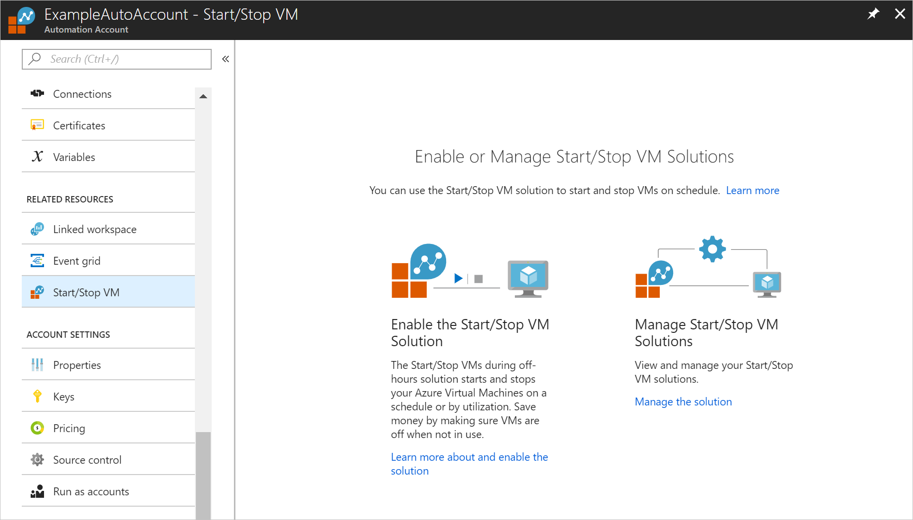
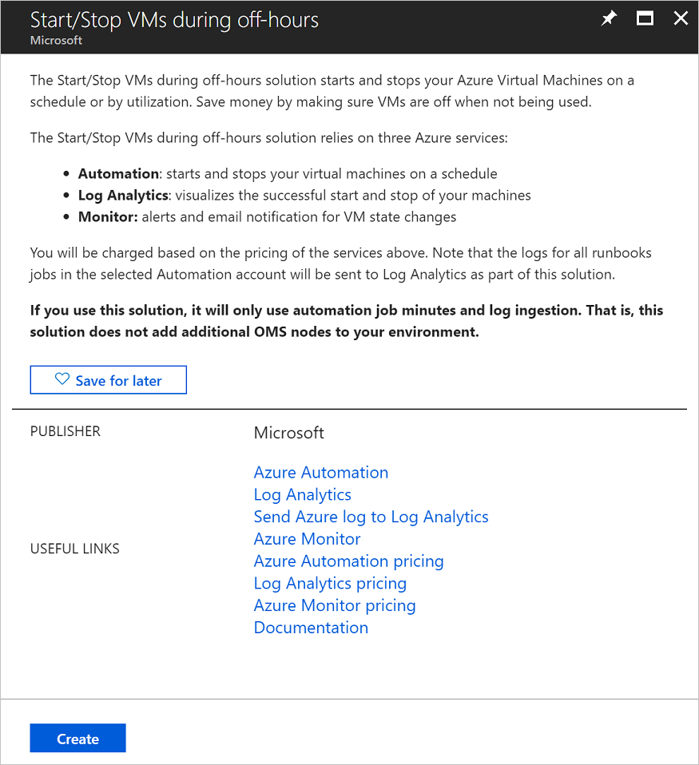
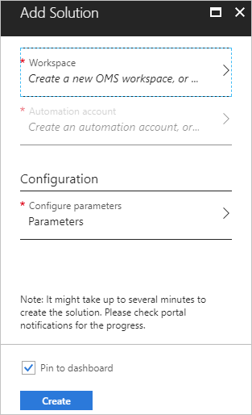

# Enable Azure Start/Stop VMs solution

Perform the following steps to add the Start/Stop VMs during off-hours solution to your Automation account, and then configure the variables to customize the solution.

1. Sign in to the Azure [portal](https://portal.azure.com).

2. Search for and select **Automation Accounts**.

3. On the **Automation Accounts** page, select your Automation account from the list.

4. From the Automation Account, select **Start/Stop VM** under **Related Resources**. From here, you can click **Learn more about and enable the solution**. If you already have a Start/Stop VM solution deployed, you can select it by clicking **Manage the solution** and finding it in the list.

   

   > [!NOTE]
   > You can also create it from anywhere in the Azure portal, by clicking **Create a resource**. In the Marketplace page, type a keyword such as **Start** or **Start/Stop**. As you begin typing, the list filters based on your input. Alternatively, you can type in one or more keywords from the full name of the solution and then press Enter. Select **Start/Stop VMs during off-hours** from the search results.

5. In the **Start/Stop VMs during off-hours** page for the selected solution, review the summary information and then click **Create**.

   

6. The **Add Solution** page appears. You are prompted to configure the solution before you can import it into your Automation subscription.

   

7. On the **Add Solution** page, select **Workspace**. Select a Log Analytics workspace that's linked to the same Azure subscription that the Automation account is in. If you don't have a workspace, select **Create New Workspace**. On the **Log Analytics workspace** page, perform the following steps:

   - Specify a name for the new **Log Analytics workspace**, such as "ContosoLAWorkspace".
   - Select a **Subscription** to link to by selecting from the drop-down list, if the default selected is not appropriate.
   - For **Resource Group**, you can create a new resource group or select an existing one.
   - Select a **Location**.
   - Select a **Pricing tier**. Choose the **Per GB (Standalone)** option. Azure Monitor logs have updated [pricing](https://azure.microsoft.com/pricing/details/log-analytics/) and the Per GB tier is the only option.

   > [!NOTE]
   > When enabling solutions, only certain regions are supported for linking a Log Analytics workspace and an Automation Account.
   >
   > For a list of the supported mapping pairs, see [Region mapping for Automation Account and Log Analytics workspace](how-to/region-mappings.md).

8. After providing the required information on the **Log Analytics workspace** page, click **Create**. You can track its progress under **Notifications** from the menu, which returns you to the **Add Solution** page when done.

9. On the **Add Solution** page, select **Automation account**. If you're creating a new Log Analytics workspace, you can create a new Automation account to be associated with it, or select an existing Automation Account that is not already linked to a Log Analytics workspace. Select an existing Automation Account or click **Create an Automation account**, and on the **Add Automation account** page, provide the following information:
 
   - In the **Name** field, enter the name of the Automation account.

     All other options are automatically populated based on the Log Analytics workspace selected. These options cannot be modified. An Azure Run As account is the default authentication method for the runbooks included in this solution. After you click **OK**, the configuration options are validated and the Automation account is created. You can track its progress under **Notifications** from the menu.

10. Finally, on the **Add Solution** page, select **Configuration**. The **Parameters** page appears.

   

   Here, you're prompted to:
  
   - Specify the **Target ResourceGroup Names**. These values are resource group names that contain VMs to be managed by this solution. You can enter more than one name and separate each by using a comma (values are not case-sensitive). Using a wildcard is supported if you want to target VMs in all resource groups in the subscription. This value is stored in the **External_Start_ResourceGroupNames** and **External_Stop_ResourceGroupNames** variables.
  
   - Specify the **VM Exclude List (string)**. This value is the name of one or more virtual machines from the target resource group. You can enter more than one name and separate each by using a comma (values are not case-sensitive). Using a wildcard is supported. This value is stored in the **External_ExcludeVMNames** variable.
  
   - Select a **Schedule**. Select a date and time for your schedule. A reoccurring daily schedule will be created starting with the time that you selected. Selecting a different region is not available. To configure the schedule to your specific time zone after configuring the solution, see [Modifying the startup and shutdown schedule](automation-solution-vm-management-config.md#modify-the-startup-and-shutdown-schedules).
  
   - To receive **Email notifications** from an action group, accept the default value of **Yes** and provide a valid email address. If you select **No** but decide at a later date that you want to receive email notifications, you can update the [action group](../azure-monitor/platform/action-groups.md) that is created with valid email addresses separated by a comma. You also need to enable the following alert rules:

     - AutoStop_VM_Child
     - Scheduled_StartStop_Parent
     - Sequenced_StartStop_Parent

     > [!IMPORTANT]
     > The default value for **Target ResourceGroup Names** is a **&ast;**. This targets all VMs in a subscription. If you do not want the solution to target all the VMs in your subscription this value needs to be updated to a list of resource group names prior to enabling the schedules.

11. After you have configured the initial settings required for the solution, click **OK** to close the **Parameters** page and select **Create**. 

After all settings are validated, the solution is deployed to your subscription. This process can take several seconds to finish, and you can track its progress under **Notifications** from the menu.

> [!NOTE]
> If you have an Azure Cloud Solution Provider (Azure CSP) subscription, after deployment is complete, in your Automation Account, go to **Variables** under **Shared Resources** and set the [**External_EnableClassicVMs**](automation-solution-vm-management.md#variables) variable to **False**. This stops the solution from looking for Classic VM resources.

## Next steps

