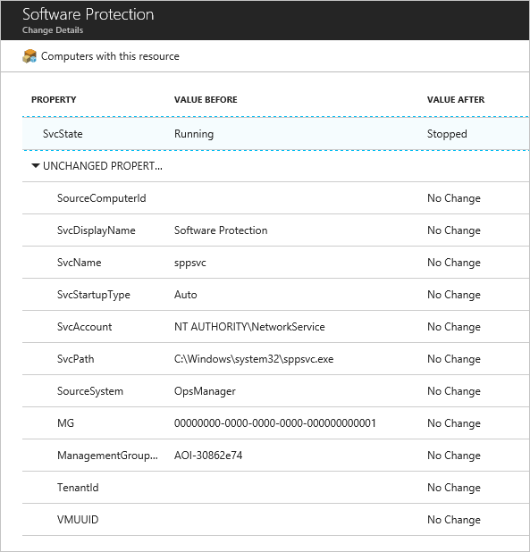
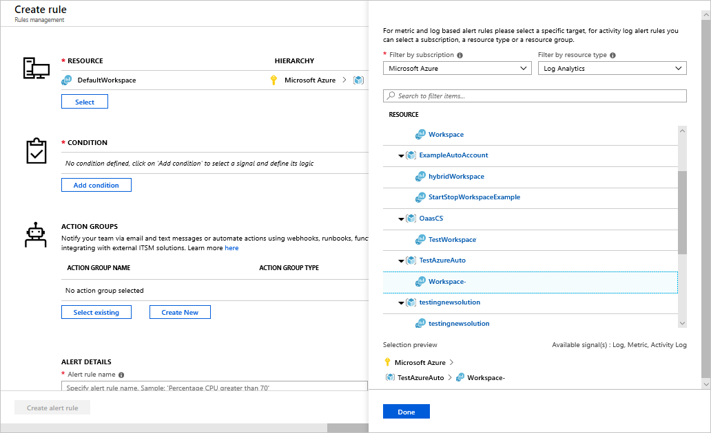
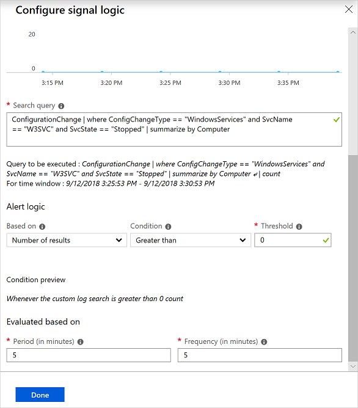
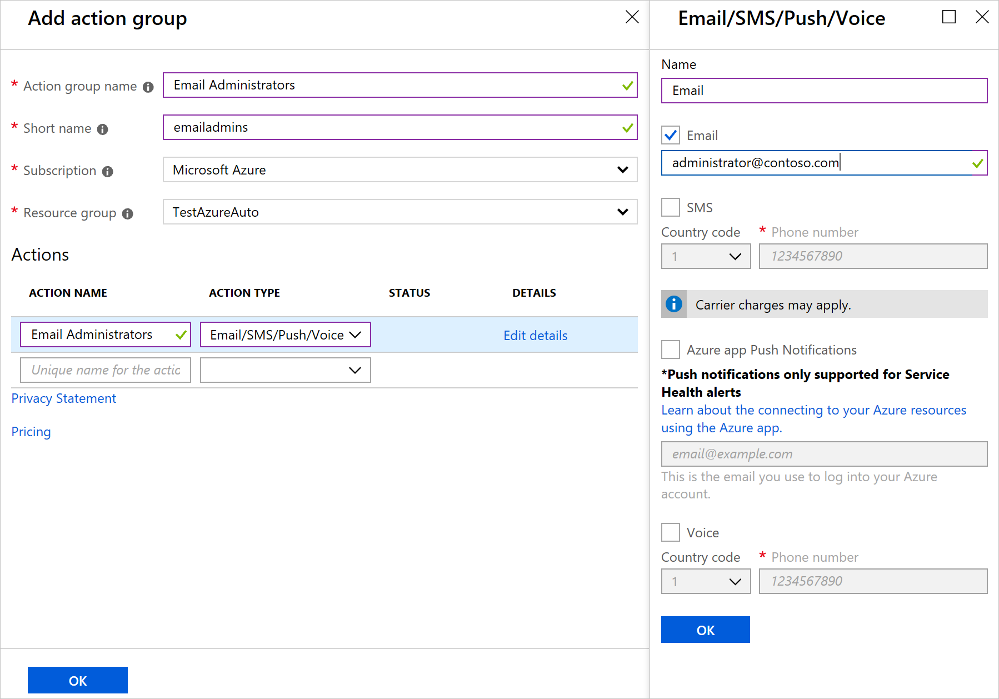
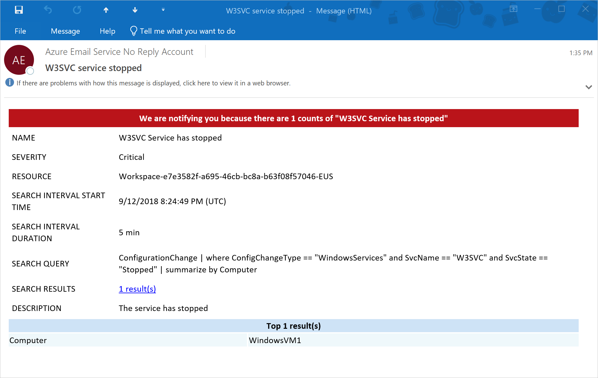

# Troubleshoot changes on an Azure VM

In this tutorial, you learn how to troubleshoot changes on an Azure virtual machine. By enabling Change Tracking and Inventory, you can track changes to software, files, Linux daemons, Windows Services, and Windows Registry keys on your computers.
Identifying these configuration changes can help you pinpoint operational issues across your environment.

In this tutorial you learn how to:

> [!div class="checklist"]
> * Enable Change Tracking and Inventory for a VM
> * Search change logs for stopped services
> * Configure change tracking
> * Enable Activity log connection
> * Trigger an event
> * View changes
> * Configure alerts

## Prerequisites

To complete this tutorial, you need:

* An Azure subscription. If you don't have one yet, you can [activate your MSDN subscriber benefits](https://azure.microsoft.com/pricing/member-offers/msdn-benefits-details/) or sign up for a [free account](https://azure.microsoft.com/free/?WT.mc_id=A261C142F).
* An [Automation account](./index.yml) to hold the watcher and action runbooks and the Watcher task.
* A [virtual machine](../virtual-machines/windows/quick-create-portal.md) to enable for the feature.

## Sign in to Azure

Sign in to the Azure portal at https://portal.azure.com.

## Enable Change Tracking and Inventory

First you need to enable Change Tracking and Inventory for this tutorial. If you've previously enabled the feature, this step is not necessary.

>[!NOTE]
>If the fields are grayed out, another Automation feature is enabled for the VM, and you must use same workspace and Automation account.

1. Select **Virtual machines** and select a VM from the list.
2. On the left menu, select **Inventory** under **Operations**. The Inventory page opens.

    

3. Choose the [Log Analytics](../log-analytics/log-analytics-overview.md?toc=%2fazure%2fautomation%2ftoc.json) workspace. This workspace collects data that is generated by features such as Change Tracking and Inventory. The workspace provides a single location to review and analyze data from multiple sources.

    [!INCLUDE [azure-monitor-log-analytics-rebrand](../../includes/azure-monitor-log-analytics-rebrand.md)]

4. Select the Automation account to use.

5. Configure the location for the deployment.

5. Click **Enable** to deploy the feature for your VM. 

During setup, the VM is provisioned with the Log Analytics agent for Windows and a [Hybrid Runbook Worker](automation-hybrid-runbook-worker.md). Enabling Change Tracking and Inventory can take up to 15 minutes. During this time, you shouldn't close the browser window.

After the feature is enabled, information about installed software and changes on the VM flows to Azure Monitor logs.
It can take between 30 minutes and 6 hours for the data to be available for analysis.

## Use Change Tracking and Inventory in Azure Monitor logs

Change Tracking and Inventory generates log data that is sent to Azure Monitor logs. To search the logs by running queries, select **Log Analytics** at the top of the Change tracking page. Change tracking data is stored under the type `ConfigurationChange`.

The following example Log Analytics query returns all the Windows services that have been stopped.

```loganalytics
ConfigurationChange
| where ConfigChangeType == "WindowsServices" and SvcState == "Stopped"
```

To learn more about running and searching log files in Azure Monitor logs, see [Azure Monitor logs](../azure-monitor/log-query/log-query-overview.md).

## Configure change tracking

With change tracking, you choose the files and registry keys to collect and track using **Edit settings** at the top of the Change tracking page on your VM. You can add Windows registry keys, Windows files, or Linux files to track on the Workspace Configuration page.

> [!NOTE]
> Both change tracking and inventory use the same collection settings, and settings are configured on a workspace level.

### Add a Windows registry key

1. On the **Windows Registry** tab, select **Add**. 

1. On the Add Windows Registry for Change Tracking page, enter the information for the key to track and click **Save**

    |Property  |Description  |
    |---------|---------|
    |Enabled     | Determines if the setting is applied        |
    |Item Name     | Friendly name of the file to be tracked        |
    |Group     | A group name for logically grouping files        |
    |Windows Registry Key   | The path to check for the file For example: "HKEY_LOCAL_MACHINE\SOFTWARE\Microsoft\Windows\CurrentVersion\Explorer\User Shell Folders\Common Startup"      |

### Add a Windows file

1. On the **Windows Files** tab, select **Add**. 

1. On the Add Windows File for Change Tracking page, enter the information for the file or directory to track and click **Save**

    |Property  |Description  |
    |---------|---------|
    |Enabled     | Determines if the setting is applied        |
    |Item Name     | Friendly name of the file to be tracked        |
    |Group     | A group name for logically grouping files        |
    |Enter Path     | The path to check for the file For example: "c:\temp\\\*.txt"<br>You can also use environment variables such as "%winDir%\System32\\\*.*"         |
    |Recursion     | Determines if recursion is used when looking for the item to be tracked.        |
    |Upload file content for all settings| Turns on or off file content upload on tracked changes. Available options: **True** or **False**.|

### Add a Linux file

1. On the **Linux Files** tab, select **Add**. 

1. On the Add Linux File for Change Tracking page, enter the information for the file or directory to track and click **Save**.

    |Property  |Description  |
    |---------|---------|
    |Enabled     | Determines if the setting is applied        |
    |Item Name     | Friendly name of the file to be tracked        |
    |Group     | A group name for logically grouping files        |
    |Enter Path     | The path to check for the file For example: "/etc/*.conf"       |
    |Path Type     | Type of item to be tracked, possible values are File and Directory        |
    |Recursion     | Determines if recursion is used when looking for the item to be tracked.        |
    |Use Sudo     | This setting determines if sudo is used when checking for the item.         |
    |Links     | This setting determines how symbolic links dealt with when traversing directories.<br> **Ignore** - Ignores symbolic links and does not include the files/directories referenced<br>**Follow** - Follows the symbolic links during recursion and also includes the files/directories referenced<br>**Manage** - Follows the symbolic links and allows alter the treatment of returned content      |
    |Upload file content for all settings| Turns on or off file content upload on tracked changes. Available options: True or False.|

   > [!NOTE]
   > The **Manage** value for the **Links** property is not recommended. File content retrieval is not supported.

## Enable Activity log connection

1. From the Change tracking page on your VM, select **Manage Activity Log Connection**. 

2. On the Azure Activity log page, click **Connect** to connect Change Tracking and Inventory to the Azure activity log for your VM.

3. Navigate to the Overview page for your VM and select **Stop** to stop your VM. 

4. When prompted, select **Yes** to stop the VM. 

5. When the VM is deallocated, select **Start** to restart it. Stopping and starting a VM logs an event in its Activity Log. 

## View changes

1. Navigate back to the Change tracking page and select the **Events** tab at the bottom of the page. 

2. After a while, change tracking events are shown in the chart and the table. The chart shows changes that have occurred over time. The line graph at the top displays Azure Activity Log events. Each row of bar graphs represents a different trackable change type. These types are Linux daemons, files, Windows registry keys, software, and Windows services. The change tab shows the details for the displayed changes, with the most recent change displayed first.

    

3. Notice that there have been multiple changes to the system, including changes to services and software. You can use the filters at the top of the page to filter the results by **Change type** or by a time range.

    

4. Select a **WindowsServices** change. This selection opens the Change Details page showing details about the change and the values before and after the change. In this instance, the Software Protection service was stopped.

    

## Configure alerts

Viewing changes in the Azure portal can be helpful, but being able to be alerted when a change occurs, such as a stopped service is more beneficial. Let's add an alert for a stopped service. 

1. In the Azure portal, go to **Monitor**. 

2. Select **Alerts** under **Shared Services**, and click **+ New alert rule**.

3. Click **Select** to choose a resource. 

4. On the Select a resource page, choose **Log Analytics** from the **Filter by resource type** dropdown menu. 

5. Select your Log Analytics workspace, and then click **Done**.

    

6. Click **Add condition**.

7. In the table on the Configure signal logic page, select **Custom log search**. 

8. Enter the following query in the search query text box:

    ```loganalytics
    ConfigurationChange | where ConfigChangeType == "WindowsServices" and SvcName == "W3SVC" and SvcState == "Stopped" | summarize by Computer
    ```

    This query returns the computers that had the W3SVC service stopped in the specified timeframe.

9. For **Threshold** under **Alert logic**, enter **0**. When you're finished, click **Done**.

    

10. Select **Create New** under **Action Groups**. An action group is a group of actions that you can use across multiple alerts. The actions can include but are not limited to email notifications, runbooks, webhooks, and many more. To learn more about action groups, see [Create and manage action groups](../azure-monitor/platform/action-groups.md).

11. Under **Alert details**, enter a name and description for the alert. 

12. Set **Severity** to **Informational(Sev 2)**, **Warning(Sev 1)**, or **Critical(Sev 0)**.

13. In the **Action group name** box, enter a name for the alert and a short name. The short name is used in place of a full action group name when notifications are sent using this group.

14. For **Actions**, enter a name for the action, such as **Email Administrators**. 

15. For **ACTION TYPE**, select **Email/SMS/Push/Voice**. 

16. For **DETAILS**, select **Edit details**.

    

17. In the Email/SMS/Push/Voice pane, enter a name, select the **Email** checkbox, and then enter a valid email address. When finished, click **OK** on the pane, then click **OK** on the Add action group page.

18. To customize the subject of the alert email, select **Customize Actions**. 

19. For **Create rule**, select **Email subject**, then choose **Create alert rule**. The alert tells you when an update deployment succeeds, and which machines were part of that update deployment run. The following image is an example email received wen the W3SVC service stops.

    

## Next steps

In this tutorial you learned how to:

> [!div class="checklist"]
> * Enable Change Tracking and Inventory for a VM
> * Search change logs for stopped services
> * Configure change tracking
> * Enable Activity Log connection
> * Trigger an event
> * View changes
> * Configure alerts

Continue to the overview for the Change Tracking and Inventory feature to learn more about it.

> [!div class="nextstepaction"]
> [Change Tracking and Inventory overview](./change-tracking.md)
