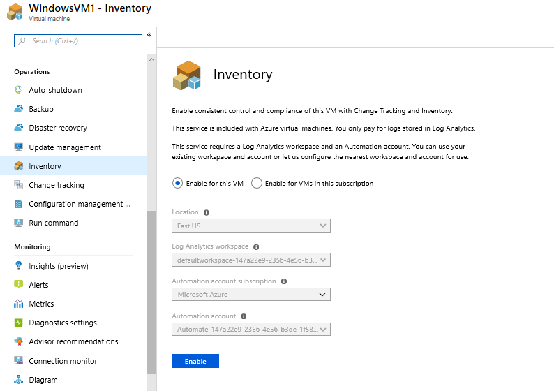
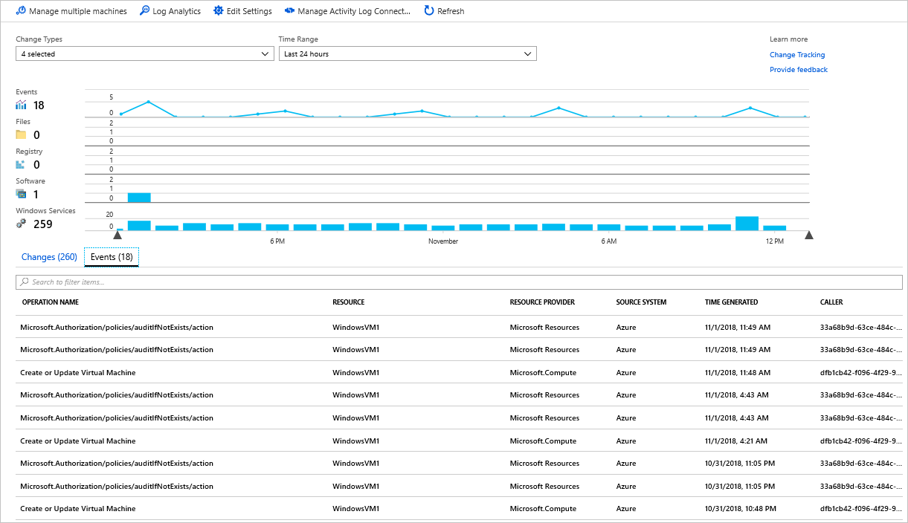

# Troubleshoot changes in your environment

In this tutorial, you learn how to troubleshoot changes on an Azure virtual machine. By enabling Change tracking, you can track changes to software, files, Linux daemons, Windows Services, and Windows Registry keys on your computers.
Identifying these configuration changes can help you pinpoint operational issues across your environment.

In this tutorial you learn how to:

> [!div class="checklist"]
> * Onboard a VM for Change tracking and Inventory
> * View changes
> * Search inventory logs for installed software
> * Configure change tracking
> * Enable Activity log connection
> * Trigger an event
> * View changes

## Prerequisites

To complete this tutorial:

* Azure subscription. If you don't have one yet, you can [activate your MSDN subscriber benefits](https://azure.microsoft.com/pricing/member-offers/msdn-benefits-details/) or sign up for a [free account](https://azure.microsoft.com/free/?WT.mc_id=A261C142F).
* [Automation account](automation-offering-get-started.md) to hold the watcher and action runbooks and the Watcher Task.
* A [virtual machine](../virtual-machines/windows/quick-create-portal.md) to onboard.

## Log in to Azure

Log in to the Azure portal at http://portal.azure.com.

## Enable Change tracking and Inventory

First you need to enable Change tracking and Inventory for your VM for this tutorial. If you have previously enabled another automation solution for a VM, this step is not necessary.

1. On the left menu, select **Virtual machines** and select a VM from the list
1. On the left menu, under the **Operations** section, click **Inventory**. The **Enable Change tracking and Inventory** page opens.

Validation is performed to determine if Change tracking and Inventory is enabled for this VM.
The validation includes checks for a Log Analytics workspace and linked Automation account, and if the solution is in the workspace.

A [Log Analytics](../log-analytics/log-analytics-overview.md?toc=%2fazure%2fautomation%2ftoc.json) workspace is used to collect data that is generated by features and services such as Inventory.
The workspace provides a single location to review and analyze data from multiple sources.

The validation process also checks to see if the VM is provisioned with the Microsoft Monitoring Agent (MMA) and hybrid worker.
This agent is used to communicate with the VM and obtain information about installed software.
The validation process also checks to see if the VM is provisioned with the Microsoft Monitoring Agent (MMA) and Automation hybrid runbook worker.

If these prerequisites aren't met, a banner appears that gives you the option to enable the solution.



To enable the solution, click the banner.
If any of the following prerequisites were found to be missing after the validation, they're automatically added:

* [Log Analytics](../log-analytics/log-analytics-overview.md) workspace
* [Automation](./automation-offering-get-started.md)
* A [Hybrid runbook worker](./automation-hybrid-runbook-worker.md) is enabled on the VM

The **Change Tracking and Inventory** screen opens. Configure the location, Log analytics workspace, and Automation account to use and click **Enable**. If the fields are grayed out, that means another automation solution is enabled for the VM and the same workspace and Automation account must be used.


Enabling the solution can take up to 15 minutes. During this time, you shouldn't close the browser window.
After the solution is enabled, information about installed software and changes on the VM flows to Log Analytics.
It can take between 30 minutes and 6 hours for the data to be available for analysis.


## Using Change tracking in Log Analytics

Change tracking generates log data that is sent to Log Analytics. 
To search the logs by running queries, select **Log Analytics** at the top of the **Change tracking** window.
Change tracking data is stored under the type **ConfigurationChange**. 
The following sample Log Analytics query returns all the Windows Services that have been stopped.

```
ConfigurationChange
| where ConfigChangeType == "WindowsServices" and SvcState == "Stopped"
```

To learn more about running and searching log files in Log Analytics, see [Azure Log Analytics](https://docs.loganalytics.io/index).

## Configure Change tracking

Change tracking gives you the ability to track configuration changes on your VM. The following steps show you how to configure tracking of registry keys and files.
 
To choose which files and Registry keys to collect and track, select **Edit settings** at the top of the **Change tracking** page.

> [!NOTE]
> Inventory and Change tracking use the same collection settings, and settings are configured on a workspace level.

In the **Workspace Configuration** window, add the Windows Registry keys, Windows files, or Linux files to be tracked, as outlined in the next three sections.

### Add a Windows Registry key

1. On the **Windows Registry** tab, select **Add**.
    The **Add Windows Registry for Change Tracking** window opens.

   

2. Under **Enabled**, select **True**.
3. In the **Item Name** box, enter a friendly name.
4. (Optional) In the **Group** box, enter a group name.
5. In the **Windows Registry Key** box, enter the name of the registry key you want to track.
6. Select **Save**.

### Add a Windows file

1. On the **Windows Files** tab, select **Add**.  
    The **Add Windows File for Change Tracking** window opens.

   

2. Under **Enabled**, select **True**.
3. In the **Item Name** box, enter a friendly name.
4. (Optional) In the **Group** box, enter a group name.
5. In the **Enter Path** box, enter the full path and file name of the file you want to track.
6. Select **Save**.

### Add a Linux file

1. On the **Linux Files** tab, select **Add**.  
    The **Add Linux File for Change Tracking** window opens.

   

2. Under **Enabled**, select **True**.
3. In the **Item Name** box, enter a friendly name.
4. (Optional) In the **Group** box, enter a group name.
5. In the **Enter Path** box, enter the full path and file name of the file you want to track.
6. In the **Path Type** box, select either **File** or **Directory**.
7. Under **Recursion**, to track changes for the specified path and all files and paths under it, select **On**. To track only the selected path or file, select **Off**.
8. Under **Use Sudo**, to track files that require the `sudo` command to access, select **On**. Otherwise, select **Off**.
9. Select **Save**.

## Enable Activity log connection

From the **Change tracking** page on your VM, select **Manage Activity Log Connection**. This task opens the **Azure Activity log** page.  Select **Connect** to connect Change tracking to the Azure activity log for your VM.

With this setting enabled, navigate to the **Overview** page for your VM and select **Stop** to stop your VM. When prompted, select **Yes** to stop the VM. When it is dealocated, select **Start** to restart your VM.

Stopping and starting a VM logs an event in it's activity log. Navigate back to the **Change tracking** page. Select the **Events** tab at the bottom of the page. After a while, the events shown in the chart and the table. Like in the preceding step, each event can be selected to view detailed information on the event.



## View changes

Once the Change tracking and Inventory solution is enabled, you can view the results on the **Change tracking** page.

From within your VM, select **Change tracking** under **OPERATIONS**.


The chart shows changes that have occurred over time.
After you have added an Activity Log connection, the line graph at the top displays Azure Activity Log events.
Each row of bar graphs represents a different trackable Change type.
These types are Linux daemons, files, Windows Registry keys, software, and Windows services.
The change tab shows the details for the changes shown in the visualization in descending order of time that the change occurred (most recent first).
The **Events** tab, the table displays the connected Activity Log events and their corresponding details with the most recent first.

You can see in the results, that there were multiple changes to the system, including changes to services and software. You can use the filters at the top of the page to filter the results by **Change type** or by a time range.

Select a **WindowsServices** change, this opens the **Change Details** window. The change details window shows details about the change and the values before and after the change. In this instance the Software Protection service was stopped.


## Next Steps

In this tutorial you learned how to:

> [!div class="checklist"]
> * Onboard a VM for Change tracking and Inventory
> * View changes
> * Search inventory logs for installed software
> * Configure change tracking
> * Enable Activity log connection
> * Trigger an event
> * View changes

Continue to the overview for the Change tracking and Inventory solution to learn more about it.

> [!div class="nextstepaction"]
> [Change management and Inventory solution](../operations-management-suite/log-analytics-change-tracking.md?toc=%2fazure%2fautomation%2ftoc.json)
