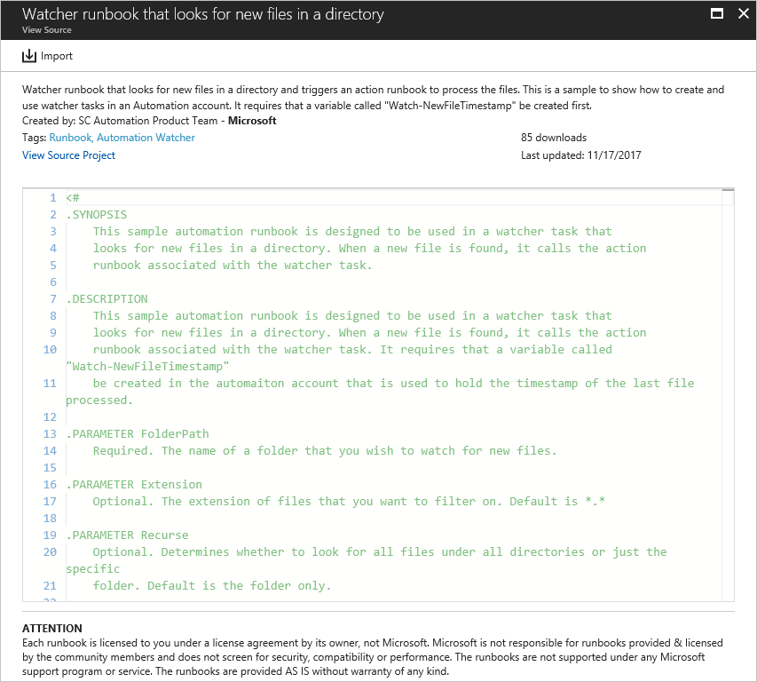
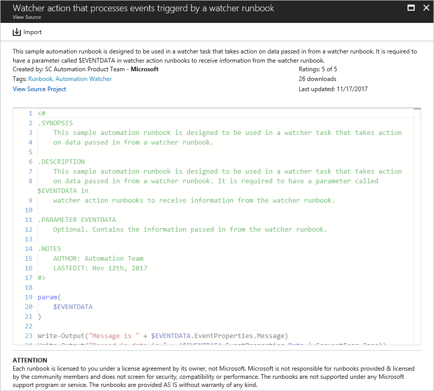
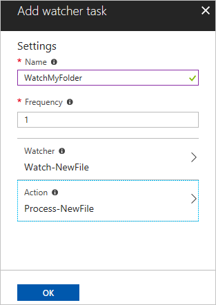

# Track updated files with a watcher task

Azure Automation uses a watcher task to look for events and trigger actions with PowerShell runbooks. The watcher task contains two parts, the watcher and the action. A watcher runbook runs at an interval defined in the watcher task, and outputs data to an action runbook. 

> [!NOTE]
> Watcher tasks are not supported in Azure China Vianet 21.

> [!IMPORTANT]
> Starting in May 2020, using Azure Logic Apps is the supported way to monitor for events, schedule recurring tasks, and trigger actions. See [Schedule and run recurring automated tasks, processes, and workflows with Azure Logic Apps](https://docs.microsoft.com/en-us/azure/logic-apps/concepts-schedule-automated-recurring-tasks-workflows).

This tutorial walks you through creating a watcher task to monitor when a new file is added to a directory. You learn how to:

> [!div class="checklist"]
> * Import a watcher runbook
> * Create an Automation variable
> * Create an action runbook
> * Create a watcher task
> * Trigger a watcher
> * Inspect the output

## Prerequisites

To complete this tutorial, the following are required:

* Azure subscription. If you don't have one yet, you can [activate your MSDN subscriber benefits](https://azure.microsoft.com/pricing/member-offers/msdn-benefits-details/) or sign up for a [free account](https://azure.microsoft.com/free/?WT.mc_id=A261C142F).
* [Automation account](automation-offering-get-started.md) to hold the watcher and action runbooks and the Watcher Task.
* A [hybrid runbook worker](automation-hybrid-runbook-worker.md) where the watcher task runs.
* PowerShell runbooks. PowerShell Workflow runbooks aren't supported by watcher tasks.

## Import a watcher runbook

This tutorial uses a watcher runbook called **Watch-NewFile** to look for new files in a directory. The watcher runbook retrieves the last known write time to the files in a folder and looks at any files newer than that watermark.

This import process can be done through the [PowerShell Gallery](https://www.powershellgallery.com).

1. Navigate to the gallery page for [Watch-NewFile.ps1](https://gallery.technet.microsoft.com/scriptcenter/Watcher-runbook-that-looks-36fc82cd).
2. Under the **Azure Automation** tab, click **Deploy to Azure Automation**.

You can also import this runbook into your automation account from the portal using the following steps.

1. Open your Automation account, and click on the Runbooks page.
2. Click **Browse gallery**.
3. Search for **Watcher runbook**, select **Watcher runbook that looks for new files in a directory**, and click **Import**.
  
4. Give the runbook a name and description and click **OK** to import the runbook into your Automation account.
5. Select **Edit** and then click **Publish**. When prompted, click **Yes** to publish the runbook.

## Create an Automation variable

An [automation variable](automation-variables.md) is used to store the timestamps that the preceding runbook reads and stores from each file.

1. Select **Variables** under **Shared Resources** and click **+ Add a variable**.
1. Enter Watch-NewFileTimestamp for the name.
1. Select DateTime for the type.
1. Click **Create** to create the Automation variable.

## Create an action runbook

An action runbook is used in a watcher task to act on the data passed to it from a watcher runbook. You must import a predefined action runbook called **Process-NewFile** from the [PowerShell Gallery](https://www.powershellgallery.com). 

To create an action runbook:

1. Navigate to the gallery page for [Process-NewFile.ps1](https://gallery.technet.microsoft.com/scriptcenter/Watcher-action-that-b4ff7cdf).
2. Under the **Azure Automation** tab, click **Deploy to Azure Automation**.

You can also import this runbook into your Automation account from the Azure portal:

1. Navigate to your Automation account and select **Runbooks** under **Process Automation**.
1. Click **Browse gallery**.
1. Search for **Watcher action**, select **Watcher action that processes events triggered by a watcher runbook**, and click **Import**.
  
1. Give the runbook a name and description and click **OK** to import the runbook into your Automation account.
1. Select **Edit** and then click **Publish**. When prompted, click **Yes** to publish the runbook.

## Create a watcher task

In this step, you configure the watcher task referencing the watcher and action runbooks defined in the preceding sections.

1. Navigate to your Automation account and select **Watcher tasks** under **Process Automation**.
1. Select the Watcher tasks page and click **+ Add a watcher task**.
1. Enter **WatchMyFolder** as the name.

1. Select **Configure watcher** and choose the **Watch-NewFile** runbook.

1. Enter the following values for the parameters:

   * **FOLDERPATH** - A folder on the Hybrid Runbook Worker where new files get created, for example, **d:\examplefiles**.
   * **EXTENSION** - Extension for the configuration. Leave blank to process all file extensions.
   * **RECURSE** - Recursive operation. Leave this value as the default.
   * **RUN SETTINGS** - Setting for running the runbook. Pick the hybrid worker.

1. Click **OK**, and then **Select** to return to the Watcher page.
1. Select **Configure action** and choose the **Process-NewFile** runbook.
1. Enter the following values for the parameters:

   * **EVENTDATA** - Event data. Leave blank. Data is passed in from the watcher runbook.
   * **Run Settings** - Setting for running the runbook. Leave as Azure, as this runbook runs in Azure Automation.

1. Click **OK**, and then **Select** to return to the Watcher page.
1. Click **OK** to create the watcher task.



## Trigger a watcher

You must run a test as described below to ensure that the watcher task works as expected. 

1. Remote into the Hybrid Runbook Worker. 
2. Open **PowerShell** and create a test file in the folder.

```azurepowerShell-interactive
New-Item -Name ExampleFile1.txt
```

The following example shows the expected output.

```output
    Directory: D:\examplefiles


Mode                LastWriteTime         Length Name
----                -------------         ------ ----
-a----       12/11/2017   9:05 PM              0 ExampleFile1.txt
```

## Inspect the output

1. Navigate to your Automation account and select **Watcher tasks** under **Process Automation**.
1. Select the watcher task **WatchMyFolder**.
1. Click on **View watcher streams** under **Streams** to see that the watcher has found the new file and started the action runbook.
1. To see the action runbook jobs, click on **View watcher action jobs**. Each job can be selected to view the details of the job.

   

The expected output when the new file is found can be seen in the following example:

```output
Message is Process new file...

Passed in data is @{FileName=D:\examplefiles\ExampleFile1.txt; Length=0}
```

## Next steps

In this tutorial, you learned how to:

> [!div class="checklist"]
> * Import a watcher runbook
> * Create an Automation variable
> * Create an action runbook
> * Create a watcher task
> * Trigger a watcher
> * Inspect the output

Follow this link to learn more about authoring your own runbook.

> [!div class="nextstepaction"]
> [Create a PowerShell runbook](automation-tutorial-runbook-textual-powershell.md)

