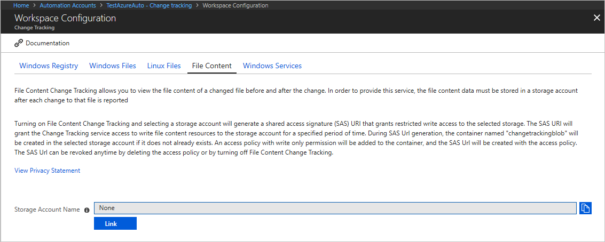
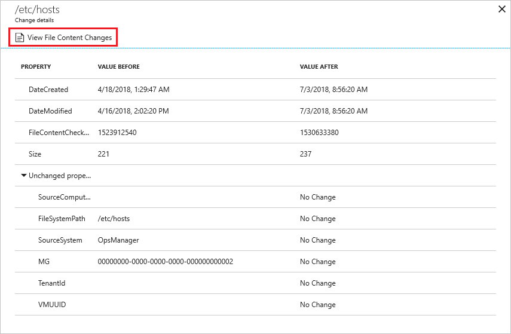
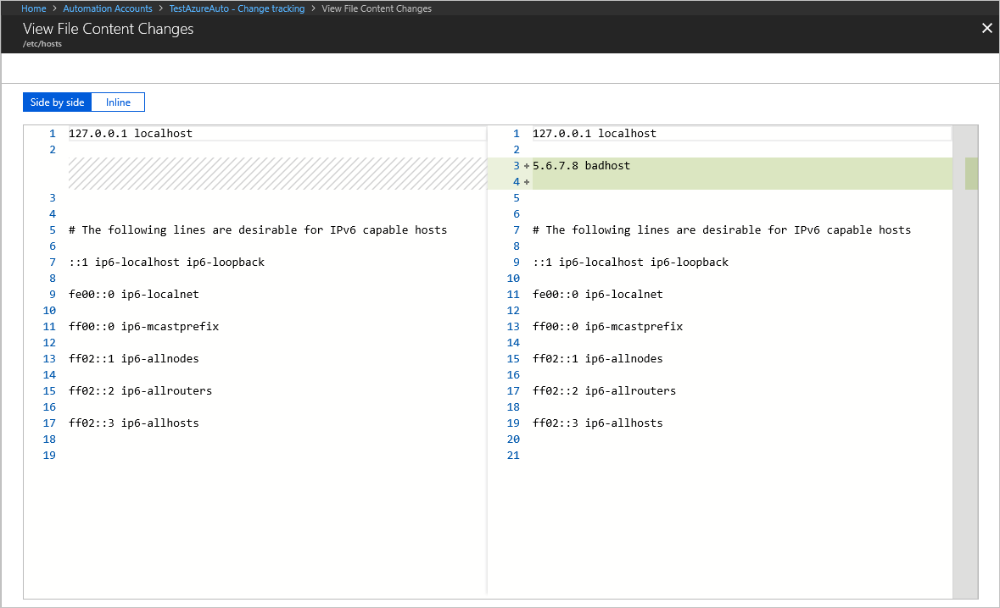

# Track changes in your environment with the Change Tracking solution

File Content tracking allows you to view the contents of a file before and after a change. To do this, it saves the file contents to a storage account after each change occurs.

## Requirements

* A standard storage account using the Resource Manager deployment model is required. Premium and service managment storage accounts should not be used. For more information on storage accounts, see [About Azure storage accounts](../storage/common/storage-create-storage-account.md)

* A storage account used for store file contents for Change Tracking can only have 1 Automation Account connected.

## Enable file content tracking

1. In the Azure portal, open your Automation account, and then select **Change tracking**.
2. On the top menu, select **Edit Settings**.
3. Select **File Content** and click **Link**. This opens the **Add Content Location for Change Tracking** pane.

   

4. Select the subscription and storage account to use to store the file contents to. If you want to enable file content tracking for all existing tracked files, select **On** for **Upload file content for all settings**. You can change this for each file path afterwards.

   

5. Once enabled, the storage account and the SAS Uris are shown. the SAS Uris expire after 1 year, and can be recreated by clicking the **Regenerate** button.

   

## Add a file

The following steps walk you through turning on change tracking for a file:

1. On the **Change Tracking** page, select either **Windows Files** or **Linux Files**, and click **Add**

1. Fill out the information for the file path and select **True** under **Upload file content for all settings**. This enables file content tracking for that file path only.

   

## Viewing the contents of a tracked file

1. Once a change has been detected for the file or a file in the path, it shows in the portal. Select the file change from the list of changes. The **Change details** pane is displayed.

   

1. On the **Change details** page you see the standard before and after file information, in the top left, click **View File Content Changes** to see the contents of the file.

  

1. The new page shows you the file contents in a side by side view. You can also select **Inline** to see an inline view of the changes.

  

## Next steps

Visit the tutorial on Change Tracking to learn more about using the solution:

> [!div class="nextstepaction"]
> [Troubleshoot changes in your environment](automation-tutorial-troubleshoot-changes.md)

* Use [Log searches in Log Analytics](../log-analytics/log-analytics-log-searches.md) to view detailed change tracking data.
