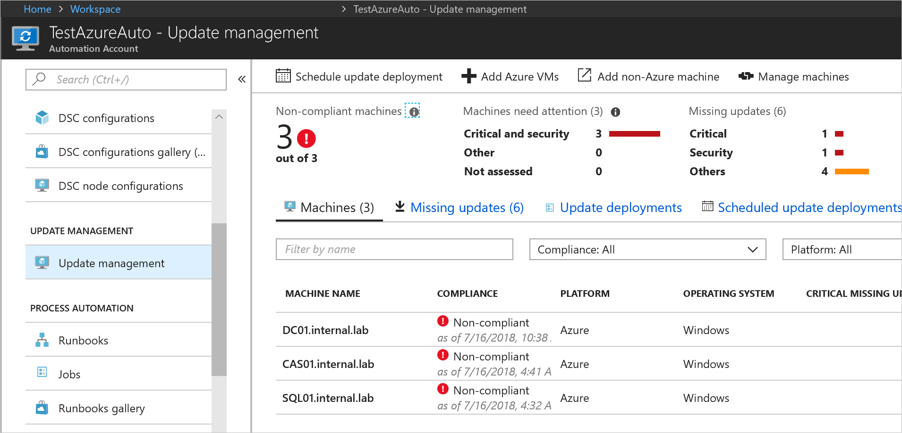
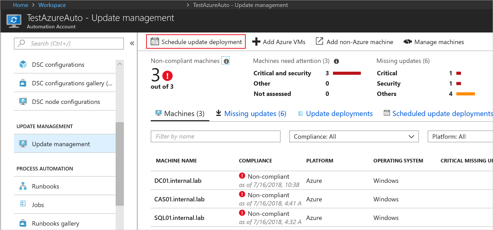

# Migrate your OMS Update Deployments to Azure

The Operations Management Suite (OMS) portal is being [deprecated](../azure-monitor/platform/oms-portal-transition.md). All functionality that was available in the OMS portal for Update Management is available in the Azure portal. This article provides the information you need in order to migrate to the Azure portal.

## Key information

* Existing deployments will continue to work. Once you have recreated the deployment in Azure, you can delete your old deployment from OMS.
* All existing features you had in OMS are available in Azure, to learn more about Update Management, see [Update Management overview](automation-update-management.md).

## Access the Azure portal

From your OMS workspace, click **Open in Azure**. This navigates to the Log Analytics workspace that OMS used.

In the Azure portal, click **Automation Account**

In your Automation Account, click **Update Management** to open up Update Management.

In the future you can go directly to the Azure portal, under **All services**, select **Automation Accounts** under **Management Tools**, select the appropriate Automation Account, and click **Update Management**.

## Recreate existing deployments

All update deployments created in the OMS portal have a [saved search](../azure-monitor/platform/computer-groups.md) also known as a computer group, with the same name as the update deployment that exists. The saved search contains the list of machines that were scheduled in the update deployment.

To use this existing saved search, follow these steps:

To create a new update deployment, go to the Azure portal, select the Automation Account that is used, and click **Update Management**. Click **Schedule update deployment**.

The **New Update Deployment** pane opens. Enter values for the properties described in the following table and then click **Create**:

For Machines to update, select the saved search used by the existing OMS deployment.

| Property | Description | | |
| --- | --- | --- | --- |
|Name |Unique name to identify the update deployment. | | |
|Operating System| Select **Linux** or **Windows**.| | |
|Machines to update |Select a Saved search, Imported group, or pick Machine from the drop-down and select individual machines. If you choose **Machines**, the readiness of the machine is shown in the **UPDATE AGENT READINESS** column.  To learn about the different methods of creating computer groups in Azure Monitor logs, see [Computer groups in Azure Monitor logs](../azure-monitor/platform/computer-groups.md) | | |
|Update classifications|Select all the update classifications that you need. CentOS does not support this out of the box.| | |
|Updates to exclude|Enter the updates to exclude. For Windows, enter the KB article without the **KB** prefix. For Linux, enter the package name or use a wildcard character.  | | |
|Schedule settings|Select the time to start, and then select either **Once** or **Recurring** for the recurrence.| Maintenance window |Number of minutes set for updates. The value can't be less than 30 minutes or more than 6 hours. |
| Maintenance window |Number of minutes set for updates. The value can be not be less than 30 minutes and no more than 6 hours | | |
| Reboot control| Determines how reboots should be handled. Available options are: Reboot if required (Default) Always reboot Never reboot Only reboot - will not install updates| | |

Click **Scheduled update deployments** to view the status of the newly created update deployment.

As mentioned previously, once your new deployments are configured through the Azure portal, the existing deployments can be removed from the OMS portal.

## Next steps

To learn more about Update Management in Azure, see [Update Management](automation-update-management.md)
