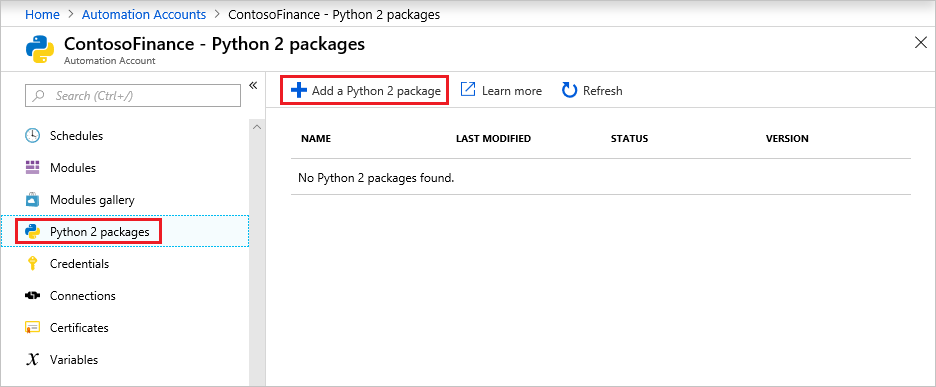

# Manage Python 2 packages in Azure Automation

Azure Automation allows you to run Python 2 runbooks on Azure and on Linux Hybrid Runbook Workers. To help in simplification of runbooks, you can use Python packages to import the modules that you need. This article describes how you manage and use Python packages in Azure Automation.

## Import packages

In your Automation Account, select **Python 2 packages** under **Shared Resources**. Click **+ Add a Python 2 package**.



On the **Add Python 2 Package** page, select a local package to upload. The package can be a `.whl` file or `.tar.gz` file. When selected, click **OK** to upload the package.


Once a package has been imported, it's listed on the **Python 2 packages** page in your Automation Account. If you need to remove a package, select the package and choose **Delete**  on the package page.


## Import packages with dependencies

Azure automation doesn't resolve dependencies for python packages during the import process. There are two ways to import a package with all its dependencies. Only one of the following steps needs to be used to import the packages into your Automation Account.

### Manually download

On a Windows 64-bit machine with `python2.7` and `pip` installed, run the following command to download a package and all its dependencies:

```
C:\Python27\Scripts\pip2.7.exe download -d <output dir> <package name>
```

Once the packages are downloaded, you can import them into your automation account.

### Runbook

Import the python runbook [Import Python 2 packages from pypi into Azure Automation account](https://gallery.technet.microsoft.com/scriptcenter/Import-Python-2-packages-57f7d509) from the gallery into your Automation Account. Make sure the Run Settings are set to **Azure** and start the runbook with the parameters. The runbook requires a Run As Account for the Automation Account to work. For each parameter make sure you start it with the switch as seen in the following list and image:

* -s \<subscriptionId\>
* -g \<resourceGroup\>
* -a \<automationAccount\>
* -m \<modulePackage\>


The runbook allows you to specify what package to download, for example, `Azure` (the fourth parameter) will download all Azure modules and all its dependencies, which is about 105.

Once the runbook has completed you can check the **Python 2 packages** page under **Shared Resources** in your Automation Account to verify that they package was imported correctly.

## Use a package in a runbook

Once you've imported a package, you can now use it in a runbook. The following example uses the [
Azure Automation utility package](https://github.com/azureautomation/azure_automation_utility). This package makes it easier to use Python with Azure Automation. To use the package, follow the instructions in the GitHub repository and add it to the runbook by using `from azure_automation_utility import get_automation_runas_credential` for example to import the function for retrieving the RunAs Account.

```python
import azure.mgmt.resource
import automationassets
from azure_automation_utility import get_automation_runas_credential

# Authenticate to Azure using the Azure Automation RunAs service principal
runas_connection = automationassets.get_automation_connection("AzureRunAsConnection")
azure_credential = get_automation_runas_credential()

# Intialize the resource management client with the RunAs credential and subscription
resource_client = azure.mgmt.resource.ResourceManagementClient(
    azure_credential,
    str(runas_connection["SubscriptionId"]))

# Get list of resource groups and print them out
groups = resource_client.resource_groups.list()
for group in groups:
    print group.name
```

## Develop and test runbooks offline

To develop and test your Python 2 runbooks offline, you can use the [Azure Automation python emulated assets](https://github.com/azureautomation/python_emulated_assets) module on GitHub. This module allows you to reference your shared resources such as credentials, variables, connections, and certificates.

## Next steps

To get started with Python 2 runbooks, see [My first Python 2 runbook](automation-first-runbook-textual-python2.md)
