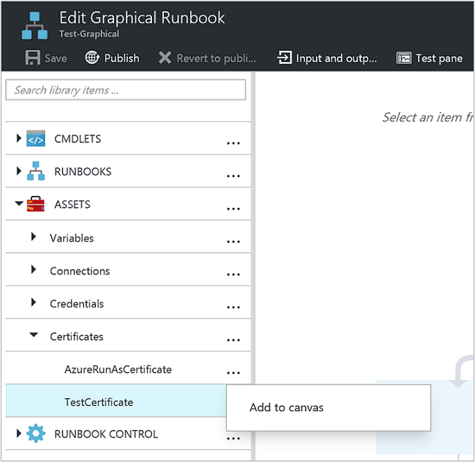
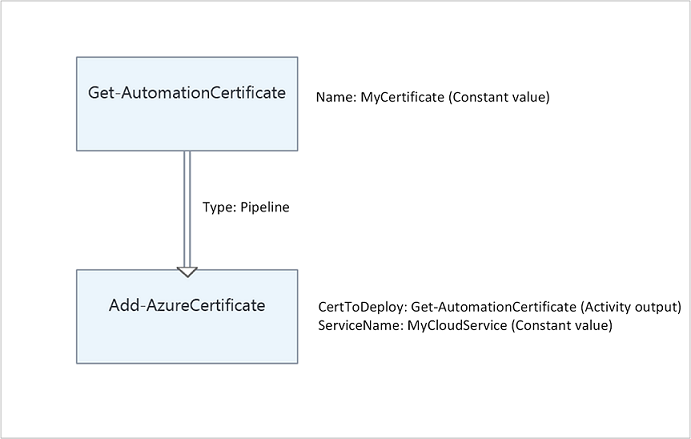

# Manage certificates in Azure Automation

Azure Automation stores certificates securely for access by runbooks and DSC configurations, by using the [Get-AzAutomationCertificate](https://docs.microsoft.com/powershell/module/Az.Automation/Get-AzAutomationCertificate?view=azps-3.7.0) cmdlet for Azure Resource Manager resources. Secure certificate storage allows you to create runbooks and DSC configurations that use certificates for authentication, or add them to Azure or third-party resources.

>[!NOTE]
>Secure assets in Azure Automation include credentials, certificates, connections, and encrypted variables. These assets are encrypted and stored in Automation by using a unique key that is generated for each Automation account. Automation stores the key in the system-managed Key Vault service. Before storing a secure asset, Automation loads the key from Key Vault, and then uses it to encrypt the asset. 

>[!NOTE]
>This article shows you how to use the Azure PowerShell Az module. You can still use the AzureRM module. To learn more about the Az module and AzureRM compatibility, see [Introducing the new Azure PowerShell Az module](https://docs.microsoft.com/powershell/azure/new-azureps-module-az?view=azps-3.5.0). For Az module installation instructions on your Hybrid Runbook Worker, see [Install the Azure PowerShell module](https://docs.microsoft.com/powershell/azure/install-az-ps?view=azps-3.5.0). For your Automation account, you can update your modules to the latest version by using [How to update Azure PowerShell modules in Azure Automation](../automation-update-azure-modules.md).

## PowerShell cmdlets to access certificates

The cmdlets in the following table create and manage Automation certificates with PowerShell. They ship as part of the [Az modules](modules.md#az-modules).

|Cmdlet |Description|
| --- | ---|
|[Get-AzAutomationCertificate](https://docs.microsoft.com/powershell/module/Az.Automation/Get-AzAutomationCertificate?view=azps-3.7.0)|Retrieves information about a certificate to use in a runbook or DSC configuration. You can only retrieve the certificate itself by using the internal `Get-AutomationCertificate` cmdlet.|
|[New-AzAutomationCertificate](https://docs.microsoft.com/powershell/module/Az.Automation/New-AzAutomationCertificate?view=azps-3.7.0)|Creates a new certificate in Automation.|
|[Remove-AzAutomationCertificate](https://docs.microsoft.com/powershell/module/Az.Automation/Remove-AzAutomationCertificate?view=azps-3.7.0)|Removes a certificate from Automation.|
|[Set-AzAutomationCertificate](https://docs.microsoft.com/powershell/module/Az.Automation/Set-AzAutomationCertificate?view=azps-3.7.0)|Sets the properties for an existing certificate, including uploading the certificate file and setting the password for a **.pfx** file.|

The [Add-AzureCertificate](/powershell/module/servicemanagement/azure/add-azurecertificate) cmdlet can also be used to upload a service certificate for the specified cloud service.

## Internal cmdlets to access certificates

The internal cmdlet in the following table is used to access certificates in your runbooks. This cmdlet comes with the global module `Orchestrator.AssetManagement.Cmdlets`. For more information, see [Internal cmdlets](modules.md#internal-cmdlets).

| Internal Cmdlet | Description |
|:---|:---|
|`Get-AutomationCertificate`|Gets a certificate to use in a runbook or DSC configuration. Returns a [System.Security.Cryptography.X509Certificates.X509Certificate2](/dotnet/api/system.security.cryptography.x509certificates.x509certificate2) object.|

> [!NOTE] 
> You should avoid using variables in the `Name` parameter of `Get-AutomationCertificate` in a runbook or DSC configuration. Such variables can complicate discovery of dependencies between runbooks or DSC configurations and Automation variables at design time.

## Python 2 functions to access certificates

Use the function in the following table to access certificates in a Python 2 runbook.

| Function | Description |
|:---|:---|
| `automationassets.get_automation_certificate` | Retrieves information about a certificate asset. |

> [!NOTE]
> You must import the `automationassets` module at the beginning of your Python runbook to access the asset functions.

## Create a new certificate

When you create a new certificate, you upload a .cer or .pfx file to Automation. If you mark the certificate as exportable, then you can transfer it out of the Automation certificate store. If it isn't exportable, then it can only be used for signing within the runbook or DSC configuration. Automation requires the certificate to have the provider **Microsoft Enhanced RSA and AES Cryptographic Provider**.

### Create a new certificate with the Azure portal

1. From your Automation account, select **Assets** > **Certificates** > **Add a certificate**..
1. In the **Name** field, type a name for the certificate.
1. To browse for a **.cer** or **.pfx** file, under **Upload a certificate file**, choose **Select a file**. If you select a **.pfx** file, specify a password and indicate if it can be exported.
1. Select **Create** to save the new certificate asset.

### Create a new certificate with PowerShell

The following example demonstrates how to create a new Automation certificate and mark it exportable. This example imports an existing **.pfx** file.

```powershell-interactive
$certificateName = 'MyCertificate'
$PfxCertPath = '.\MyCert.pfx'
$CertificatePassword = ConvertTo-SecureString -String 'P@$$w0rd' -AsPlainText -Force
$ResourceGroup = "ResourceGroup01"

New-AzAutomationCertificate -AutomationAccountName "MyAutomationAccount" -Name $certificateName -Path $PfxCertPath –Password $CertificatePassword -Exportable -ResourceGroupName $ResourceGroup
```

### Create a new certificate with a Resource Manager template

The following example demonstrates how to deploy a certificate to your Automation account by using a Resource Manager template through PowerShell:

```powershell-interactive
$AutomationAccountName = "<automation account name>"
$PfxCertPath = '<PFX cert path'
$CertificatePassword = '<password>'
$certificateName = '<certificate name>'
$AutomationAccountName = '<automation account name>'
$flags = [System.Security.Cryptography.X509Certificates.X509KeyStorageFlags]::Exportable `
    -bor [System.Security.Cryptography.X509Certificates.X509KeyStorageFlags]::PersistKeySet `
    -bor [System.Security.Cryptography.X509Certificates.X509KeyStorageFlags]::MachineKeySet
# Load the certificate into memory
$PfxCert = New-Object -TypeName System.Security.Cryptography.X509Certificates.X509Certificate2 -ArgumentList @($PfxCertPath, $CertificatePassword, $flags)
# Export the certificate and convert into base 64 string
$Base64Value = [System.Convert]::ToBase64String($PfxCert.Export([System.Security.Cryptography.X509Certificates.X509ContentType]::Pkcs12))
$Thumbprint = $PfxCert.Thumbprint


$json = @"
{
    '`$schema': 'https://schema.management.azure.com/schemas/2015-01-01/deploymentTemplate.json#',
    'contentVersion': '1.0.0.0',
    'resources': [
        {
            'name': '$AutomationAccountName/$certificateName',
            'type': 'Microsoft.Automation/automationAccounts/certificates',
            'apiVersion': '2015-10-31',
            'properties': {
                'base64Value': '$Base64Value',
                'thumbprint': '$Thumbprint',
                'isExportable': true
            }
        }
    ]
}
"@

$json | out-file .\template.json
New-AzResourceGroupDeployment -Name NewCert -ResourceGroupName TestAzureAuto -TemplateFile .\template.json
```

## Get a certificate

To retrieve a certificate, use the internal `Get-AutomationCertificate` cmdlet. You can't use the [Get-AzAutomationCertificate](https://docs.microsoft.com/powershell/module/Az.Automation/Get-AzAutomationCertificate?view=azps-3.7.0) cmdlet, because it returns information about the certificate asset, but not the certificate itself.

### Textual runbook example

The following example shows how to add a certificate to a cloud service in a runbook. In this sample, the password is retrieved from an encrypted automation variable.

```powershell-interactive
$serviceName = 'MyCloudService'
$cert = Get-AutomationCertificate -Name 'MyCertificate'
$certPwd = Get-AzAutomationVariable -ResourceGroupName "ResourceGroup01" `
–AutomationAccountName "MyAutomationAccount" –Name 'MyCertPassword'
Add-AzureCertificate -ServiceName $serviceName -CertToDeploy $cert
```

### Graphical runbook example

Add an activity for the internal `Get-AutomationCertificate` cmdlet to a graphical runbook by right-clicking on the certificate in the Library pane, and selecting **Add to canvas**.



The following image shows an example of using a certificate in a graphical runbook. 



### Python 2 example

The following example shows how to access certificates in Python 2 runbooks.

```python
# get a reference to the Azure Automation certificate
cert = automationassets.get_automation_certificate("AzureRunAsCertificate")

# returns the binary cert content  
print cert
```

## Next steps

* To learn more about the cmdlets used to access certificates, see [Manage modules in Azure Automation](modules.md).
* For general information about runbooks, see [Runbook execution in Azure Automation](../automation-runbook-execution.md).
* For details of DSC configurations, see [State Configuration overview](../automation-dsc-overview.md). 
