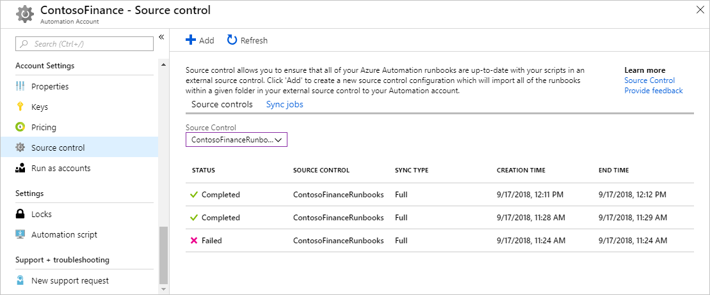

# Source control integration in Azure Automation

Source control allows you to keep your runbooks in your Automation account are up-to-date with your scripts in your GitHub or Azure Repos source control repository. Source control allows you to easily collaborate with your team, track changes, and roll back to earlier versions of your runbooks. For example, source control allows you to sync different branches in source control to your development, test or production Automation accounts. This makes it easy to promote code that has been tested in your development environment to your production Automation account. Source control integration with automation supports single direction syncing from your source control repository.

Azure Automation supports 3 types of source control:

* GitHub
* Azure Repos (Git)
* Azure Repos (TFVC)

## Pre-requisites

* A source control repository (GitHub or Azure Repos)
* A [Run-As Account](manage-runas-account.md)

> [!NOTE]
> Source control sync jobs run under the users Automation Account and are billed at the same rate as other Automation jobs.

## Configure source control - Azure portal

Within your Automation Account, select **Source Control** and click **+ Add**


Choose **Source Control type**, click **Authenticate**. A browser window opens and prompts you to sign in, follow the prompts to complete authentication.

On the **Source Control Summary** page, fill out the information and click **Save**. The following table shows a description of the available fields.

|Property  |Description  |
|---------|---------|
|Source control name     | A friendly name for the source control        |
|Source control type     | The type of source control source. Available options are:</br> GitHub</br>Azure Repos (Git)</br> Azure Repos (TFVC)        |
|Repository     | The name of the repository or project. The first 200 repositories are returned. To search for a repository, type the name in the field and click **Search on GitHub**.|
|Branch     | The branch to pull the source files from. Branch targeting is not available for the TFVC source control type.          |
|Folder path     | The folder that contains the runbooks to sync. Example: /Runbooks </br>*Only runbooks in the folder specified are synced. Recursion is not supported.*        |
|Auto Sync     | Turns on or off automatic sync when a commit is made in the source control repository         |
|Publish Runbook     | If set to **On**, after runbooks are synced from source control they will be automatically published.         |
|Description     | A text field to provide additional details        |


> [!NOTE]
> Ensure you are logged in with the correct account when configuring source control. If there is a doubt, open a new tab in your browser and log out from visualstudio.com or github.com and try connecting source control again.

## Configure source control - PowerShell

You can also use PowerShell to configure source control in Azure Automation. To configure source control with the PowerShell cmdlets, a [personal access token (PAT)](#personal-access-token) is needed. You use the [New-AzureRmAutomationSourceControl](/powershell/module/AzureRM.Automation/New-AzureRmAutomationSourceControl) to create the source control connection. The cmdlet requires a secure string of the Personal Access Token, to learn how to create a secure string, see [ConvertTo-SecureString](/powershell/module/microsoft.powershell.security/convertto-securestring?view=powershell-6).

### Azure Repos (Git)

```powershell-interactive
New-AzureRmAutomationSourceControl -Name SCReposGit -RepoUrl https://<account>.visualstudio.com/DefaultCollection/<project>/_git/<repository> -SourceType VsoGit -AccessToken <secureStringofPAT> -Branch master -ResourceGroupName <ResourceGroupName> -AutomationAccountName <AutomationAccountName> -FolderPath "/Runbooks"
```

### Azure Repos (TFVC)

```powershell-interactive
New-AzureRmAutomationSourceControl -Name SCReposTFVC -RepoUrl https://<account>.visualstudio.com/<projectName>/_versionControl -SourceType VsoTfvc -AccessToken <secureStringofPAT> -ResourceGroupName <ResourceGroupName> -AutomationAccountName <AutomationAccountName> -FolderPath "/Runbooks"
```

### GitHub

```powershell-interactive
New-AzureRmAutomationSourceControl -Name SCGitHub -RepoUrl https://github.com/<account>/<repoName>.git -SourceType GitHub -FolderPath "/MyRunbooks" -Branch master -AccessToken <secureStringofPAT> -ResourceGroupName <ResourceGroupName> -AutomationAccountName <AutomationAccountName>
```

### Personal access token permissions

Source control requires some minimum permissions for personal access tokens. The following tables contain the minimum permissions required for GitHub and Azure Repos.

#### GitHub

For more information about creating a personal access token in GitHub, visit [Creating a personal access token for the command line](https://help.github.com/articles/creating-a-personal-access-token-for-the-command-line/).

|Scope  |Description  |
|---------|---------|
|**repo**     |         |
|repo:status     | Access commit status         |
|repo_deployment      | Access deployment status         |
|public_repo     | Access public repositories         |
|**admin:repo_hook**     |         |
|write:repo_hook     | Write repository hooks         |
|read:repo_hook|Read repository hooks|

#### Azure Repos

For more information about creating a personal access token in Azure Repos, visit [Authenticate access with personal access tokens](/azure/devops/organizations/accounts/use-personal-access-tokens-to-authenticate).

|Scope  |
|---------|
|Code (read)     |
|Project and team (read)|
|Identity (read)      |
|User profile (read)     |
|Work items (read)    |
|Service Connections (read, query, and manage)<sup>1</sup>    |

<sup>1</sup>The Service Connections permission is only required if you have enabled autosync.

## Syncing

Select the source from the table on the **Source control** page. Click **Start Sync** to start the sync process.

You can view the status of the current sync job or previous ones by clicking the **Sync jobs** tab. On the **Source Control** drop-down, select a source control.



Clicking on a job allows you to view the job output. The following example is the output from a source control sync job.

```output
========================================================================================================

Azure Automation Source Control.
Supported runbooks to sync: PowerShell Workflow, PowerShell Scripts, DSC Configurations, Graphical, and Python 2.

Setting AzureRmEnvironment.

Getting AzureRunAsConnection.

Logging in to Azure...

Source control information for syncing:

[Url = https://ContosoExample.visualstudio.com/ContosoFinanceTFVCExample/_versionControl] [FolderPath = /Runbooks]

Verifying url: https://ContosoExample.visualstudio.com/ContosoFinanceTFVCExample/_versionControl

Connecting to VSTS...


Source Control Sync Summary:


2 files synced:
 - ExampleRunbook1.ps1
 - ExampleRunbook2.ps1


========================================================================================================
```

Additional logging is available by selecting **All Logs** on the **Source Control Sync Job Summary** page. These additional log entries can help you troubleshoot issues that may arise when using source control.

## Disconnecting source control

To disconnect from a source control repository, open **Source control** under **Account Settings** in your Automation Account.

Select the source control you want to remove. On the **Source Control Summary** page, click **Delete**.

## Next steps

To learn more about runbook types, their advantages and limitations, see [Azure Automation runbook types](automation-runbook-types.md)