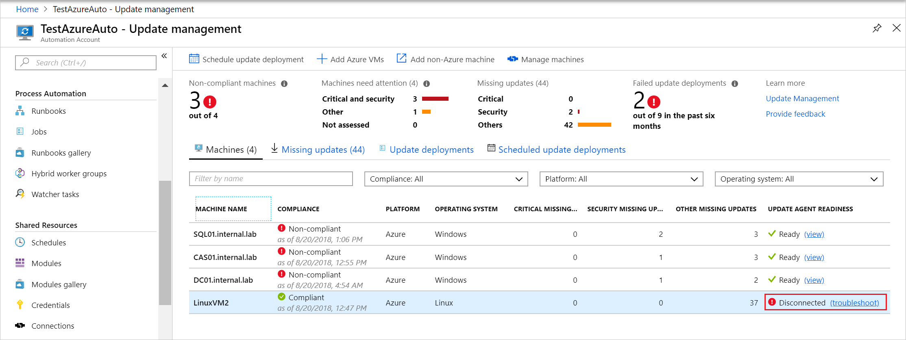

# Understand the agent check results in Update Management

There may be many reasons your Non-Azure machine is not showing **Ready** in Update Management. In Update Management you can check the health of a Hybrid Worker agent to determine the underlying problem. This article discusses how to run the troubleshooter from the Azure portal and in offline scenarios.

## Start the troubleshooter

By clicking the **Troubleshoot** link under the **Update Agent Readiness** column in the portal, you launch the **Troubleshoot Update Agent** page. This page shows you problems with the agent and a link to this article in order to assist you in troubleshooting your issues.

On The **Troubleshoot Update Agent** page, click **Run Checks**, to start the troubleshooter. The troubleshooter uses [Run command](../../virtual-machines/windows/run-command.md) to run a script on machine to verify multiple dependencies the agent has.

When complete the results are returned in the window. The [Pre-requisite checks](#pre-requisistes-checks) section, provides information on what each check is looking for.

## Pre-requisite checks

### OS check

The OS check, checks to ensure that the Hybrid Runbook Worker is running one of the following Operating Systems:

|Operating system  |Notes  |
|---------|---------|
|Windows Server 2008, Windows Server 2008 R2 RTM    | Supports only update assessments.         |
|Windows Server 2008 R2 SP1 and later     |.NET Framework 4.5 or later is required. ([Download .NET Framework](/dotnet/framework/install/guide-for-developers))  Windows PowerShell 4.0 or later is required. ([Download WMF 4.0](https://www.microsoft.com/download/details.aspx?id=40855))  Windows PowerShell 5.1 is recommended for increased reliability.  ([Download WMF 5.1](https://www.microsoft.com/download/details.aspx?id=54616))        |
|CentOS 6 (x86/x64) and 7 (x64)      | Linux agents must have access to an update repository. Classification-based patching requires 'yum' to return security data which CentOS does not have out of the box.         |
|Red Hat Enterprise 6 (x86/x64) and 7 (x64)     | Linux agents must have access to an update repository.        |
|SUSE Linux Enterprise Server 11 (x86/x64) and 12 (x64)     | Linux agents must have access to an update repository.        |
|Ubuntu 14.04 LTS and 16.04 LTS (x86/x64)      |Linux agents must have access to an update repository.         |

### .NET Framework check

The .NET framework check, ensures that the system has a minimum of [.NET Framework 4.5](https://www.microsoft.com/download/details.aspx?id=30653) present.

### WMF Check

The WMF check, ensures that the system have the required version of the Windows Management. [Windows Management Framework 4.0](https://www.microsoft.com/download/details.aspx?id=40855) is the lowest version supported. It is recommended that you install [Windows Management Framework 5.1](https://www.microsoft.com/download/details.aspx?id=54616) for increased reliability of the Hybrid Runbook Worker.

## Connectivity Checks

### Automation Agent Service check

This check determines if the agent can properly communicate with the agent service.

Proxy and firewall configurations must allow the Hybrid Runbook Worker agent to communicate with the Job Runtime Data Service. For a list of addresses and ports to open, see[Network planning for Hybrid Workers](automation-hybrid-runbook-worker.md#network-planning)

### Job Runtime Data service check

This check determines if the agent can properly communicate with the Job Runtime Data Service.

Proxy and firewall configurations must allow the Hybrid Runbook Worker agent to communicate with the Job Runtime Data Service. For a list of addresses and ports to open, see[Network planning for Hybrid Workers](automation-hybrid-runbook-worker.md#network-planning)

### TLS 1.2 Support

This check, determines if you are using TLS 1.2 to encrypt your communications. TLS 1.0 is no longer supported by the platform and it is recommended that clients use TLS 1.2 to communicate with Update Management.

## VM Service Health Checks

### Microsoft Monitoring Agent service check

This check determines if the Microsoft Monitoring Agent, `HealthService` is running on the machine.

To learn more about troubleshooting the service, see [The Microsoft Monitoring Agent is not running](hybrid-runbook-worker.md#mma-not-running).

To reinstall the Microsoft Monitoring Agent, see [Install and configure the Microsoft Monitoring Agent](/log-analytics/log-analytics-concept-hybrid.md#install-and-configure-agent)

### Event 4502 Check

This check determines if there have been any `4502` events in the Operations Manager log on the machine in the last 24 hours.

To learn more about this event, see the [troubleshooting guide](hybrid-runbook-worker.md#event-4502) for this event.

## Access Permissions Checks

### Crypto Folder Access

The Crypto Folder Access check determines if Local System Account has access to `C:\ProgramData\Microsoft\Crypto\RSA`

## Troubleshoot offline

Do troubleshoot the Hybrid worker offline, you can run the same script from the [Troubleshoot-WindowsUpdateAgentRegistration](https://www.powershellgallery.com/packages/Troubleshoot-WindowsUpdateAgentRegistration) script from the PowerShell Gallery.

## Next steps
