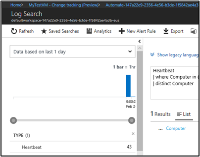

# Limit Update Management deployment scope

This article describes how to work with scope configurations when using the [Update Management](overview.md) feature to deploy updates and patches to your VMs. For more information, see [Targeting monitoring solutions in Azure Monitor (Preview)](../../azure-monitor/insights/solution-targeting.md).

## About scope configurations

A scope configuration is a group of one or more saved searches (queries) used to limit the scope of Update Management to specific computers. The scope configuration is used within the Log Analytics workspace to target the computers to enable. When you add a computer to receive updates from Update Management, the computer is also added to a saved search in the workspace.

## Set the scope limit

To limit the scope for your Update Management deployment:

1. In your Automation account, select **Linked Workspace** under **Related resources**.

2. Select **Go to workspace**.

3. Select **Scope Configurations (Preview)** under **Workspace Data Sources**.

4. Select the ellipsis to the right of the  `MicrosoftDefaultScopeConfig-Updates` scope configuration, and select **Edit**.

5. In the editing pane, expand **Select Computer Groups**. The Computer Groups pane shows the saved searches that are used to create the scope configuration. The saved search used by Update Management is:

    |Name     |Category  |Alias  |
    |---------|---------|---------|
    |MicrosoftDefaultComputerGroup     | Updates        | Updates__MicrosoftDefaultComputerGroup         |

6. Select the saved search to view and edit the query used to populate the group. The following image shows the query and its results:

    

## Next steps

You can [query Azure Monitor logs](query-logs.md) to analyze update assessments, deployments, and other related management tasks. It includes pre-defined queries to help you get started.
