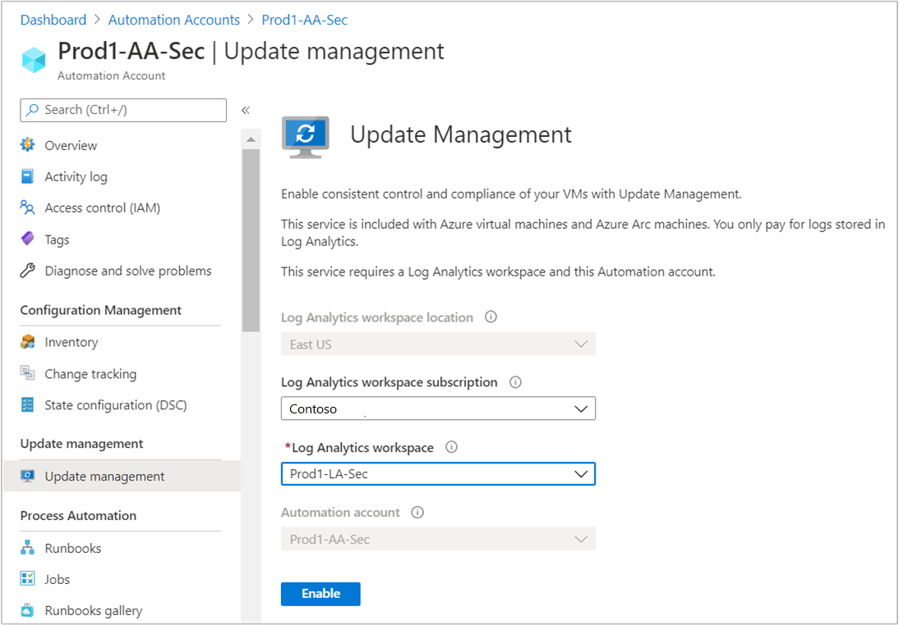

# Enable Update Management from a runbook

This article describes how you can use a runbook to enable the [Update Management](update-mgmt-overview.md) feature for VMs in your environment. To enable Azure VMs at scale, you must enable an existing VM using Update Management.

> [!NOTE]
> When enabling Update Management, only certain regions are supported for linking a Log Analytics workspace and an Automation account. For a list of the supported mapping pairs, see [Region mapping for Automation account and Log Analytics workspace](../how-to/region-mappings.md).

## Prerequisites

* Azure subscription. If you don't have one yet, you can [activate your MSDN subscriber benefits](https://azure.microsoft.com/pricing/member-offers/msdn-benefits-details/) or sign up for a [free account](https://azure.microsoft.com/free/?WT.mc_id=A261C142F).
* [Automation account](../index.yml) to manage machines.
* A [virtual machine](../../virtual-machines/windows/quick-create-portal.md).
* Create two Automation assets, which are used by the **Enable-AutomationSolution** runbook and is automatically imported into the account if it doesn't exist:
    * *LASolutionSubscriptionId*: Subscription ID of where the Log Analytics workspace is located.
    * *LASolutionWorkspaceId*: Workspace ID of the Log Analytics workspace linked to your Automation account.

## Sign in to Azure

Sign in to the [Azure portal](https://portal.azure.com).

## Enable Update Management

1. In the Azure portal, navigate to **Automation Accounts**. On the **Automation Accounts** page, select your account from the list.

2. In your Automation account, select **Update Management** under **Update Management**.

3. Select the Log Analytics workspace, then click **Enable**. While Update Management is being enabled, a banner is shown.

    

## Install and update modules

It's required to update to the latest Azure modules and import the [Az.OperationalInsights](/powershell/module/az.operationalinsights) module to successfully enable Update Management for your VMs with the runbook.

1. In your Automation account, select **Modules** under **Shared Resources**.

2. Select **Update Azure Modules** to update the Azure modules to the latest version.

3. Click **Yes** to update all existing Azure modules to the latest version.

    

4. Return to **Modules** under **Shared Resources**.

5. Select **Browse gallery** to open the module gallery.

6. Search for `Az.OperationalInsights` and import this module into your Automation account.

    

## Select Azure VM to manage

With Update Management enabled, you can add an Azure VM to receive updates.

1. From your Automation account, select **Update management** under the section **Update management**.

2. Select **Add Azure VMs** to add your VM.

3. Choose the VM from the list and click **Enable** to configure the VM for management.

   

    > [!NOTE]
    > If you try to enable another feature before setup of Update Management has completed, you receive this message: `Installation of another solution is in progress on this or a different virtual machine. When that installation completes the Enable button is enabled, and you can request installation of the solution on this virtual machine.`

## Import a runbook to enable Update Management

1. In your Automation account, select **Runbooks** under **Process Automation**.

2. Select **Browse gallery**.

3. Search for `update and change tracking`.

4. Select the runbook and click **Import** on the **View Source** page.

5. Click **OK** to import the runbook into the Automation account.

   

6. On the **Runbook** page, select the **Enable-MultipleSolution** runbook and then click **Edit**. On the textual editor, select  **Publish**.

7. When prompted to confirm, click **Yes** to publish the runbook.

## Start the runbook

You must have enabled Update Management for an Azure VM to start this runbook. It requires an existing VM and resource group with the feature enabled in order to properly configure the runbook parameters.

1. Open the **Enable-MultipleSolution** runbook.

   

2. Click the start button and enter parameter values in the following fields:

   * **VMNAME** - The name of an existing VM to add to Update Management. Leave this field blank to add all VMs in the resource group.
   * **VMRESOURCEGROUP** - The name of the resource group for the VMs to enable.
   * **SUBSCRIPTIONID** - The subscription ID of the new VM to enable. Leave this field blank to use the subscription of the workspace. When you use a different subscription ID, add the Run As account for your Automation account as a contributor for the subscription.
   * **ALREADYONBOARDEDVM** - The name of the VM that is already manually enabled for updates.
   * **ALREADYONBOARDEDVMRESOURCEGROUP** - The name of the resource group to which the VM belongs.
   * **SOLUTIONTYPE** - Enter **Updates**.

   

3. Select **OK** to start the runbook job.

4. Monitor progress of the runbook job and any errors from the **Jobs** page.

## Next steps

* To use Update Management for VMs, see [Manage updates and patches for your VMs](update-mgmt-manage-updates-for-vm.md).

* To troubleshoot general Update Management errors, see [Troubleshoot Update Management issues](../troubleshoot/update-management.md).
