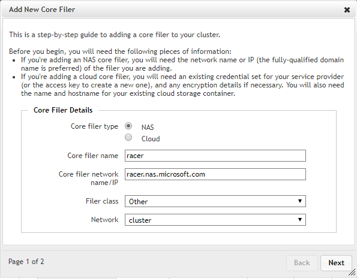
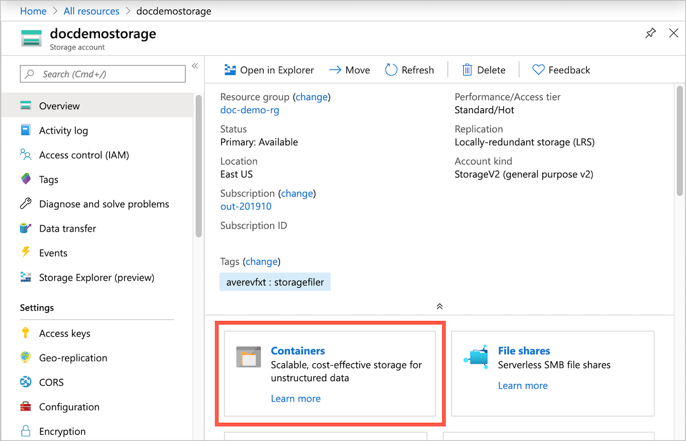
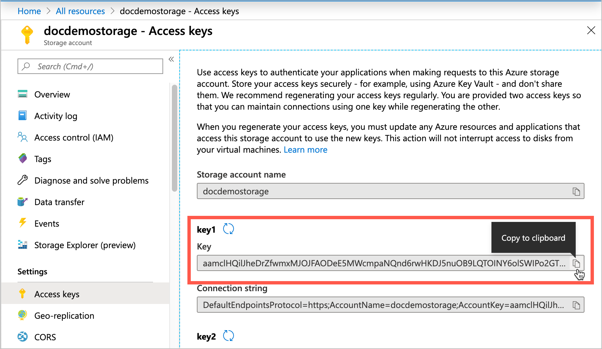
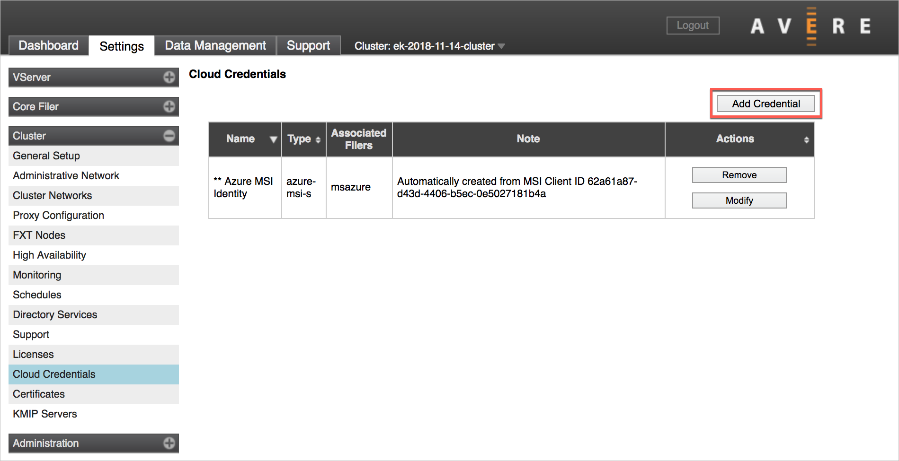
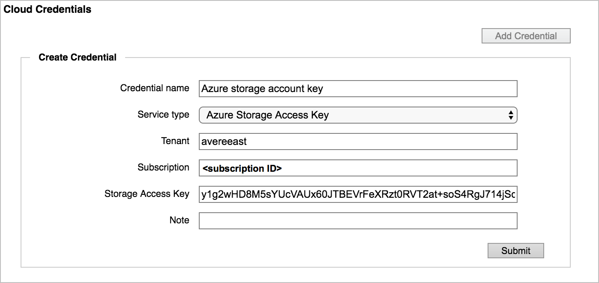
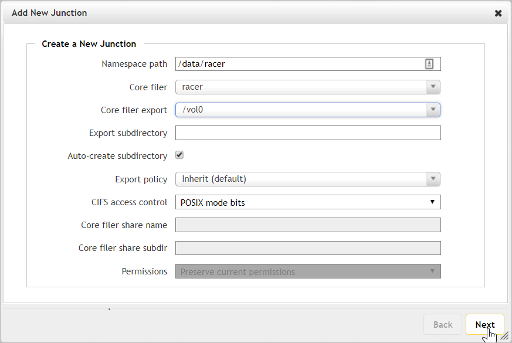

# Configure storage

This step sets up backend storage system for your vFXT cluster.

> [!TIP]
> If you used the `create-cloudbacked-cluster` prototype script to create a new Blob container along with the Avere vFXT cluster, that container is already set up for use and you do not need to add storage.

Follow these instructions if you used the `create-minimal-cluster` prototype script for your cluster, or if you want to add an additional hardware or cloud-based storage system.

There are two main tasks:

1. [Create a core filer](#create-a-core-filer), which connects your vFXT cluster to an existing storage system or an Azure Storage Account.

1. [Create a namespace junction](#create-a-junction), which defines the path that clients will mount.

These steps use the Avere Control Panel. Read [Access the vFXT cluster](avere-vfxt-cluster-gui.md) to learn how to use it.

## Create a core filer

"Core filer" is a vFXT term for a backend storage system. The storage can be a hardware NAS appliance like NetApp or Isilon, or it can be a cloud object store. More information about core filers can be found [in the Avere cluster settings guide](http://library.averesystems.com/ops_guide/4_7/settings_overview.html#managing-core-filers).

To add a core filer, choose one of the two main types of core filers:

  * [NAS core filer](#nas-core-filer) - describes how to add a NAS core filer 
  * [Azure Storage account cloud core filer](#azure-storage-account-cloud-core-filer) - describes how to add an Azure Storage account as a cloud core filer

### NAS core filer

A NAS core filer can be an on-premises NetApp or Isilon, or a NAS endpoint in the cloud.  
The storage system must have a reliable high-speed connection to the Avere vFXT cluster - for example, a 1GBps ExpressRoute connection (not a VPN) - and it must give the cluster root access to the NAS exports being used.

The following steps add a NAS core filer:

1. From the Avere Control Panel, click the **Settings** tab at the top.

2. Click **Core Filer** > **Manage Core Filers** on the left.

3. Click **Create**.

   

   * Name your core filer.
   * Provide a fully qualified domain name (FQDN) if available. Otherwise, provide an IP address or hostname that resolves to your core filer.
   * Choose your filer class from the list. If unsure, choose **Other**.
   * Click **Next** and choose a cache policy. 
   * Click **Add Filer**.
   * For more detailed information, refer to [Adding a new NAS core filer](http://library.averesystems.com/ops_guide/4_7/new_core_filer_nas.html) in the Avere cluster settings guide.

Next, proceed to [Create a junction](#create-a-junction).  

### Azure Storage cloud core filer

To use Azure Blob storage as your vFXT cluster's backend storage, you need an empty container to add as a core filer.

> [!TIP] 
> The ``create-cloudbacked-cluster`` sample script creates a storage container, defines it as a core filer, and creates the namespace junction as part of the vFXT cluster creation. The ``create-minimal-cluster`` sample script does not create an Azure storage container. To avoid having to create and configure an Azure Storage core filer after creating the cluster, use the ``create-cloudbacked-cluster`` script to deploy your vFXT cluster.

Adding Blob storage to your cluster requires these tasks:

* Create a storage account (step 1, below)
* Create an empty Blob container (steps 2-3)
* Add the storage access key as a cloud credential for the vFXT cluster (steps 4-6)
* Add the Blob container as a core filer for the vFXT cluster (steps 7-9)
* Create a namespace junction that clients use to mount the core filer ([Create a junction](#create-a-junction), same for both hardware and cloud storage)

To add Blob storage after creating the cluster, follow these steps. 

1. Create a general-purpose V2 storage account with these settings:

   * **Subscription** - same as the vFXT cluster
   * **Resource group** - same as the vFXT cluster group (optional)
   * **Location** - same as the vFXT cluster
   * **Performance** - Standard (Premium storage is unsupported)
   * **Account kind** - General purpose V2 (StorageV2)
   * **Replication** - Locally redundant storage (LRS)
   * **Access tier** - Hot
   * **Secure transfer required** - disable this option (non-default value)
   * **Virtual networks** - not required

   You can use the Azure portal or click the  "Deploy to Azure" button below.

   

1. After the account is created, browse to the storage account page.

   

1. Create a blob container by clicking **Blobs** on the overview page and then click **+Container**. Use any container name, and make sure access is set to **Private**.

   

1. Get the Azure Storage account key by clicking **Access keys** under **Settings**:

    

1. Open the Avere Control Panel for your cluster. Click **Settings**, then open **Cluster** > **Cloud Credentials** on the left navigation pane. On the Cloud Credentials page, click **Add Credential**.

   

1. Fill in the following information to create a credential for the cloud core filer: 

   | Field | Value |
   | --- | --- |
   | Credential name | any descriptive name |
   | Service type | (select Azure Storage Access Key) |
   | Tenant | storage account name |
   | Subscription | subscription ID |
   | Storage Access Key | Azure storage account key (copied in the previous step) | 

   Click **Submit**.

   

1. Next, create the core filer. In the left side of the Avere Control Panel, click **Core Filer** >  **Manage Core Filers**. 

1. Click the **Create** button on the **Manage Core Filers** settings page.

1. Fill out the wizard:

   * Select filer type **Cloud**. 
   * Name the new core filer and click **Next**.
   * Accept the default cache policy and continue to the third page.
   * In **Service type**, choose **Azure storage**. 
   * Choose the credential created earlier.
   * Set **Bucket contents** to **Empty**
   * Change **Certificate verification** to **Disabled**
   * Change **Compression mode** to **None**  
   * Click **Next**.
   * On the fourth page, enter the name of the container in **Bucket name** as *storage_account_name*/*container_name*.
   * Optionally, set **Encryption type** to **None**.  Azure Storage is encrypted by default.
   * Click **Add Filer**.

  For more detailed information, read [Adding a new cloud core filer](<http://library.averesystems.com/ops_guide/4_7/new_core_filer_cloud.html>) in the Avere cluster configuration guide. 

The page will refresh, or you can refresh the page to display your new core filer.

Next, you need to [Create a junction](#create-a-junction).

## Create a junction

A junction is a path that you create for clients. Clients mount the path and arrive at the destination you choose.

For example, you could create `/avere/files` to map to your NetApp core filer `/vol0/data` export and the `/project/resources` subdirectory.

More information about junctions can be found in the [namespace section of the Avere cluster configuration guide](http://library.averesystems.com/ops_guide/4_7/gui_namespace.html).

Follow these steps in the Avere Control Panel settings interface:

* Click **VServer** > **Namespace** in the upper left.
* Provide a namespace path beginning with / (forward slash), like ``/avere/data``.
* Choose your core filer.
* Choose the core filer export.
* Click **Next**.

  

The junction will appear after a few seconds. Create additional junctions as needed.

After the junction has been created, clients can [Mount the Avere vFXT cluster](avere-vfxt-mount-clients.md) to access the file system.