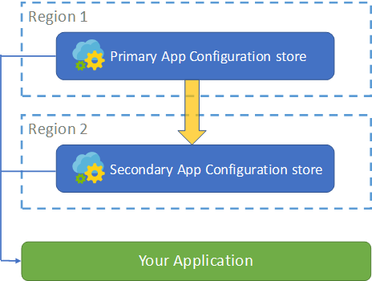

# Resiliency and disaster recovery

Currently Azure App Configuration is a regional service. Each configuration store is created in a particular Azure region. A region-wide outage will impact all stores in that region. App Configuration doesn't offer automatic fail-over to another region. This article provides general guidance on how you can use multiple configuration stores across Azure regions to increase the geo-resiliency of your application.

## High availability architecture

To realize cross-region redundancy, you need to create multiple app configuration stores in different regions. With this setup, your application will have at least one additional configuration store to fall back onto with the primary store becomes inaccessible. Below is a diagram that illustrates the topology between your application and its primary and secondary configuration stores.



Your application will load its configuration from both the primary and secondary stores in parallel. Doing this increases the chance of successfully getting the configuration data significantly. You are responsible for keeping the data in both stores in sync. The following sections explain how you can build geo-resiliency into your application.

## Failover between configuration stores

Technically your application isn't executing a failover. Instead, it's attempting to retrieve the same set of configuration data from two app configuration stores simultaneously. You should arrange your code such that it loads first from the secondary store first and then the primary store. In this way, the configuration data in the primary store will take precedence whenever they are available. The code snippet below shows how you can implement this in .NET Core.

```csharp
public static IWebHostBuilder CreateWebHostBuilder(string[] args) =>
    WebHost.CreateDefaultBuilder(args)
        .ConfigureAppConfiguration((hostingContext, config) =>
        {
            var settings = config.Build();
            config.AddAzureAppConfiguration(settings["ConnectionString_SecondaryStore"], optional: true)
                  .AddAzureAppConfiguration(settings["ConnectionString_PrimaryStore"], optional: true);
        })
        .UseStartup<Startup>();
    }
```

Note the `optional` parameter passed into the `AddAzureAppConfiguration` function. When set to `true`, this parameter will prevent the application from failing to continue if the function can't load configuration data.

## Synchronization between configuration stores

To obtain high availability, it's important that your geo-redundant configuration stores all have the same set of data. You can use the **Export** function in App Configuration to copy data from the primary store to the secondary on-demand. This function is available through both the Azure portal and CLI.

From the Azure portal, you can push a change to another configuration store by following these steps:

1. Navigate to **Import/Export** tab, select **Export**, select **App Configuration** as the **Target** service, click **Select a resource**.

2. In the new blade that has opened up, specify the subscription, resource group, and resource name of your secondary store and then click **Apply**.

3. The UI will be updated so that you can choose what configuration data you want to export to your secondary store. You can leave the default time value as is and set both **From label** and to **Label** to the same value. Click **Apply**.

4. Repeat the above steps for all configuration changes.

You can automate this exporting process using the Azure CLI. The command below shows how to export a single configuration change from the primary store to the secondary.

    az appconfig kv export --destination appconfig --name {PrimaryStore} --label {Label} --dest-name {SecondaryStore} --dest-label {Label}

## Next steps

In this article, you've learned how to augment your application to achieve geo-resiliency during runtime for App Configuration. Alternatively, you can embed configuration data from App Configuration at build or deployment time. For more information, see [Integrate with a CI/CD pipeline](./integrate-ci-cd-pipeline.md).
