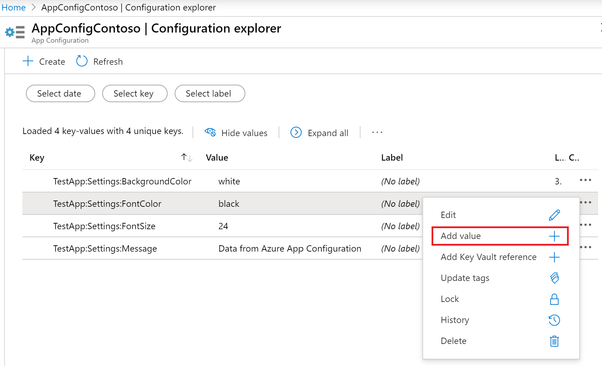

# Use labels to enable different configurations for different environments

Many applications need to use different configurations for different environments. Suppose that an application has a configuration value that defines the connection string to use for its back-end database. The application's developers use a different database from the one used in production. The database connection string used by the application must change as the application moves from development to production.

In Azure App Configuration, you can use *labels* to define different values for the same key. For example, you can define a single key with different values for *Development* and *Production*. You can specify which label(s) to load when connecting to App Configuration.

To demonstrate this functionality, we'll modify the web app created in [Quickstart: Create an ASP.NET Core app with Azure App Configuration](./quickstart-aspnet-core-app.md) to use different configuration settings for development vs. production. Please complete the quickstart before proceeding.

## Specify a label when adding a configuration value

In the Azure portal, go into **Configuration Explorer** and locate the *TestApp:Settings:FontColor* key that you created in the quickstart. Select its context menu and then click **Add Value**.

> [!div class="mx-imgBorder"]
> 

On the **Add Value** screen, enter a **Value** of **red** and a **Label** of **Development**. Leave **Content type** empty. Select **Apply**.

## Loading configuration values with a specified label

By default, Azure App Configuration only loads configuration values with no label. If you've defined labels for your configuration values, you'll want to specify the label(s) to use when connecting to App Configuration.

In the last section, you created a different configuration value for the *Development* environment. You use the `HostingEnvironment.EnvironmentName` variable to dynamically determine which environment the app is currently running in. To learn more, see [Use multiple environments in ASP.NET Core](/aspnet/core/fundamentals/environments).

Load configuration values with the label corresponding to the current environment by passing the environment name into the `Select` method:

```csharp
        public static IHostBuilder CreateHostBuilder(string[] args) =>
            Host.CreateDefaultBuilder(args)
            .ConfigureWebHostDefaults(webBuilder =>
            webBuilder.ConfigureAppConfiguration((hostingContext, config) =>
            {
                var settings = config.Build();
                config.AddAzureAppConfiguration(options =>
                    options
                        .Connect(Environment.GetEnvironmentVariable("AppConfigConnectionString"))
                        // Load configuration values with no label
                        .Select(KeyFilter.Any, LabelFilter.Null)
                        // Override with any configuration values specific to current hosting env
                        .Select(KeyFilter.Any, hostingContext.HostingEnvironment.EnvironmentName)
                );
            })
            .UseStartup<Startup>());
```

> [!IMPORTANT]
> The above code snippet loads the App Configuration connection string from an environment variable called `AppConfigConnectionString`. Be sure that this environment variable is set properly.

Note that the `Select` method is called twice. The first time, it loads configuration values with no label. Then, it loads configuration values with the label corresponding to the current environment. These environment-specific values override any corresponding values with no label. You do not need to define environment-specific values for every key. If a key does not have a value with a label corresponding to the current environment, then the value with no label is used.

## Testing in different environments

To test the different configuration values, open the `launchSettings.json` file under the `Properties` directory. Locate the `config` entry under `profiles`. In the `environmentVariables` section, set the `ASPNETCORE_ENVIRONMENT` variable to `Production`.

With the new values set, build and run your application.

```dotnetcli
dotnet build
dotnet run
```

Use a web browser to navigate to `http://localhost:5000`. You'll notice that the font color is black.


Now update `launchSettings.json` to set the `ASPNETCORE_ENVIRONMENT` variable to `Development`. Run `dotnet run` again. You'll notice that the font color is now red. This is because the application now uses the value of `TestApp:Settings:FontColor` that has the `Development` label. All other configuration values remain the same as their production values.


## Next steps

> [!div class="nextstepaction"]
> [Configuration in ASP.NET Core](/aspnet/core/fundamentals/configuration/)