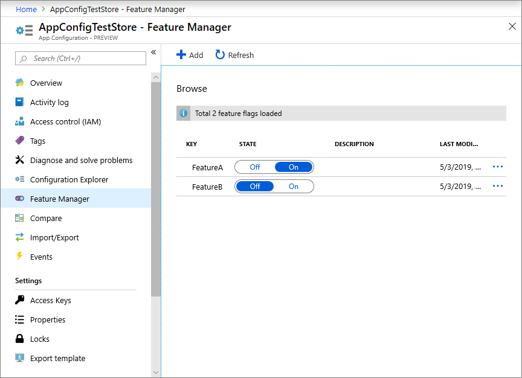
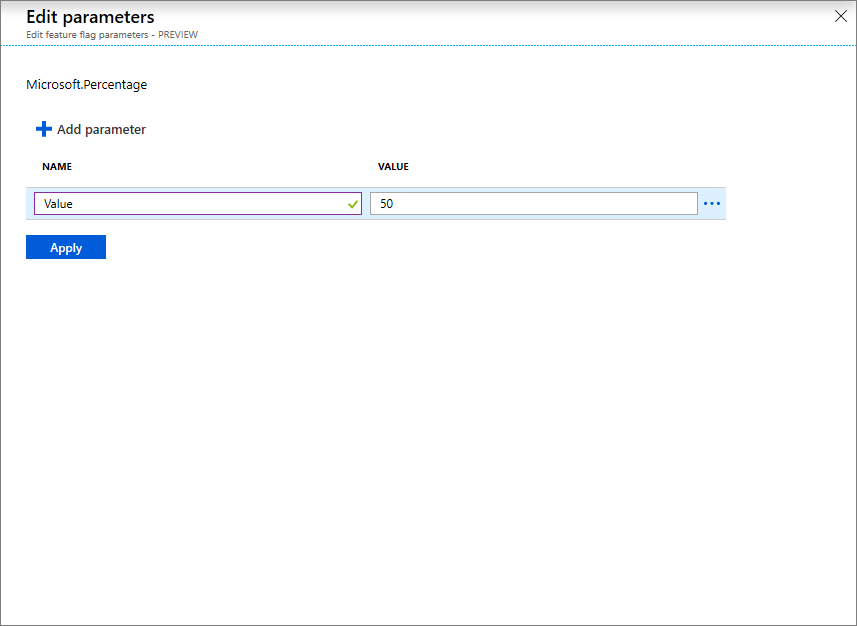

# Tutorial: Manage feature flags in Azure App Configuration

You can store all feature flags in Azure App Configuration and administer them from a single place. It has a portal UI, called **Feature Manager**, that is designed specifically for feature flags. Furthermore, App Configuration supports .NET Core feature flag data schema natively.

In this tutorial, you learn how to:

> [!div class="checklist"]
> * Define and manage feature flags in App Configuration.
> * Access feature flags from your application.

## Create feature flags

The **Feature Manager** in the Azure portal for App Configuration provides a UI for creating and managing feature flags that you use in your application. Follow the following steps to add a new feature flag.

1. Select **Feature Manager** > **+ Create** to add a feature flag.

    

2. Enter a unique key name for the feature flag. You need this name to reference the flag in your code.

3. Optionally give the feature flag a more human-friendly description.

4. Set the initial state of the feature flag. It is usually just *On* or *Off*.

    

5. When the state is *On*, optionally specify any additional condition to qualify it with **Add filter**. Enter a built-in or custom filter key and associate parameter(s). Built-in filters include:

    | Key | JSON Parameters |
    |---|---|
    | Microsoft.Percentage | {"Value": 0-100 percent} |
    | Microsoft.TimeWindow | {"Start": UTC time, "End": UTC time} |

    

## Update feature flag states

Follow the following steps to change a feature flag's state value.

1. Select **Feature Manager**.

2. Click on **...** > **Edit** to the right of a feature flag you want to modify.

3. Set a new state for the feature flag.

## Access feature flags

Feature flags created by the **Feature Manager** are stored and retrieved as regular key-values. They are kept under a special namespace prefix *.appconfig.featureflag*. You can view the underlying key-values using the **Configuration Explorer**. Your application can retrieve them using the App Configuration configuration providers, SDKs, command-line extensions, and REST APIs.

## Next steps

In this tutorial, you learned how to manage feature flags and their states using App Configuration. See the following resources for more information on feature management support in App Configuration and ASP.NET Core.

* [Use feature flags in an ASP.NET Core app](./use-feature-flags-dotnet-core.md)
