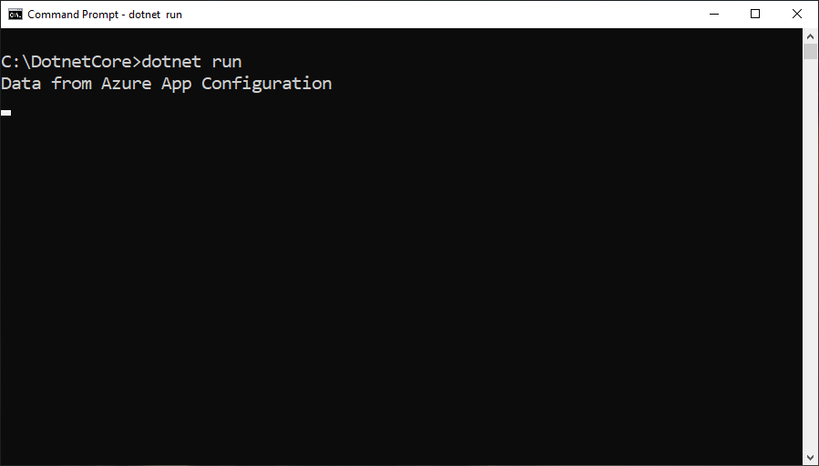

# Quickstart: Create an .NET Core app with App Configuration

Azure App Configuration is a managed configuration service in Azure. It lets you easily store and manage all your application settings in one place that is separated from your code. This quickstart shows you how to incorporate the service into a .NET Core console app.

You can use any code editor to complete the steps in this quickstart. However, [Visual Studio Code](https://code.visualstudio.com/) is an excellent option available on the Windows, macOS, and Linux platforms.

## Prerequisites

To complete this quickstart, install the [.NET Core SDK](https://dotnet.microsoft.com/download).

[!INCLUDE [quickstarts-free-trial-note](../../includes/quickstarts-free-trial-note.md)]

## Create an app configuration store

[!INCLUDE [azure-app-configuration-create](../../includes/azure-app-configuration-create.md)]

## Create a .NET Core console app

You will use the [.NET Core command-line interface (CLI)](https://docs.microsoft.com/dotnet/core/tools/) to create a new .NET Core Console App project. The advantage of using the .NET Core CLI over Visual Studio is that it is available across the Windows, macOS, and Linux platforms.

1. Create a new folder for your project.

2. In the new folder, execute the following command to create a new ASP.NET Core MVC Web App project:

        dotnet new console

## Connect to app configuration store

1. Add a reference to the `Microsoft.Extensions.Configuration.Azconfig` NuGet package by executing the following command:

        dotnet add package Microsoft.Extensions.Configuration.Azconfig

2. Execute the following command to restore packages for your project.

        dotnet restore

3. Open *Program.cs* and update the `Main` method to use App Configuration by calling the `builder.AddAzconfig()` method.

    ```csharp
    static void Main(string[] args)
    {
        var builder = new ConfigurationBuilder();
        builder.AddAzconfig(Environment.GetEnvironmentVariable("ConnectionString"));

        var config = builder.Build();
        Console.WriteLine(config["TestApp:Settings:Message"] ?? "Hello world!");
    }
    ```

## Build and run the app locally

1. Set an environment variable named **ConnectionString** and set it to the access key to your app configuration store. If you are using Windows Command Prompt, execute the following command and restart the Command Prompt to allow the change to take effect:

        setx ConnectionString "Endpoint=<service_endpoint>;Id=<hub_id>;Secret=<secret_key>"

    If you are using Windows PowerShell, execute the following command:

        $Env:ConnectionString = "Endpoint=<service_endpoint>;Id=<hub_id>;Secret=<secret_key>"

    If you are using macOS or Linux, execute the following command:

        export ConnectionString='Endpoint=<service_endpoint>;Id=<hub_id>;Secret=<secret_key>'

2. Execute the following command to build the console app:

        dotnet build

3. Once the build successfully completes, execute the following command to run the app locally:

        dotnet run

    

## Clean up resources

[!INCLUDE [azure-app-configuration-cleanup](../../includes/azure-app-configuration-cleanup.md)]

## Next steps

In this quickstart, you've created a new app configuration store and used it with a .NET Core console app. To learn more about using App Configuration, continue to the next tutorial that demonstrates authentication.

> [!div class="nextstepaction"]
> [Managed Identities for Azure Resources Integration](./integrate-azure-managed-service-identity.md)
