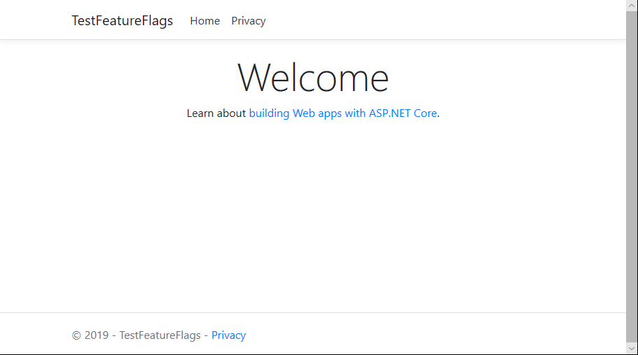
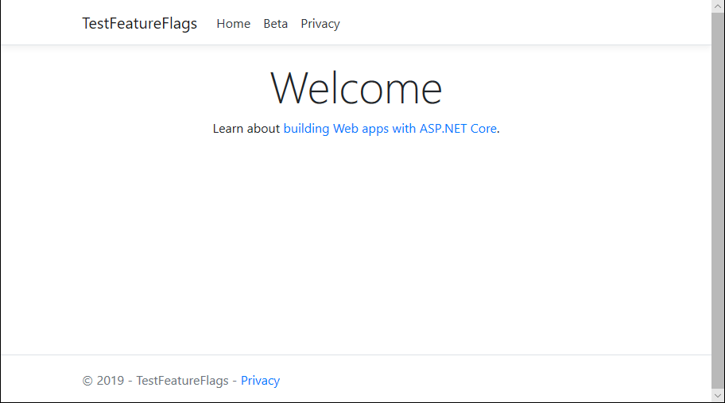

# Quickstart: Add feature flags to an ASP.NET Core app

You can enable feature management in ASP.NET Core by connecting your application to Azure App Configuration. You can use this managed service to store all your feature flags and control their states centrally. This quickstart shows how to incorporate App Configuration into an ASP.NET Core web app to create an end-to-end implementation of feature management.

The .NET Core Feature Management libraries extend the framework with comprehensive feature flag support. These libraries are built on top of the .NET Core configuration system. They seamlessly integrate with App Configuration through its .NET Core configuration provider.

You can use any code editor to do the steps in this quickstart. [Visual Studio Code](https://code.visualstudio.com/) is an excellent option available on the Windows, macOS, and Linux platforms.

## Prerequisites

To do this quickstart, install the [.NET Core SDK](https://dotnet.microsoft.com/download).

[!INCLUDE [quickstarts-free-trial-note](../../includes/quickstarts-free-trial-note.md)]

## Create an App Configuration store

[!INCLUDE [azure-app-configuration-create](../../includes/azure-app-configuration-create.md)]

6. Select **Feature Manager** > **+Create** to add the following feature flags:

    | Key | State |
    |---|---|
    | Beta | Off |

## Create an ASP.NET Core web app

You use the [.NET Core command-line interface (CLI)](https://docs.microsoft.com/dotnet/core/tools/) to create a new ASP.NET Core MVC web app project. The advantage of using the .NET Core CLI instead of Visual Studio is that the .NET Core CLI is available across the Windows, macOS, and Linux platforms.

1. Create a new folder for your project. For this quickstart, name it *TestFeatureFlags*.

1. In the new folder, run the following command to create a new ASP.NET Core MVC web app project:

   ```    
   dotnet new mvc
   ```

## Add Secret Manager

Add the [Secret Manager tool](https://docs.microsoft.com/aspnet/core/security/app-secrets) to your project. The Secret Manager tool stores sensitive data for development work outside your project tree. This approach helps prevent the accidental sharing of app secrets within source code.

1. Open the *.csproj* file.
1. Add a `UserSecretsId` element as shown in the following example, and replace its value with your own, which typically is a GUID:

    ```xml
    <Project Sdk="Microsoft.NET.Sdk.Web">

    <PropertyGroup>
        <TargetFramework>netcoreapp2.1</TargetFramework>
        <UserSecretsId>79a3edd0-2092-40a2-a04d-dcb46d5ca9ed</UserSecretsId>
    </PropertyGroup>

    <ItemGroup>
        <PackageReference Include="Microsoft.AspNetCore.App" />
        <PackageReference Include="Microsoft.AspNetCore.Razor.Design" Version="2.1.2" PrivateAssets="All" />
    </ItemGroup>

    </Project>
    ```

1. Save the file.

## Connect to an App Configuration store

1. Add reference to the `Microsoft.AzureAppConfiguration.AspNetCore` NuGet package by running the following command:

    ```
    dotnet add package Microsoft.AzureAppConfiguration.AspNetCore --version 2.0.0-preview-009080001-1053
    ```

1. Run the following command to restore packages for your project:

    ```
    dotnet restore
    ```

1. Add a secret named **ConnectionStrings:AppConfig** to Secret Manager.

    This secret contains the connection string to access your App Configuration store. Replace the `<your_connection_string>` value in the following command with the connection string for your App Configuration store.

    This command must be executed in the same directory as the *.csproj* file.

    ```
    dotnet user-secrets set ConnectionStrings:AppConfig <your_connection_string>
    ```

    You use Secret Manager only to test the web app locally. When you deploy the app to [Azure App Service](https://azure.microsoft.com/services/app-service), for example, you use an application setting named **Connection Strings** in App Service instead of using Secret Manager to store the connection string.

    You can access this secret with the App Configuration API. A colon (:) works in the configuration name with the App Configuration API on all supported platforms. See [Configuration by environment](https://docs.microsoft.com/aspnet/core/fundamentals/configuration).

1. Open *Program.cs*, and add a reference to the .NET Core App Configuration provider:

    ```csharp
    using Microsoft.Extensions.Configuration.AzureAppConfiguration;
    ```

1. Update the `CreateWebHostBuilder` method to use App Configuration by calling the `config.AddAzureAppConfiguration()` method.

    ```csharp
    public static IWebHostBuilder CreateWebHostBuilder(string[] args) =>
        WebHost.CreateDefaultBuilder(args)
            .ConfigureAppConfiguration((hostingContext, config) =>
            {
                var settings = config.Build();
                config.AddAzureAppConfiguration(options => {
                    options.Connect(settings["ConnectionStrings:AppConfig"])
                           .UseFeatureFlags();
                });
            })
            .UseStartup<Startup>();
    ```

1. Open *Startup.cs*, and add references to the .NET Core feature manager:

    ```csharp
    using Microsoft.FeatureManagement.AspNetCore;
    ```

1. Update the `ConfigureServices` method to add feature flag support by calling the `services.AddFeatureManagement()` method. Optionally, you can include any filter to be used with feature flags by calling `services.AddFeatureFilter<FilterType>()`:

    ```csharp
    public void ConfigureServices(IServiceCollection services)
    {
        services.AddFeatureManagement();
    }
    ```

1. Update the `Configure` method to add a middleware to allow the feature flag values to be refreshed at a recurring interval while the ASP.NET Core web app continues to receive requests.

    ```csharp
    public void Configure(IApplicationBuilder app, IHostingEnvironment env)
    {
        app.UseAzureAppConfiguration();
        app.UseMvc();
    }
    ```

1. Add a *MyFeatureFlags.cs* file:

    ```csharp
    namespace TestFeatureFlags
    {
        public enum MyFeatureFlags
        {
            Beta
        }
    }
    ```

1. Add *BetaController.cs* to the *Controllers* directory:

    ```csharp
    using Microsoft.AspNetCore.Mvc;
    using Microsoft.FeatureManagement;
    using Microsoft.FeatureManagement.Mvc;

    namespace TestFeatureFlags.Controllers
    {
        public class BetaController: Controller
        {
            private readonly IFeatureManager _featureManager;

            public BetaController(IFeatureManagerSnapshot featureManager)
            {
                _featureManager = featureManager;
            }

            [FeatureGate(MyFeatureFlags.Beta)]
            public IActionResult Index()
            {
                return View();
            }
        }
    }
    ```

1. Open *_ViewImports.cshtml* in the *Views* directory, and add the feature manager tag helper:

    ```html
    @addTagHelper *, Microsoft.FeatureManagement.AspNetCore
    ```

1. Open *_Layout.cshtml* in the *Views*\\*Shared* directory, and replace the `<nav>` bar code under `<body>` > `<header>` with the following code:

    ```html
    <nav class="navbar navbar-expand-sm navbar-toggleable-sm navbar-light bg-white border-bottom box-shadow mb-3">
        <div class="container">
            <a class="navbar-brand" asp-area="" asp-controller="Home" asp-action="Index">TestFeatureFlags</a>
            <button class="navbar-toggler" type="button" data-toggle="collapse" data-target=".navbar-collapse" aria-controls="navbarSupportedContent"
            aria-expanded="false" aria-label="Toggle navigation">
            <span class="navbar-toggler-icon"></span>
            </button>
            <div class="navbar-collapse collapse d-sm-inline-flex flex-sm-row-reverse">
                <ul class="navbar-nav flex-grow-1">
                    <li class="nav-item">
                        <a class="nav-link text-dark" asp-area="" asp-controller="Home" asp-action="Index">Home</a>
                    </li>
                    <feature name="Beta">
                    <li class="nav-item">
                        <a class="nav-link text-dark" asp-area="" asp-controller="Beta" asp-action="Index">Beta</a>
                    </li>
                    </feature>
                    <li class="nav-item">
                        <a class="nav-link text-dark" asp-area="" asp-controller="Home" asp-action="Privacy">Privacy</a>
                    </li>
                </ul>
            </div>
        </div>
    </nav>
    ```

1. Create a *Beta* directory under *Views* and add *Index.cshtml* to it:

    ```html
    @{
        ViewData["Title"] = "Beta Home Page";
    }

    <h1>
        This is the beta website.
    </h1>
    ```

## Build and run the app locally

1. To build the app by using the .NET Core CLI, run the following command in the command shell:

    ```
    dotnet build
    ```

1. After the build successfully completes, run the following command to run the web app locally:

    ```
    dotnet run
    ```

1. Open a browser window, and go to `https://localhost:5001`, which is the default URL for the web app hosted locally.

    

1. Sign in to the [Azure portal](https://portal.azure.com). Select **All resources**, and select the App Configuration store instance that you created in the quickstart.

1. Select **Feature Manager**, and change the state of the **Beta** key to **On**:

    | Key | State |
    |---|---|
    | Beta | On |

1. Refresh the browser page to see the new configuration settings.

    

## Clean up resources

[!INCLUDE [azure-app-configuration-cleanup](../../includes/azure-app-configuration-cleanup.md)]

## Next steps

In this quickstart, you created a new App Configuration store and used it to manage features in an ASP.NET Core web app via the [Feature Management libraries](https://go.microsoft.com/fwlink/?linkid=2074664).

- Learn more about [feature management](./concept-feature-management.md).
- [Manage feature flags](./manage-feature-flags.md).
- [Use feature flags in an ASP.NET Core app](./use-feature-flags-dotnet-core.md).
