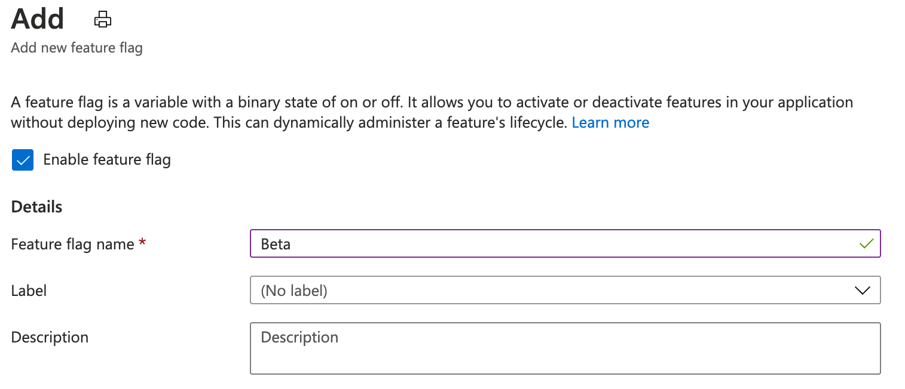

# Quickstart: Add feature flags to an Azure Functions app

In this quickstart, you create an implementation of feature management in an Azure Functions app using Azure App Configuration. You will use the App Configuration service to centrally store all your feature flags and control their states. 

The .NET Feature Management libraries extend the framework with comprehensive feature flag support. These libraries are built on top of the .NET configuration system. They seamlessly integrate with App Configuration through its .NET configuration provider.

## Prerequisites

- Azure subscription - [create one for free](https://azure.microsoft.com/free/)
- [Visual Studio 2019](https://visualstudio.microsoft.com/vs) with the **Azure development** workload.
- [Azure Functions tools](../azure-functions/functions-develop-vs.md#check-your-tools-version)

## Create an App Configuration store

[!INCLUDE [azure-app-configuration-create](../../includes/azure-app-configuration-create.md)]

6. Select **Feature Manager** > **+Add** to add a feature flag called `Beta`.

    > [!div class="mx-imgBorder"]
    > 

    Leave `label` and `Description` undefined for now.

7. Select **Apply** to save the new feature flag.

## Create a Functions app

[!INCLUDE [Create a project using the Azure Functions template](../../includes/functions-vstools-create.md)]

## Connect to an App Configuration store

1. Right-click your project, and select **Manage NuGet Packages**. On the **Browse** tab, search and add the following NuGet packages to your project. If you can't find them, select the **Include prerelease** check box. Verify for `Microsoft.Extensions.DependencyInjection` that you are on the most recent stable build. 

    ```
    Microsoft.Extensions.DependencyInjection
    Microsoft.Extensions.Configuration
    Microsoft.FeatureManagement
    ```


1. Open *Function1.cs*, and add the namespaces of these packages.

    ```csharp
    using Microsoft.Extensions.Configuration;
    using Microsoft.FeatureManagement;
    using Microsoft.Extensions.DependencyInjection;
    ```

1. Update the `Function1` method to connect to App Configuration. Add two `static` properties, one named `FeatureManager` to create a singleton instance of `IFeatureManager` and another named `services` to create a singleton instance of `IServiceCollection`. Then connect to App Configuration in `Function1` by calling `AddAzureAppConfiguration()`. This process will load the configuration at application startup. The same configuration instance will be used for all Functions calls later.

    ```csharp
        private static IFeatureManager FeatureManager { set; get; }

        private static IServiceCollection services; 

        static Function1()
        {
            IConfigurationRoot configuration = new ConfigurationBuilder()
            .AddAzureAppConfiguration(options =>
            {
                options.Connect(Environment.GetEnvironmentVariable("ConnectionString"))
                       .UseFeatureFlags();
            }).Build();

            services = new ServiceCollection();                                                                           
            services.AddSingleton<IConfiguration>(configuration).AddFeatureManagement();
        }
    ```

1. Update the `Run` method to change value of the displayed message depending on the state of the feature flag.

    ```csharp
        public static async Task<IActionResult> Run(
                [HttpTrigger(AuthorizationLevel.Anonymous, "get", "post", Route = null)] HttpRequest req,
                ILogger log)
            {
                log.LogInformation("C# HTTP trigger function processed a request.");
    
                string message = "The Feature Flag named Beta is turned OFF";
                using (ServiceProvider serviceProvider = services.BuildServiceProvider())
                {
                    FeatureManager = serviceProvider.GetRequiredService<IFeatureManager>();
                }
    
                if (await FeatureManager.IsEnabledAsync("Beta"))
                {
                    message = "The Feature Flag named Beta has been turned ON!";
                }
                
                return message != null
                    ? (ActionResult)new OkObjectResult(message)
                    : new BadRequestObjectResult($"Error message: Please create the appropriate feature flag in App Configuration.");   
            }
    ```

## Test the function locally

1. Set an environment variable named **ConnectionString**, where the value is the access key you retrieved earlier in your App Configuration store under **Access Keys**. If you use the Windows command prompt, run the following command and restart the command prompt to allow the change to take effect:

    ```cmd
        setx ConnectionString "connection-string-of-your-app-configuration-store"
    ```

    If you use Windows PowerShell, run the following command:

    ```azurepowershell
        $Env:ConnectionString = "connection-string-of-your-app-configuration-store"
    ```

    If you use macOS or Linux, run the following command:

    ```bash
        export ConnectionString='connection-string-of-your-app-configuration-store'
    ```

1. Press F5 to test your function. If prompted, accept the request from Visual Studio to download and install **Azure Functions Core (CLI)** tools. You might also need to enable a firewall exception so that the tools can handle HTTP requests.

1. Copy the URL of your function from the Azure Functions runtime output.

    

1. Paste the URL for the HTTP request into your browser's address bar. The following image shows the response in the browser to the local GET request returned by the function.

    

1. Sign in to the [Azure portal](https://portal.azure.com). Select **All resources**, and select the App Configuration store instance that you created.

1. Select **Feature Manager**, and change the state of the **Beta** key to **On**.

1. Return to your command prompt and cancel the running process by pressing `Ctrl-C`.  Restart your application by pressing F5. 

1. Copy the URL of your function from the Azure Functions runtime output using the same process as in Step 3. Paste the URL for the HTTP request into your browser's address bar. The browser response should have changed, as shown in the image below.
1. 
    

## Clean up resources

[!INCLUDE [azure-app-configuration-cleanup](../../includes/azure-app-configuration-cleanup.md)]

## Next steps

In this quickstart, you created a feature flag and used it with an Azure Functions app via the [App Configuration provider](https://go.microsoft.com/fwlink/?linkid=2074664).

- Learn more about [feature management](./concept-feature-management.md).
- [Manage feature flags](./manage-feature-flags.md).
- [Use dynamic configuration in an Azure Functions app](./enable-dynamic-configuration-azure-functions-csharp.md)
