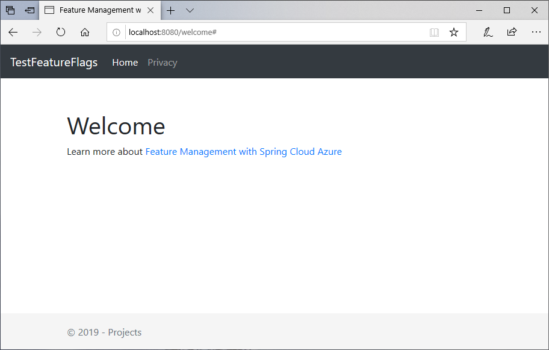
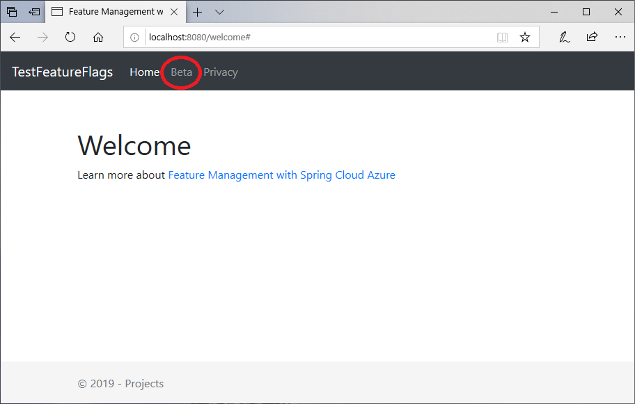

# Quickstart: Add feature flags to a Spring Boot app

In this quickstart, you incorporate Azure App Configuration into a Spring Boot web app to create an end-to-end implementation of feature management. You can use the App Configuration service to centrally store all your feature flags and control their states.

The Spring Boot Feature Management libraries extend the framework with comprehensive feature flag support. These libraries do **not** have a dependency on any Azure libraries. They seamlessly integrate with App Configuration through its Spring Boot configuration provider.

## Prerequisites

- Azure subscription - [create one for free](https://azure.microsoft.com/free/)
- A supported [Java Development Kit SDK](https://docs.microsoft.com/java/azure/jdk) with version 8.
- [Apache Maven](https://maven.apache.org/download.cgi) version 3.0 or above.

## Create an App Configuration instance

[!INCLUDE [azure-app-configuration-create](../../includes/azure-app-configuration-create.md)]

6. Select **Feature Manager** > **+Add** to add a feature flag called `Beta`.

    > [!div class="mx-imgBorder"]
    > 

    Leave `label` undefined for now.

## Create a Spring Boot app

Use the [Spring Initializr](https://start.spring.io/) to create a new Spring Boot project.

1. Browse to <https://start.spring.io/>.

2. Specify the following options:

   - Generate a **Maven** project with **Java**.
   - Specify a **Spring Boot** version that's equal to or greater than 2.0.
   - Specify the **Group** and **Artifact** names for your application.  This article uses `com.example` and `demo`.
   - Add the **Spring Web** dependency.

3. After you specify the previous options, select **Generate Project**. When prompted, download the project to your local computer.

## Add feature management

1. After you extract the files on your local system, your Spring Boot application is ready for editing. Locate  *pom.xml* in the root directory of your app.

1. Open the *pom.xml* file in a text editor and add the following to the list of `<dependencies>`.:

    ```xml
    <dependency>
        <groupId>com.microsoft.azure</groupId>
        <artifactId>spring-cloud-starter-azure-appconfiguration-config</artifactId>
        <version>1.2.0</version>
    </dependency>
    <dependency>
        <groupId>com.microsoft.azure</groupId>
        <artifactId>spring-cloud-azure-feature-management-web</artifactId>
        <version>1.2.0</version>
    </dependency>
    <dependency>
            <groupId>org.springframework.boot</groupId>
            <artifactId>spring-boot-starter-thymeleaf</artifactId>
    </dependency>
    ```

> [!Note]
> There is a non-web Feature Management Library that doesn't have a dependency on spring-web. Refer to GitHub's [documentation](https://github.com/microsoft/spring-cloud-azure/tree/master/spring-cloud-azure-feature-management) for differences.

## Connect to an App Configuration store

1. Navigate to the `resources` directory of your app and open `bootstrap.properties`.  If the file does not exist, create it. Add the following line to the file.

    ```properties
    spring.cloud.azure.appconfiguration.stores[0].name= ${APP_CONFIGURATION_CONNECTION_STRING}
    ```
1. In the App Configuration portal for your config store, select `Access keys` from the sidebar. Select the Read-only keys tab. Copy the value of the primary connection string.

1. Add the primary connection string as an environment variable using the variable name `APP_CONFIGURATION_CONNECTION_STRING`.

1. Open the main application Java file, and add `@EnableConfigurationProperties` to enable this feature.

    ```java
    package com.example.demo;

    import org.springframework.boot.SpringApplication;
    import org.springframework.boot.context.properties.ConfigurationProperties;
    import org.springframework.boot.context.properties.EnableConfigurationProperties;
    import org.springframework.boot.autoconfigure.SpringBootApplication;

    @SpringBootApplication
    @EnableConfigurationProperties(MessageProperties.class)
    public class DemoApplication {

        public static void main(String[] args) {
        SpringApplication.run(DemoApplication.class, args);
        }
    }
    ```

1. Create a new Java file named *HelloController.java* in the package directory of your app. 

    ```java
    package com.example.demo;

    import org.springframework.boot.context.properties.ConfigurationProperties;
    import org.springframework.stereotype.Controller;
    import org.springframework.ui.Model;

    import com.microsoft.azure.spring.cloud.feature.manager.FeatureManager;
    import org.springframework.web.bind.annotation.GetMapping;


    @Controller
    @ConfigurationProperties("controller")

    public class HelloController {

        private FeatureManager featureManager;

        public HelloController(FeatureManager featureManager) {
            this.featureManager = featureManager;
        } 

        @GetMapping("/welcome")
        public String mainWithParam(Model model) {
            model.addAttribute("Beta", featureManager.isEnabledAsync("Beta"));
            return "welcome";
        }
    }
    ```

1. Create a new HTML file named *welcome.html* in the templates directory of your app.

    ```html
    <!DOCTYPE html>
    <html lang="en" xmlns:th="http://www.thymeleaf.org">
    <head>
        <meta charset="utf-8">
        <meta name="viewport" content="width=device-width, initial-scale=1, shrink-to-fit=no">
        <title>Feature Management with Spring Cloud Azure</title>

        <link rel="stylesheet" href="/css/main.css">
        <link rel="stylesheet" href="https://stackpath.bootstrapcdn.com/bootstrap/4.3.1/css/bootstrap.min.css" integrity="sha384-ggOyR0iXCbMQv3Xipma34MD+dH/1fQ784/j6cY/iJTQUOhcWr7x9JvoRxT2MZw1T" crossorigin="anonymous">

        <script src="https://code.jquery.com/jquery-3.3.1.slim.min.js" integrity="sha384-q8i/X+965DzO0rT7abK41JStQIAqVgRVzpbzo5smXKp4YfRvH+8abtTE1Pi6jizo" crossorigin="anonymous"></script>
        <script src="https://cdnjs.cloudflare.com/ajax/libs/popper.js/1.14.7/umd/popper.min.js" integrity="sha384-UO2eT0CpHqdSJQ6hJty5KVphtPhzWj9WO1clHTMGa3JDZwrnQq4sF86dIHNDz0W1" crossorigin="anonymous"></script>
        <script src="https://stackpath.bootstrapcdn.com/bootstrap/4.3.1/js/bootstrap.min.js" integrity="sha384-JjSmVgyd0p3pXB1rRibZUAYoIIy6OrQ6VrjIEaFf/nJGzIxFDsf4x0xIM+B07jRM" crossorigin="anonymous"></script>

    </head>
    <body>
        <header>
        <!-- Fixed navbar -->
        <nav class="navbar navbar-expand-md navbar-dark fixed-top bg-dark">
            <a class="navbar-brand" href="#">TestFeatureFlags</a>
            <button class="navbar-toggler" aria-expanded="false" aria-controls="navbarCollapse" aria-label="Toggle navigation" type="button" data-target="#navbarCollapse" data-toggle="collapse">
            <span class="navbar-toggler-icon"></span>
            </button>
            <div class="collapse navbar-collapse" id="navbarCollapse">
            <ul class="navbar-nav mr-auto">
                <li class="nav-item active">
                <a class="nav-link" href="#">Home <span class="sr-only">(current)</span></a>
                </li>
                <li class="nav-item" th:if="${Beta}">
                <a class="nav-link" href="#">Beta</a>
                </li>
                <li class="nav-item">
                <a class="nav-link" href="#">Privacy</a>
                </li>
            </ul>
            </div>
        </nav>
        </header>
        <div class="container body-content">
            <h1 class="mt-5">Welcome</h1>
            <p>Learn more about <a href="https://github.com/microsoft/spring-cloud-azure/blob/master/spring-cloud-azure-feature-management/README.md">Feature Management with Spring Cloud Azure</a></p>

        </div>
        <footer class="footer">
            <div class="container">
            <span class="text-muted">&copy; 2019 - Projects</span>
        </div>

        </footer>
    </body>
    </html>

    ```

6. Create a new folder named CSS under `static` and inside of it a new CSS file named *main.css*.

    ```css
    html {
    position: relative;
    min-height: 100%;
    }
    body {
    margin-bottom: 60px;
    }
    .footer {
    position: absolute;
    bottom: 0;
    width: 100%;
    height: 60px;
    line-height: 60px;
    background-color: #f5f5f5;
    }

    body > .container {
    padding: 60px 15px 0;
    }

    .footer > .container {
    padding-right: 15px;
    padding-left: 15px;
    }

    code {
    font-size: 80%;
    }
    ```

## Build and run the app locally

1. Build your Spring Boot application with Maven and run it.

    ```shell
    mvn clean package
    mvn spring-boot:run
    ```

1. Open a browser window, and go to the default URL for a locally hosted web app: `https://localhost:8080`.

    

1. In the App Configuration portal select **Feature Manager**, and change the state of the **Beta** key to **On**:

    | Key | State |
    |---|---|
    | Beta | On |

1. Refresh the browser page to see the new configuration settings.

    

## Clean up resources

[!INCLUDE [azure-app-configuration-cleanup](../../includes/azure-app-configuration-cleanup.md)]

## Next steps

In this quickstart, you created a new App Configuration store and used it to manage features in a Spring Boot web app via the [Feature Management libraries](https://go.microsoft.com/fwlink/?linkid=2074664).

- Learn more about [feature management](./concept-feature-management.md).
- [Manage feature flags](./manage-feature-flags.md).
- [Use feature flags in a Spring Boot Core app](./use-feature-flags-spring-boot.md).
