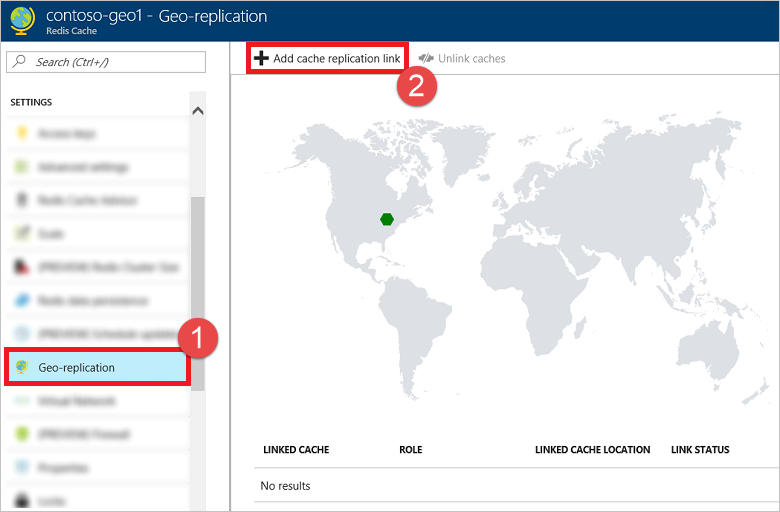
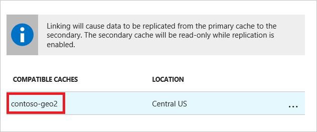
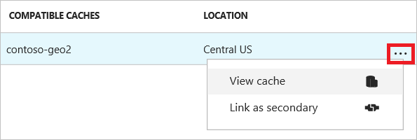
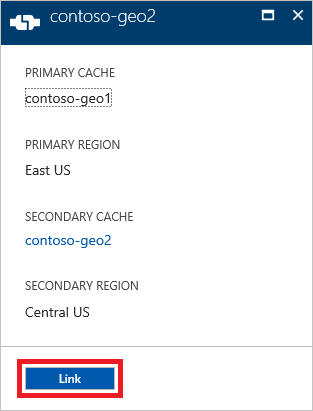
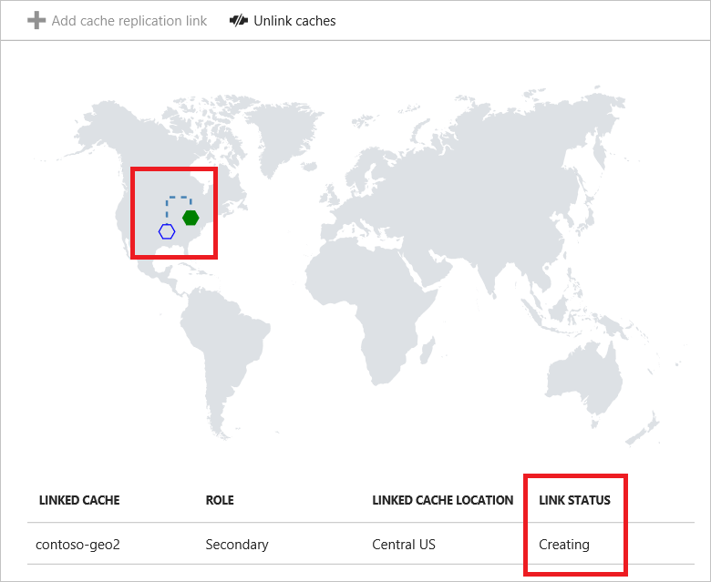
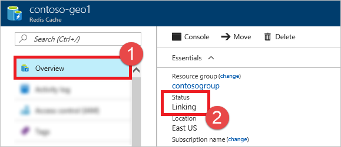
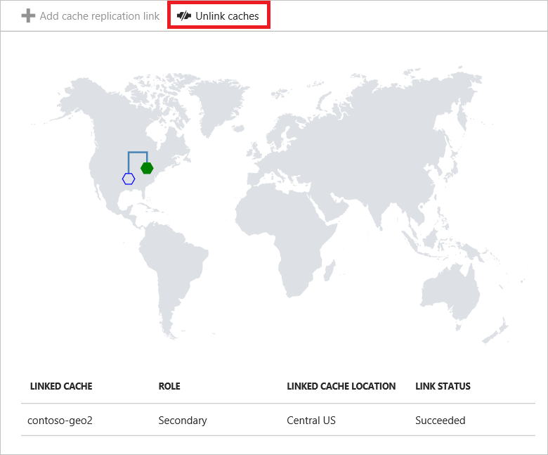

# How to set up geo-replication for Azure Cache for Redis

Geo-replication provides a mechanism for linking two Premium tier Azure Cache for Redis instances. One cache is chosen as the primary linked cache, and the other as the secondary linked cache. The secondary linked cache becomes read-only, and data written to the primary cache is replicated to the secondary linked cache. Data transfer between the primary and secondary cache instances is secured by TLS. Geo-replication can be used to set up a cache that spans two Azure regions. This article provides a guide to configuring geo-replication for your Premium tier Azure Cache for Redis instances.

> [!NOTE]
> Geo-replication is designed as a disaster-recovery solution. By default, your application will write to and read from the primary region. It can optionally be configured to read from the secondary region. Geo-replication doesn't provide automatic failover due to concerns over added network latency between regions if the rest of your application remains in the primary region. You'll need to manage and initiate the failover by unlinking the secondary cache. This will promote it to be the new primary instance.

## Geo-replication prerequisites

To configure geo-replication between two caches, the following prerequisites must be met:

- Both caches are [Premium tier](cache-overview.md#service-tiers) caches.
- Both caches are in the same Azure subscription.
- The secondary linked cache is either the same cache size or a larger cache size than the primary linked cache.
- Both caches are created and in a running state.

Some features aren't supported with geo-replication:

- Persistence isn't supported with geo-replication.
- Clustering is supported if both caches have clustering enabled and have the same number of shards.
- Caches in the same VNET are supported.
- Caches in different VNETs are supported with caveats. See [Can I use geo-replication with my caches in a VNET?](#can-i-use-geo-replication-with-my-caches-in-a-vnet) for more information.

After geo-replication is configured, the following restrictions apply to your linked cache pair:

- The secondary linked cache is read-only; you can read from it, but you can't write any data to it. 
- Any data that was in the secondary linked cache before the link was added is removed. If the geo-replication is later removed however, the replicated data remains in the secondary linked cache.
- You can't [scale](cache-how-to-scale.md) either cache while the caches are linked.
- You can't [change the number of shards](cache-how-to-premium-clustering.md) if the cache has clustering enabled.
- You can't enable persistence on either cache.
- You can [Export](cache-how-to-import-export-data.md#export) from either cache.
- You can't [Import](cache-how-to-import-export-data.md#import) into the secondary linked cache.
- You can't delete either linked cache, or the resource group that contains them, until you unlink the caches. For more information, see [Why did the operation fail when I tried to delete my linked cache?](#why-did-the-operation-fail-when-i-tried-to-delete-my-linked-cache)
- If the caches are in different regions, network egress costs apply to the data moved across regions. For more information, see [How much does it cost to replicate my data across Azure regions?](#how-much-does-it-cost-to-replicate-my-data-across-azure-regions)
- Automatic failover doesn't occur between the primary and secondary linked cache. For more information and information on how to failover a client application, see [How does failing over to the secondary linked cache work?](#how-does-failing-over-to-the-secondary-linked-cache-work)

## Add a geo-replication link

1. To link two caches together for geo-replication, fist click **Geo-replication** from the Resource menu of the cache that you intend to be the primary linked cache. Next, click **Add cache replication link** from the **Geo-replication** blade.

    

2. Click the name of your intended secondary cache from the **Compatible caches** list. If your secondary cache isn't displayed in the list, verify that the [Geo-replication prerequisites](#geo-replication-prerequisites) for the secondary cache are met. To filter the caches by region, click the region in the map to display only those caches in the **Compatible caches** list.

    
    
    You can also start the linking process or view details about the secondary cache by using the context menu.

    

3. Click **Link** to link the two caches together and begin the replication process.

    

4. You can view the progress of the replication process on the **Geo-replication** blade.

    

    You can also view the linking status on the **Overview** blade for both the primary and secondary caches.

    

    Once the replication process is complete, the **Link status** changes to **Succeeded**.

    

    The primary linked cache remains available for use during the linking process. The secondary linked cache isn't available until the linking process completes.

## Remove a geo-replication link

1. To remove the link between two caches and stop geo-replication, click **Unlink caches** from the **Geo-replication** blade.
    
    

    When the unlinking process completes, the secondary cache is available for both reads and writes.

>[!NOTE]
>When the geo-replication link is removed, the replicated data from the primary linked cache remains in the secondary cache.
>
>

## Geo-replication FAQ

- [Can I use geo-replication with a Standard or Basic tier cache?](#can-i-use-geo-replication-with-a-standard-or-basic-tier-cache)
- [Is my cache available for use during the linking or unlinking process?](#is-my-cache-available-for-use-during-the-linking-or-unlinking-process)
- [Can I link more than two caches together?](#can-i-link-more-than-two-caches-together)
- [Can I link two caches from different Azure subscriptions?](#can-i-link-two-caches-from-different-azure-subscriptions)
- [Can I link two caches with different sizes?](#can-i-link-two-caches-with-different-sizes)
- [Can I use geo-replication with clustering enabled?](#can-i-use-geo-replication-with-clustering-enabled)
- [Can I use geo-replication with my caches in a VNET?](#can-i-use-geo-replication-with-my-caches-in-a-vnet)
- [What is the replication schedule for Redis geo-replication?](#what-is-the-replication-schedule-for-redis-geo-replication)
- [How long does geo-replication replication take?](#how-long-does-geo-replication-replication-take)
- [Is the replication recovery point guaranteed?](#is-the-replication-recovery-point-guaranteed)
- [Can I use PowerShell or Azure CLI to manage geo-replication?](#can-i-use-powershell-or-azure-cli-to-manage-geo-replication)
- [How much does it cost to replicate my data across Azure regions?](#how-much-does-it-cost-to-replicate-my-data-across-azure-regions)
- [Why did the operation fail when I tried to delete my linked cache?](#why-did-the-operation-fail-when-i-tried-to-delete-my-linked-cache)
- [What region should I use for my secondary linked cache?](#what-region-should-i-use-for-my-secondary-linked-cache)
- [How does failing over to the secondary linked cache work?](#how-does-failing-over-to-the-secondary-linked-cache-work)

### Can I use geo-replication with a Standard or Basic tier cache?

No, geo-replication is only available for Premium tier caches.

### Is my cache available for use during the linking or unlinking process?

- When linking, the primary linked cache remains available while the linking process completes.
- When linking, the secondary linked cache isn't available until the linking process completes.
- When unlinking, both caches remain available while the unlinking process completes.

### Can I link more than two caches together?

No, you can only link two caches together.

### Can I link two caches from different Azure subscriptions?

No, both caches must be in the same Azure subscription.

### Can I link two caches with different sizes?

Yes, as long as the secondary linked cache is larger than the primary linked cache.

### Can I use geo-replication with clustering enabled?

Yes, as long as both caches have the same number of shards.

### Can I use geo-replication with my caches in a VNET?

Yes, geo-replication of caches in VNETs is supported with caveats:

- Geo-replication between caches in the same VNET is supported.
- Geo-replication between caches in different VNETs is also supported.
  - If the VNETs are in the same region, you can connect them using [VNET peering](https://docs.microsoft.com/azure/virtual-network/virtual-network-peering-overview) or a [VPN Gateway VNET-to-VNET connection](https://docs.microsoft.com/azure/vpn-gateway/vpn-gateway-about-vpngateways#V2V).
  - If the VNETs are in different regions, geo-replication using VNET peering is supported, but a client VM in VNET 1 (region 1) will not be able to access the cache in VNET 2 (region 2) via it's DNS name because of a constraint with Basic internal load balancers. For more information about VNET peering constraints, see [Virtual Network - Peering - Requirements and constraints](https://docs.microsoft.com/azure/virtual-network/virtual-network-manage-peering#requirements-and-constraints). The recommended solution is to use a VPN Gateway VNET-to-VNET connection.
  
Using [this Azure template](https://azure.microsoft.com/resources/templates/201-redis-vnet-geo-replication/), you can quickly deploy two geo-replicated caches into a VNET connected with a VPN Gateway VNET-to-VNET connection.

### What is the replication schedule for Redis geo-replication?

Replication is continuous and asynchronous and doesn't happen on a specific schedule. All the writes done to the primary are instantaneously and asynchronously replicated on the secondary.

### How long does geo-replication replication take?

Replication is incremental, asynchronous, and continuous and the time taken isn't much different from the latency across regions. Under certain circumstances, the secondary cache may be required to do a full sync of the data from the primary. The replication time in this case is dependent on number of factors like: load on the primary cache, available network bandwidth, and inter-region latency. We have found replication time for a full 53-GB geo-replicated pair can be anywhere between 5 to 10 minutes.

### Is the replication recovery point guaranteed?

For caches in a geo-replicated mode, persistence is disabled. If a geo-replicated pair is unlinked, such as a customer-initiated failover, the secondary linked cache keeps its synced data up to that point of time. No recovery point is guaranteed in such situations.

To obtain a recovery point, [Export](cache-how-to-import-export-data.md#export) from either cache. You can later [Import](cache-how-to-import-export-data.md#import) into the primary linked cache.

### Can I use PowerShell or Azure CLI to manage geo-replication?

Yes, geo-replication can be managed using the Azure portal, PowerShell, or Azure CLI. For more information, see the [PowerShell docs](https://docs.microsoft.com/powershell/module/az.rediscache/?view=azps-1.4.0#redis_cache) or [Azure CLI docs](https://docs.microsoft.com/cli/azure/redis/server-link?view=azure-cli-latest).

### How much does it cost to replicate my data across Azure regions?

When using geo-replication, data from the primary linked cache is replicated to the secondary linked cache. There's no charge for the data transfer if the two linked caches are in the same region. If the two linked caches are in different regions, the data transfer charge is the network egress cost of data moving across either region. For more information, see [Bandwidth Pricing Details](https://azure.microsoft.com/pricing/details/bandwidth/).

### Why did the operation fail when I tried to delete my linked cache?

Geo-replicated caches and their resource groups can't be deleted while linked until you remove the geo-replication link. If you attempt to delete the resource group that contains one or both of the linked caches, the other resources in the resource group are deleted, but the resource group stays in the `deleting` state and any linked caches in the resource group remain in the `running` state. To completely delete the resource group and the linked caches within it, unlink the caches as described in [Remove a geo-replication link](#remove-a-geo-replication-link).

### What region should I use for my secondary linked cache?

In general, it's recommended for your cache to exist in the same Azure region as the application that accesses it. For applications with separate primary and fallback regions, it's recommended your primary and secondary caches exist in those same regions. For more information about paired regions, see [Best Practices – Azure Paired regions](../best-practices-availability-paired-regions.md).

### How does failing over to the secondary linked cache work?

Automatic failover across Azure regions isn't supported for geo-replicated caches. In a disaster-recovery scenario, customers should bring up the entire application stack in a coordinated manner in their backup region. Letting individual application components decide when to switch to their backups on their own can negatively impact performance. One of the key benefits of Redis is that it's a very low-latency store. If the customer's main application is in a different region than its cache, the added round-trip time would have a noticeable impact on performance. For this reason, we avoid failing over automatically because of transient availability issues.

To start a customer-initiated failover, first unlink the caches. Then, change your Redis client to use the connection endpoint of the (formerly linked) secondary cache. When the two caches are unlinked, the secondary cache becomes a regular read-write cache again and accepts requests directly from Redis clients.

## Next steps
Learn more about Azure Cache for Redis features.

* [Azure Cache for Redis service tiers](cache-overview.md#service-tiers)
