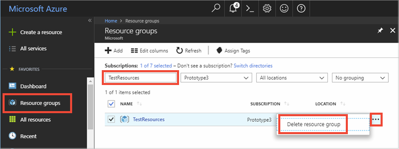

# Quickstart: Use Azure Cache for Redis with Python


## Introduction

This quickstart shows how to connect to an Azure Cache for Redis with Python to read and write to a cache. 


[!INCLUDE [quickstarts-free-trial-note](../../includes/quickstarts-free-trial-note.md)]

## Prerequisites

* [Python 2 or Python 3 environment](https://www.python.org/downloads/) installed with [pip](https://pypi.org/project/pip/). 

## Create an Azure Cache for Redis on Azure
[!INCLUDE [redis-cache-create](../../includes/redis-cache-create.md)]

[!INCLUDE [redis-cache-create](../../includes/redis-cache-access-keys.md)]

## Install redis-py

[Redis-py](https://github.com/andymccurdy/redis-py) is a Python interface to Azure Cache for Redis. Use the Python packages tool, *pip*, to install the redis-py package. 

The following example uses *pip3* for Python3 to install the redis-py package on Windows 10 using a Visual Studio 2017 Developer Command prompt running with elevated Administrator privileges.

    pip3 install redis


## Read and write to the cache

Run Python and test using the cache from the command line. Replace `<Your Host Name>` and `<Your Access Key>` with the values for your Azure Cache for Redis. 

```python
>>> import redis
>>> r = redis.StrictRedis(host='<Your Host Name>.redis.cache.windows.net',
        port=6380, db=0, password='<Your Access Key>', ssl=True)
>>> r.set('foo', 'bar')
True
>>> r.get('foo')
b'bar'
```

## Create a Python script

Create a new script text file named *PythonApplication1.py*.

Add the following script to *PythonApplication1.py* and save the file. This script will test the cache access. Replace `<Your Host Name>` and `<Your Access Key>` with the values for your Azure Cache for Redis. 

```python
import redis

myHostname = "<Your Host Name>.redis.cache.windows.net"
myPassword = "<Your Access Key>"

r = redis.StrictRedis(host=myHostname, port=6380,password=myPassword,ssl=True)

result = r.ping()
print("Ping returned : " + str(result))

result = r.set("Message", "Hello!, The cache is working with Python!")
print("SET Message returned : " + str(result))

result = r.get("Message")
print("GET Message returned : " + result.decode("utf-8"))

result = r.client_list()
print("CLIENT LIST returned : ") 
for c in result:
	print("id : " + c['id'] + ", addr : " + c['addr'])
```

Run the script with Python.


## Clean up resources

If you will be continuing with another tutorial, you can keep the resources created in this quickstart and reuse them.

Otherwise, if you are finished with the quickstart sample application, you can delete the Azure resources created in this quickstart to avoid charges. 

> [!IMPORTANT]
> Deleting a resource group is irreversible and that the resource group and all the resources in it are permanently deleted. Make sure that you do not accidentally delete the wrong resource group or resources. If you created the resources for hosting this sample inside an existing resource group that contains resources you want to keep, you can delete each resource individually from their respective blades instead of deleting the resource group.
>

Sign in to the [Azure portal](https://portal.azure.com) and click **Resource groups**.

In the **Filter by name...** textbox, type the name of your resource group. The instructions for this article used a resource group named *TestResources*. On your resource group in the result list, click **...** then **Delete resource group**.



You will be asked to confirm the deletion of the resource group. Type the name of your resource group to confirm, and click **Delete**.

After a few moments, the resource group and all of its contained resources are deleted.


## Next steps

> [!div class="nextstepaction"]
> [Create a simple ASP.NET web app that uses an Azure Cache for Redis.](./cache-web-app-howto.md)


<!--Image references-->
[1]: ./media/cache-python-get-started/redis-cache-new-cache-menu.png
[2]: ./media/cache-python-get-started/redis-cache-cache-create.png
