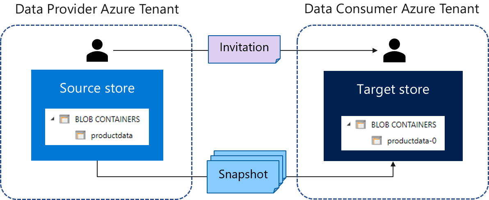

# What is Azure Data Share?

Azure Data Share is a first party resource provider that enables customers to easily and securely share big data with other organizations in Azure, with centralized management, monitoring and governance. This service acts as a one stop shop for all your data sharing needs, enabling you to share data by adding various Azure Data sources to an entity (called a 'Data Share') which can then be shared with multiple recipients outside of your organization. Third party partners that need your data can receive regular, incremental updates as they occur so that your customers are always working with the latest copy of your data. 

## Key capabilities

Azure Data Share enables Data Providers to do the following:

* Share data from Azure Storage, Azure Data Lake Gen1 & Azure Data Lake Gen2 with customers and partners outside of your organization;

* Keep track of who you have shared your data with, including how frequently they are receiving updates to your data;

* Allow your customers to pull the latest version of your data as needed, or allow them to automatically receive         incremental changes to your data at an interval defined by you;

Azure Data Share enables Data Consumers to do the following: 

* View and Accept or Reject an Azure Data Share invitation, including a description of the type of data being shared and the Terms of Use; 

* Trigger a Full or Incremental Snapshot of a Data Share that an organization has shared with you;

* Subscribe to a Data Share to receive the latest copy of the data through incremental snapshot copy;

* Accept data shared with you into an Azure Blob Storage or Azure Data Lake Gen2 account; 

All key capabilities listed above are supported through the Azure Portal or via REST APIs. For more details on using Azure Data Share through REST APIs, click here. 
    
## Next steps

* Get Started with Azure Data Share using Azure Portal | REST APIs