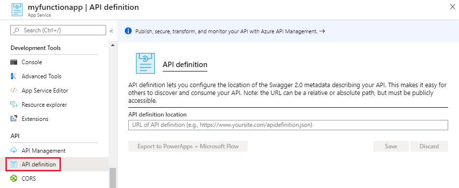
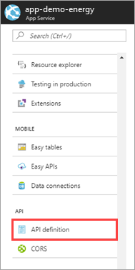
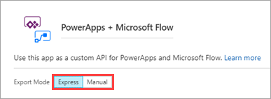
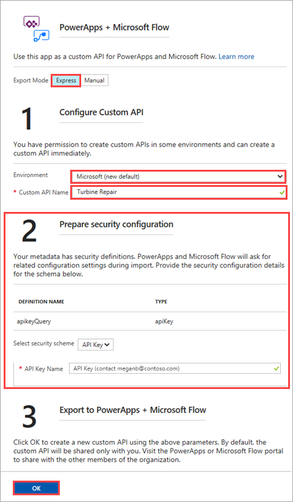
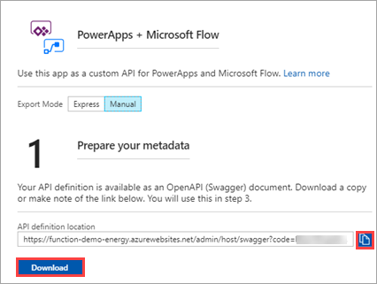
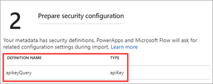
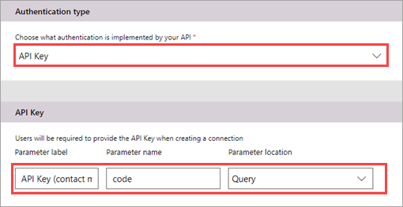
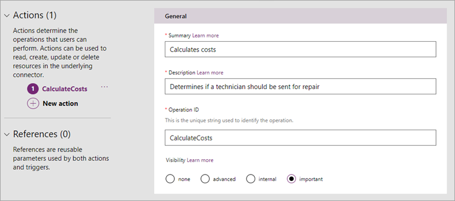

# Exporting an Azure-hosted API to PowerApps and Microsoft Flow

[PowerApps](https://powerapps.microsoft.com/guided-learning/learning-introducing-powerapps/) is a service for building and using custom business apps that connect to your data and work across platforms. [Microsoft Flow](https://flow.microsoft.com/guided-learning/learning-introducing-flow/) makes it easy to automate workflows and business processes between your favorite apps and services. Both PowerApps and Microsoft Flow come with a variety of built-in connectors to data sources such as Office 365, Dynamics 365, Salesforce, and more. In some cases, app and flow builders also want to connect to data sources and APIs built by their organization.

Similarly, developers that want to expose their APIs more broadly within an organization can make their APIs available to app and flow builders. This topic shows you how to export an API built with [Azure Functions](../azure-functions/functions-overview.md) or [Azure App Service](../app-service/app-service-web-overview.md). The exported API becomes a *custom connector*, which is used in PowerApps and Microsoft Flow just like a built-in connector.

## Create and export an API definition
Before exporting an API, you must describe the API using an OpenAPI definition (formerly known as a [Swagger](http://swagger.io/) file). This definition contains information about what operations are available in an API and how the request and response data for the API should be structured. PowerApps and Microsoft Flow can create custom connectors for any OpenAPI 2.0 definition. Azure Functions and Azure App Service have built-in support for creating, hosting, and managing OpenAPI definitions. For more information, see [Create a RESTful API in Azure Web Apps](../app-service/app-service-web-tutorial-rest-api.md).

> [!NOTE]
> You can also build custom connectors in the PowerApps and Microsoft Flow UI, without using an OpenAPI definition. For more information, see [Register and use a custom connector (PowerApps)](https://powerapps.microsoft.com/tutorials/register-custom-api/) and [Register and use a custom connector (Microsoft  Flow)](https://flow.microsoft.com/documentation/register-custom-api/).

To export the API definition, follow these steps:

1. In the [Azure portal](https://portal.azure.com), navigate to your Azure Functions or another App Service application.

    If using Azure Functions, select your function app, choose **Platform features**, and then **API definition**.

    

    If using Azure App Service, select **API definition** from the settings list.

    

2. The **Export to PowerApps + Microsoft Flow** button should be available (if not, you must first create an OpenAPI definition). Click this button to begin the export process.

    

3. Select the **Export Mode**:

    **Express** lets you create the custom connector from within the Azure portal. It requires that you are signed into PowerApps or Microsoft Flow and have permission to create connectors in the target environment. This is the recommended approach if those requirements can be met. If using this mode, follow the [Use express export](#express) instructions below.

    **Manual** lets you export the API definition, which you then import using the PowerApps or Microsoft Flow portals. This is the recommended approach if the Azure user and the user with permission to create connectors are different people or if the connector needs to be created in another Azure tenant. If using this mode, follow the [Use manual export](#manual) instructions below.

    

> [!NOTE]
> The custom connector uses a *copy* of the API definition, so PowerApps and Microsoft Flow will not immediately know if you make changes to the application and its API definition. If you do make changes, repeat the export steps for the new version.

<a name="express"></a>
## Use express export

To complete the export in **Express** mode, follow these steps:

1. Make sure you're signed in to the PowerApps or Microsoft Flow tenant to which you want to export. 

2. Use the settings as specified in the table.

    |Setting|Description|
    |--------|------------|
    |**Environment**|Select the environment that the custom connector should be saved to. For more information, see [Environments overview](https://powerapps.microsoft.com/tutorials/environments-overview/).|
    |**Custom API Name**|Enter a name, which PowerApps and Microsoft Flow builders will see in their connector list.|
    |**Prepare security configuration**|If required, provide the security configuration details needed to grant users access to your API. This example shows an API key. For more information, see [Specify authentication type](#auth) below.|
 
    

3. Click **OK**. The custom connector is now built and added to the environment you specified.

For examples of using **Express** mode with Azure Functions, see [Call a function from PowerApps](functions-powerapps-scenario.md) and [Call a function from Microsoft Flow](functions-flow-scenario.md).

<a name="manual"></a>
## Use manual export

To complete the export in **Manual** mode, follow these steps:

1. Click **Download** and save the file, or click the copy button and save the URL. You will use the download file or the URL during import.
 
    
 
2. If your API definition includes any security definitions, these are called out in step #2. During import, PowerApps and Microsoft Flow detects these and prompts for security information. Gather the credentials related to each definition for use in the next section. For more information, see [Specify authentication type](#auth) below.

    

    This example shows the API key security definition that was included in the OpenAPI definition.

Now that you've exported the API definition, you import it to create a custom connector in PowerApps and Microsoft Flow. The following example uses PowerApps, but custom connectors are shared between the two services, so you only need to import the definition once.

To import the API definition into PowerApps and Microsoft Flow, follow these steps:

1. Sign into [web.powerapps.com](https://web.powerapps.com) or [flow.microsoft.com](https://flow.microsoft.com/). 

2. Click the **Settings** button (the gear icon) at the upper right of the page, and select **Custom connectors**.

    

3. Click **Create custom connector**.

4. On the **General** tab, provide a name for your API, and then upload the OpenAPI definition or paste in the metadata URL. Click **Upload**, then **Continue**.

    

5. On the **Security** tab, if you are prompted to provide authentication details, enter the values appropriate for the authentication type. Click **Continue**.

    

    This example shows the required fields for API key authentication. The fields differ depending on the authentication type.

6. On the **Definitions** tab, all the operations defined in your OpenAPI file are auto-populated. If all your required operations are defined, you can go to the next step. If not, you can add and modify operations here.

    

    This example has one operation, named `CalculateCosts`. The metadata, like **Description**, all comes from the OpenAPI file.

7. Click **Create connector** at the top of the page.

You can now connect to the custom connector in PowerApps and Microsoft Flow. For more information on creating connectors in the PowerApps and Microsoft Flow portals, see [Register your custom connector (PowerApps)](https://powerapps.microsoft.com/tutorials/register-custom-api/#register-your-custom-connector) and [Register your custom connector (Microsoft  Flow)](https://flow.microsoft.com/documentation/register-custom-api/#register-your-custom-connector).

<a name="auth"></a>
## Specify authentication type

PowerApps and Microsoft Flow support a collection of identity providers that provide authentication for custom connectors. If your API requires authentication, ensure that it is captured as a _security definition_ in your OpenAPI document, like the following example:

```json
"securityDefinitions": {
    "AAD": {
    "type": "oauth2",
    "flow": "accessCode",
    "authorizationUrl": "https://login.windows.net/common/oauth2/authorize",
    "scopes": {}
    }
}
``` 
During export, you provide configuration values that allow PowerApps and Microsoft Flow to authenticate users.

This section covers the authentication types that are supported in **Express** mode: API key, Azure Active Directory, and Generic OAuth 2.0. PowerApps and Microsoft Flow also support Basic Authentication, and OAuth 2.0 for specific services like Dropbox, Facebook, and SalesForce.

### API key
When using an API key, the users of your connector are prompted to provide the key when they create a connection. You specify an API key name to help them understand which key is needed. In the earlier example, we use the name `API Key (contact meganb@contoso.com)` so people know where to get information about the API key. For Azure Functions, the key is typically one of the host keys, covering several functions within the function app.

### Azure Active Directory (Azure AD)
When using Azure AD, you need two Azure AD application registrations: one for the API itself, and one for the custom connector:

- To configure registration for the API, use the [App Service Authentication/Authorization](../app-service/app-service-mobile-how-to-configure-active-directory-authentication.md) feature.

- To configure registration for the connector, follow the steps in [Adding an Azure AD application](https://docs.microsoft.com/azure/active-directory/develop/active-directory-integrating-applications#adding-an-application). The registration must have delegated access to your API and a reply URL of `https://msmanaged-na.consent.azure-apim.net/redirect`. 

For more information, see the Azure AD registration examples for [PowerApps](https://powerapps.microsoft.com/tutorials/customapi-azure-resource-manager-tutorial/) and [Microsoft Flow](https://flow.microsoft.com/documentation/customapi-azure-resource-manager-tutorial/). These examples use Azure Resource Manager as the API; substitute your API if you follow the steps.

The following configuration values are required:
- **Client ID** - the client ID of your connector Azure AD registration
- **Client secret** - the client secret of your connector Azure AD registration
- **Login URL** - the base URL for Azure AD. In Azure, this is typically `https://login.windows.net`.
- **Tenant ID** - the ID of the tenant to be used for the login. This should be "common" or the ID of the tenant in which the connector is created.
- **Resource URL** - the resource URL of the Azure AD registration for your API

> [!IMPORTANT]
> If someone else will import the API definition into PowerApps and Microsoft Flow as part of the manual flow, you must provide them with the client ID and client secret of the *connector registration*, as well as the resource URL of your API. Make sure that these secrets are managed securely. **Do not share the security credentials of the API itself.**

### Generic OAuth 2.0
When using generic OAuth 2.0, you can integrate with any OAuth 2.0 provider. This allows you to work with custom providers that are not natively supported.

The following configuration values are required:
- **Client ID** - the OAuth 2.0 client ID
- **Client secret** - the OAuth 2.0 client secret
- **Authorization URL** - the OAuth 2.0 authorization URL
- **Token URL** - the OAuth 2.0 token URL
- **Refresh URL** - the OAuth 2.0 refresh URL


