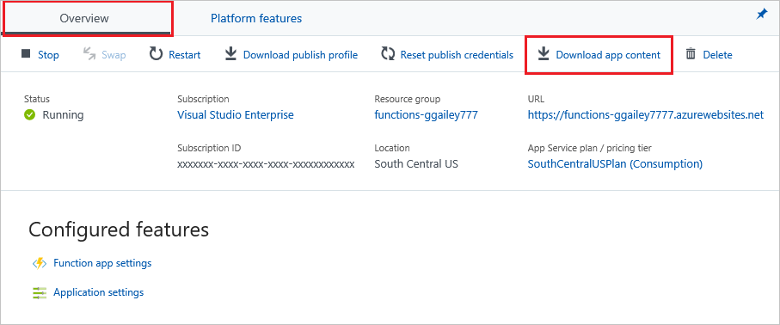

# Zip push deployment for Azure Functions 
This article describes how to deploy your function app project files to Azure from a .zip (compressed) file. You learn how to do a push deployment, both by using Azure CLI and by using the REST APIs. 

Azure Functions has the full range of continuous deployment and integration options that are provided by Azure App Service. For more information, see [Continuous deployment for Azure Functions](functions-continuous-deployment.md). 

For faster iteration during development, it's often easier to deploy your function app project files directly from a compressed .zip file. This .zip file deployment uses the same Kudu service that powers continuous integration-based deployments, including:

+ Deletion of files that were left over from earlier deployments.
+ Deployment customization, including running deployment scripts.
+ Deployment logs.
+ Syncing function triggers in a [Consumption plan](functions-scale.md) function app.

For more information, see the [.zip push deployment reference][.zip push deployment reference]. 

## Deployment .zip file requirements
The .zip file that you use for push deployment must contain all of the project files in your function app, including your function code. 

>[!IMPORTANT]
> When you use .zip push deployment, any files from an existing deployment that aren't found in the .zip file are deleted from your function app.  

### Function app folder structure

[!INCLUDE [functions-folder-structure](../../includes/functions-folder-structure.md)]

### Download your function app project

When you are developing on a local computer, it's easy to create a .zip file of the function app project folder on your development computer. 

However, you might have created your functions by using the editor in the Azure portal. To download your function app project from the portal: 

1. Sign in to the [Azure portal](https://portal.azure.com), and then go to your function app.

2. On the **Overview** tab, select **Download app content**. Select your download options, and then select **Download**.     

    

The downloaded .zip file is in the correct format to be republished to your function app by using .zip push deployment.

You can also download a .zip file from a GitHub repository. Keep in mind that when you download a GitHub repository as a .zip file, GitHub adds an extra folder level for the branch. This extra folder level means that you can't deploy the .zip file directly as you downloaded it from GitHub. If you're using a GitHub repository to maintain your function app, you should use [continuous integration](functions-continuous-deployment.md) to deploy your app.  

## <a name="cli"></a>Deploy by using Azure CLI

You can use Azure CLI to trigger a push deployment. Push deploy a .zip file to your function app by using the [az functionapp deployment source config-zip](/cli/azure/functionapp/deployment/source#az_functionapp_deployment_source_config_zip) command. To use this command, you must use Azure CLI version 2.0.21 or later. To see what Azure CLI version you are using, use the `az --version` command.

In the following command, replace the `<zip_file_path>` placeholder with the path to the location of your .zip file. Also, replace `<app_name>` with the unique name of your function app. 

```azurecli-interactive
az functionapp deployment source config-zip  -g myResourceGroup -n \
<app_name> --src <zip_file_path>
```
This command deploys project files from the downloaded .zip file to your function app in Azure. It then restarts the app. To view the list of deployments for this function app, you must use the REST APIs.

When you're using Azure CLI on your local computer, `<zip_file_path>` is the path to the .zip file on your computer. You can also run Azure CLI in [Azure Cloud Shell](../cloud-shell/overview.md). When you use Cloud Shell, you must first upload your deployment .zip file to the Azure Files account that's associated with your Cloud Shell. In that case, `<zip_file_path>` is the storage location that your Cloud Shell account uses. For more information, see [Persist files in Azure Cloud Shell](../cloud-shell/persisting-shell-storage.md).


[!INCLUDE [app-service-deploy-zip-push-rest](../../includes/app-service-deploy-zip-push-rest.md)]

[!INCLUDE [app-service-deploy-zip-push-custom](../../includes/app-service-deploy-zip-push-custom.md)]

## Next steps

> [!div class="nextstepaction"]
> [Continuous deployment for Azure Functions](functions-continuous-deployment.md)

[.zip push deployment reference topic]: https://github.com/projectkudu/kudu/wiki/Deploying-from-a-zip-file
