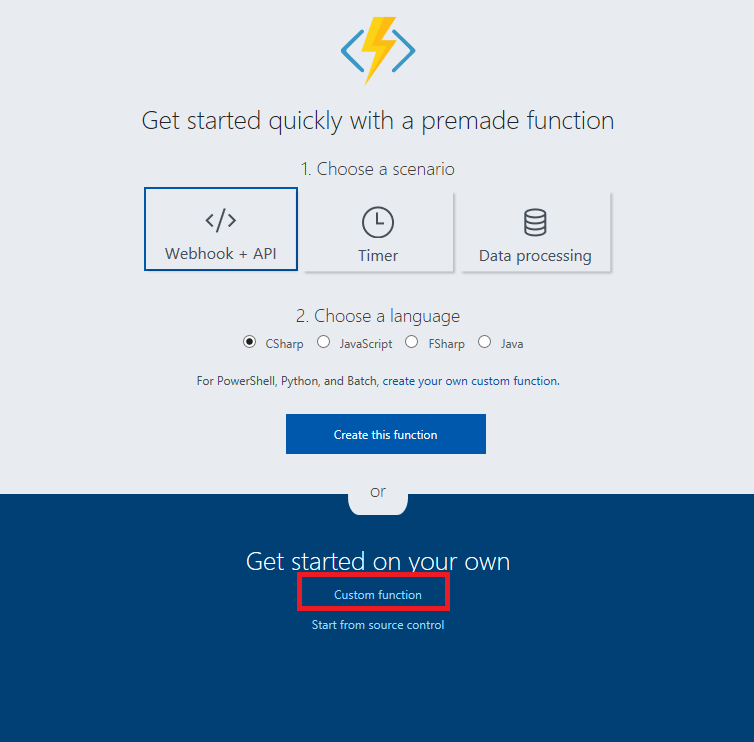
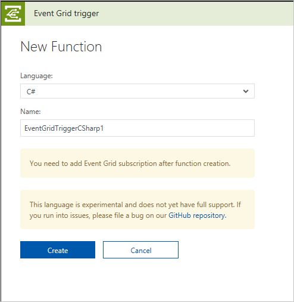
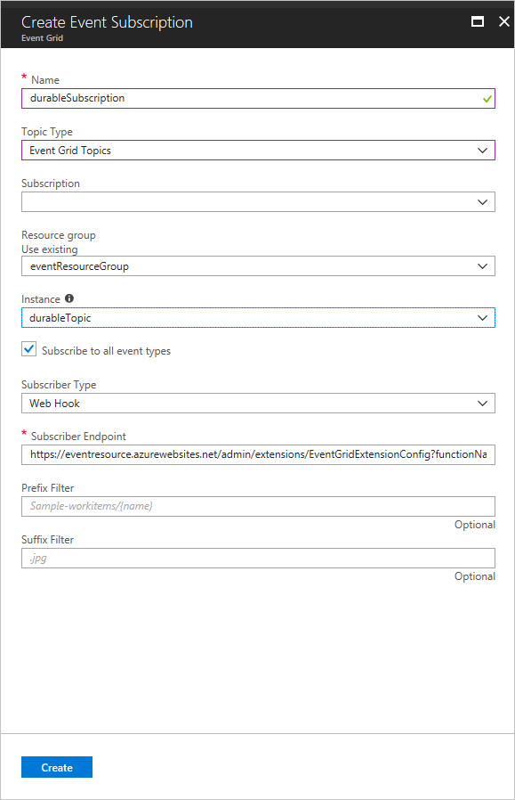

# Automatic Azure Event Grid publishing

This feature allows publishing orchestration lifecycle events (created, completed, failed, etc.) to a custom [Azure Event Grid Topic](https://docs.microsoft.com/en-us/azure/event-grid/overview). This feature is useful for these contexts.

* **DevOps scenario like blue/green deployments** : You might want to know if there is running tasks to achieve Side-by-side deployment scenario describe in [Migration strategies](https://docs.microsoft.com/en-us/azure/azure-functions/durable-functions-versioning#mitigation-strategies). For more detail, Please refer [Versioning in Durable Functions](https://docs.microsoft.com/en-us/azure/azure-functions/durable-functions-versioning#mitigation-strategies)

* **Advanced monitoring and diagnostics support** : You can keep track of orchestration status information in an external store (e.g., SQL, CosmosDB), optimized for queries.

* **Long running background activity** : If you use Durable Functions as a long-running background activity, this feature helps you to know the current status.

# Prerequisites

* [Microsoft.Azure.WebJobs.Extensions.DurableTask](https://www.nuget.org/packages/Microsoft.Azure.WebJobs.Extensions.DurableTask) 1.3.0-rc or upper
* [Storage Emulator](https://docs.microsoft.com/en-us/azure/storage/common/storage-use-emulator)
* [Azure CLI 2.0](https://docs.microsoft.com/en-us/cli/azure/?view=azure-cli-latest)

    > You can use [Azure Cloud Shell](https://docs.microsoft.com/en-us/azure/cloud-shell/overview) to use Azure CLI 2.0.

# Create a custom event grid topic

Create an event grid topic for sending events from Durable Functions. In this section, we use Azure CLI. However, you can use PowerShell and Azure portal as well. For more detail, Please refer 

* [EventGrid Quickstarts: Create custom event - Azure CLI](https://docs.microsoft.com/en-us/azure/event-grid/custom-event-quickstart)
* [EvnetGrid Quickstarts: Create custom event - PowerShell](https://docs.microsoft.com/en-us/azure/event-grid/custom-event-quickstart-powershell)
* [EventGrid Quickstarts: Create custom event - Azure portal](https://docs.microsoft.com/en-us/azure/event-grid/custom-event-quickstart-portal)

## Create a resource group

Create a resource group with the `az group create` command. Currently, Event Grid doesn't support all regions. Please check the availability in [here](https://docs.microsoft.com/en-us/azure/event-grid/overview). 

```bash
az group create --name eventResourceGroup --location westus2
```

## Create a custom topic

An event grid topic provides a user-defined endpoint that you post your event to. Replace `<topic_name>` with a unique name for your topic. The topic name must be unique because a DNS entry represents it.

```bash
az eventgrid topic create --name <topic_name> -l westus2 -g eventResourceGroup 
```

You can get the endpoint of the event grid topic. Please replace `<topic_name>` with the name you chose.

```bash
az eventgrid topic show --name <topic_name> -g eventResourceGroup --query "endpoint" --output tsv
```

Get the event grid topic key. Please replace `<topic_name>` with the name you chose.

```bash
az eventgrid topic key list --name <topic_name> -g eventResourceGroup --query "key1" --output tsv
```

Now you can send events to the topic.

# Configure Azure Event Grid publishing

On your Durable Functions project, please find `host.json` to start publishing your lifecycle event. 
Add `EventGridTopicEndpoint` and `EventGridKeySettingName` on it.

```json
{
    "durableTask": {
        "EventGridTopicEndpoint": "https://<topic_name>.westus2-1.eventgrid.azure.net/api/events",
        "EventGridKeySettingName": "EventGridKey"
    }
}
```

* **EventGridTopicEndpoint** - The endpoint of the Event Grid Topic
* **EventGridKeySettingName** - The key name of the Application settings on your Azure Function. Durable Functions will get the Event Grid Topic key from the value.

Once configure the `host.json` Your Durable Functions starts to send lifecycle events to the event grid topic. Both on Function App and Local debugging. Then you need to set the Event Grid Key to the App Settings for a Function App or `local.setting.json` to bind the `EventGridKeySettingName`. This is a sample of the `local.settings.json` for local debugging. Replace `<topic_key>` to the Key.  

```json
{
    "IsEncrypted": false,
    "Values": {
        "AzureWebJobsStorage": "UseDevelopmentStorage=true",
        "AzureWebJobsDashboard": "UseDevelopmentStorage=true",
        "EventGridKey": "<topic_key>"
    }
}
```

Plase make sure that [Storage Emulator](https://docs.microsoft.com/en-us/azure/storage/common/storage-use-emulator) is working. I recommend to clean up using `AzureStorageEmulator.exe clear all` command before executing.


# Create Azure functions which listen to the custom events

## Create Azure Functions on your portal to receive the events

Create an Azure Functions which receive the lifecycle events on your Azure portal. On the portal, find the Resource Group which you created. 

### Create a Function App

Go to the Resource Group which you created then press `Add` button.


Click Function App


Enter the parameters. I recommend using the same Location as the Event Grid Topic. Then Press `Create`.


### Create an Event Grid Trigger function

Create an Azure Function to receive the lifecycle event. Click `Custom Function` 



Choose Event Grid Trigger and click `C#`.


Enter the name of the Function. Then press create.



It will create a function. 

```csharp
#r "Newtonsoft.Json"
using Newtonsoft.Json;
using Newtonsoft.Json.Linq;
public static void Run(JObject eventGridEvent, TraceWriter log)
{
    log.Info(eventGridEvent.ToString(Formatting.Indented));
}
```

Click the `Add Event Grid Subscription`. This operation will add Event Grid subscription for subscribing the event grid topic which you created. For more detail, please refer  [Concepts in Azure Event Grid](https://docs.microsoft.com/en-us/azure/event-grid/concepts)


Create an Event Grid subscription.  Select `Event Grid Topics` for Topic Type. Select a resource group which you created for the event grid topic. Then select the instance of the event grid topic. Press create.




Now ready to try to receive the lifecycle event. 

## Create Durable Functions to send the events.

On your project, You can start the debugging on your local machine.  This code is the template code for the Durable Functions. You already configure `host.json` and `local.settings.json` on your local machine. 

```csharp
using System.Collections.Generic;
using System.Net.Http;
using System.Threading.Tasks;
using Microsoft.Azure.WebJobs;
using Microsoft.Azure.WebJobs.Extensions.Http;
using Microsoft.Azure.WebJobs.Host;

namespace LifeCycleEventSpike
{
    public static class Sample
    {
        [FunctionName("Sample")]
        public static async Task<List<string>> RunOrchestrator(
            [OrchestrationTrigger] DurableOrchestrationContext context)
        {
            var outputs = new List<string>();

            // Replace "hello" with the name of your Durable Activity Function.
            outputs.Add(await context.CallActivityAsync<string>("Sample_Hello", "Tokyo"));
            outputs.Add(await context.CallActivityAsync<string>("Sample_Hello", "Seattle"));
            outputs.Add(await context.CallActivityAsync<string>("Sample_Hello", "London"));

            // returns ["Hello Tokyo!", "Hello Seattle!", "Hello London!"]
            return outputs;
        }

        [FunctionName("Sample_Hello")]
        public static string SayHello([ActivityTrigger] string name, TraceWriter log)
        {
            log.Info($"Saying hello to {name}.");
            return $"Hello {name}!";
        }

        [FunctionName("Sample_HttpStart")]
        public static async Task<HttpResponseMessage> HttpStart(
            [HttpTrigger(AuthorizationLevel.Anonymous, "get", "post")]HttpRequestMessage req,
            [OrchestrationClient]DurableOrchestrationClient starter,
            TraceWriter log)
        {
            // Function input comes from the request content.
            string instanceId = await starter.StartNewAsync("Sample", null);
            log.Info($"Started orchestration with ID = '{instanceId}'.");
            return starter.CreateCheckStatusResponse(req, instanceId);
        }
    }
}
```

If you call the `Sample_HttpStart` with Postman or your browser, Durable Function starts to send lifecycle events. The endpoint is usually `http://localhost:7071/api/Sample_HttpStart` for local debugging.

```
2018-04-20T09:28:21.041 [Info] Function started (Id=3301c3ef-625f-40ce-ad4c-9ba2916b162d)
2018-04-20T09:28:21.104 [Info] {
    "id": "054fe385-c017-4ce3-b38a-052ac970c39d",    
    "subject": "durable/orchestrator/Running",
    "data": {
        "hubName": "DurableFunctionsHub",
        "functionName": "Sample",
        "instanceId": "055d045b1c8a415b94f7671d8df693a6",
        "reason": "",
        "eventType": 0
    },
    "eventType": "orchestratorEvent",
    "eventTime": "2018-04-20T09:28:19.6492068Z",
    "dataVersion": "1.0",
    "metadataVersion": "1",
    "topic": "/subscriptions/<your_subscription_id>/resourceGroups/eventResourceGroup/providers/Microsoft.EventGrid/topics/durableTopic"
}

2018-04-20T09:28:21.104 [Info] Function completed (Success, Id=3301c3ef-625f-40ce-ad4c-9ba2916b162d, Duration=65ms)
2018-04-20T09:28:37.098 [Info] Function started (Id=36fadea5-198b-4345-bb8e-2837febb89a2)
2018-04-20T09:28:37.098 [Info] {
    "id": "8cf17246-fa9c-4dad-b32a-5a868104f17b",
    "subject": "durable/orchestrator/Completed",
    "data": {
        "hubName": "DurableFunctionsHub",
        "functionName": "Sample",
        "instanceId": "055d045b1c8a415b94f7671d8df693a6",
        "reason": "",
        "eventType": 1
    },
    "eventType": "orchestratorEvent",
    "eventTime": "2018-04-20T09:28:36.5061317Z",
    "dataVersion": "1.0",
    "metadataVersion": "1",
    "topic": "/subscriptions/<your_subscription_id>/resourceGroups/eventResourceGroup/providers/Microsoft.EventGrid/topics/durableTopic"
}
2018-04-20T09:28:37.098 [Info] Function completed (Success, Id=36fadea5-198b-4345-bb8e-2837febb89a2, Duration=0ms)
```

## Event Schema

Lifecycle event schema defines these columns.

* **id** : Unique idendifier for the Event Grid event.
* **subject** : Path to the event subject. `durable/orchestrator/{orchestrationRuntimeStatus}`. `{orchestrationRuntimeStatus}` will be `Running`, `Completed`, `Failed`, and `Terminated`.  
* **data** : Durable Functions Specific Parameters.
    * **hubName** : [TaskHub](https://docs.microsoft.com/en-us/azure/azure-functions/durable-functions-task-hubs) name.
    * **functionName** : Orchestrator function name.
    * **instanceId** : Durable Functions instanceId.
    * **reason** : Additional data associated with the tracking event. For more detail, please refer [Diagnostics in Durable Functions (Azure Functions)](https://docs.microsoft.com/en-us/azure/azure-functions/durable-functions-diagnostics)
    * **eventType**: "orchestratorEvent"
* **eventType** : "orchestratorEvent"
* **eventTime** : Event time (UTC).
* **dataVersion** : Version of the Lifecycle event schema.
* **metadataVersion** :  Version of the metadata.
* **topic** : EventGrid Topic resource.

# How to test locally


## Next steps
