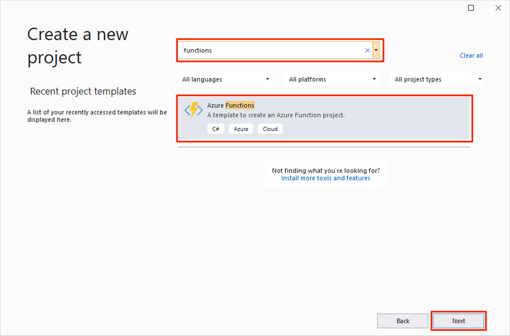
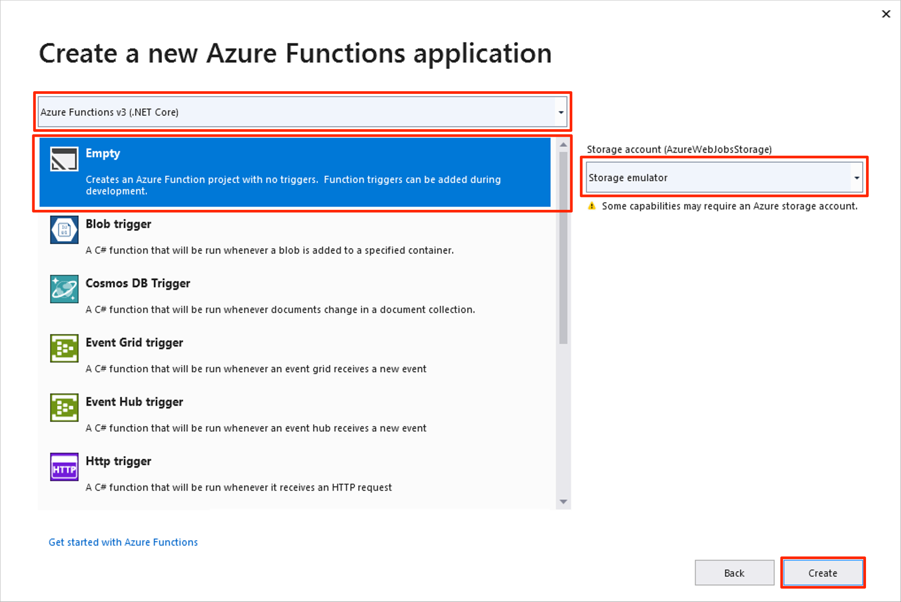
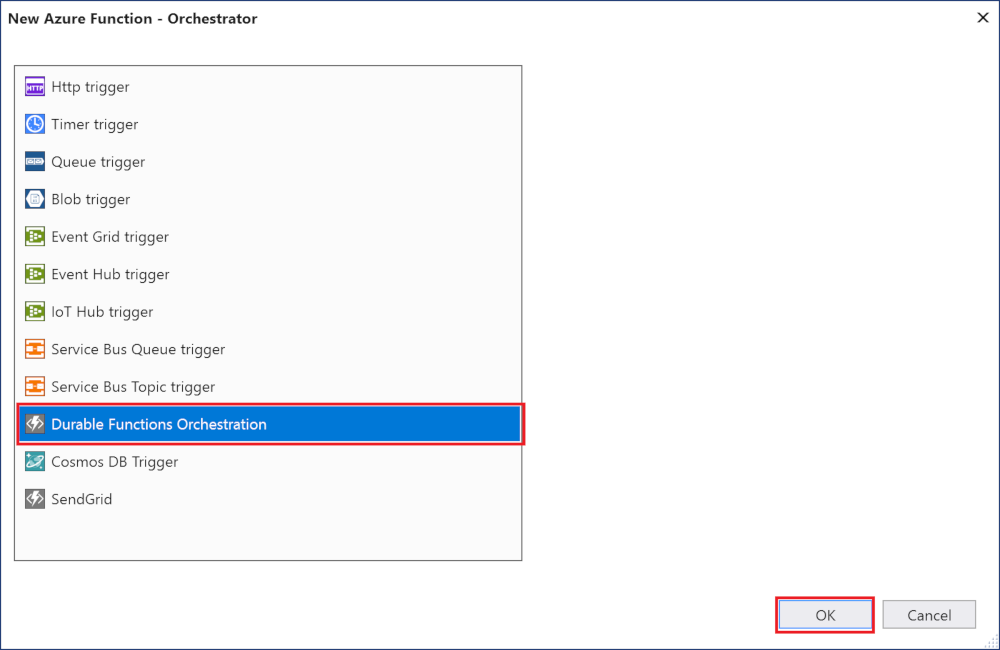

# Create your first durable function in C\#

*Durable Functions* is an extension of [Azure Functions](../functions-overview.md) that lets you write stateful functions in a serverless environment. The extension manages state, checkpoints, and restarts for you.

::: zone pivot="code-editor-vscode"

In this article, you learn how to use the Visual Studio Code to locally create and test a "hello world" durable function.  This function orchestrates and chains-together calls to other functions. You then publish the function code to Azure. These tools are available as part of the VS Code [Azure Functions extension](https://marketplace.visualstudio.com/items?itemName=ms-azuretools.vscode-azurefunctions).


## Prerequisites

To complete this tutorial:

* Install [Visual Studio Code](https://code.visualstudio.com/download).

* Make sure you have the latest version of the [Azure Functions Core Tools](../functions-run-local.md).

* Durable Functions require an Azure storage account. You need an Azure subscription.

* Make sure that you have version 3.1 or a later version of the [.NET Core SDK](https://dotnet.microsoft.com/download) installed.

[!INCLUDE [quickstarts-free-trial-note](../../../includes/quickstarts-free-trial-note.md)]

## <a name="create-an-azure-functions-project"></a>Create your local project 

In this section, you use Visual Studio Code to create a local Azure Functions project. 

1. In Visual Studio Code, press F1 (or Ctrl/Cmd+Shift+P) to open the command palette. In the command palette, search for and select `Azure Functions: Create New Project...`.

1. Choose an empty folder location for your project and choose **Select**.

    > [!NOTE]
    > These steps were designed to be completed outside of a workspace. In this case, do not select a project folder that is part of a workspace.

1. Following the prompts, provide the following information:

    | Prompt | Value | Description |
    | ------ | ----- | ----------- |
    | Select a language for your function app project | C# | Create a local C# Functions project. |
    | Select a version | Azure Functions v3 | You only see this option when the Core Tools aren't already installed. In this case, Core Tools are installed the first time you run the app. |
    | Select a template for your project's first function | Skip for now | |
    | Select how you would like to open your project | Open in current window | Reopens VS Code in the folder you selected. |

Visual Studio Code installs the Azure Functions Core Tools, if needed. It also creates a function app project in a folder. This project contains the [host.json](../functions-host-json.md) and [local.settings.json](../functions-run-local.md#local-settings-file) configuration files.

## Add functions to the app

The following steps use a template to create the durable function code in your project.

1. In the command palette, search for and select `Azure Functions: Create Function...`.

    

1. Following the prompts, provide the following information:

    | Prompt | Value | Description |
    | ------ | ----- | ----------- |
    | Select a template for your function | DurableFunctionsOrchestration | Create a Durable Functions orchestration |
    | Provide a function name | HelloOrchestration | Name of the class in which functions are created |
    | Provide a namespace | Company.Function | |

1. When VS Code prompts you to select a storage account, select **Select storage account**. Following the prompts, provide the following information to create a new storage account in Azure.

    | Prompt | Value | Description |
    | ------ | ----- | ----------- |
    | Select subscription | name of your subscription | Select your Azure subscription |
    | Select a storage account | Create a new storage account |  |
    | Enter the name of the new storage account | a unique name | Name of the storage account to create |
    | Select a resource group | a unique name | Name of the resource group to create |
    | Select a location | region | Select a region close to you |

A class containing the new functions is added to the project. VS Code also adds the new storage account connection string to *local.settings.json* and a reference to the [`Microsoft.Azure.WebJobs.Extensions.DurableTask`](https://www.nuget.org/packages/Microsoft.Azure.WebJobs.Extensions.DurableTask) NuGet package to the *.csproj* project file.

Open the new *HelloOrchestration.cs* file to view the contents. This durable function is a simple function chaining example with the following methods:  

| Method | FunctionName | Description |
| -----  | ------------ | ----------- |
| **`RunOrchestrator`** | `HelloOrchestration` | Manages the durable orchestration. In this case, the orchestration starts, creates a list, and adds the result of three functions calls to the list.  When the three function calls are complete, it returns the list. |
| **`SayHello`** | `HelloOrchestration_Hello` | The function returns a hello. It is the function that contains the business logic that is being orchestrated. |
| **`HttpStart`** | `HelloOrchestration_HttpStart` | An [HTTP-triggered function](../functions-bindings-http-webhook.md) that starts an instance of the orchestration and returns a check status response. |

Now that you've created your function project and a durable function, you can test it on your local computer.

## Test the function locally

Azure Functions Core Tools lets you run an Azure Functions project on your local development computer. You're prompted to install these tools the first time you start a function from Visual Studio Code.

1. To test your function, set a breakpoint in the function code and press F5 to start the function app project. Output from Core Tools is displayed in the **Terminal** panel.

1. In the **Terminal** panel, copy the URL endpoint of your HTTP-triggered function.

    

1. Using a tool like [Postman](https://www.getpostman.com/) or [cURL](https://curl.haxx.se/), send an HTTP POST request to the URL endpoint.

   The response is the initial result from the HTTP function letting us know the durable orchestration has started successfully. It is not yet the end result of the orchestration. The response includes a few useful URLs. For now, let's query the status of the orchestration.

1. Copy the URL value for `statusQueryGetUri` and paste it in the browser's address bar and execute the request. Alternatively you can also continue to use Postman to issue the GET request.

   The request will query the orchestration instance for the status. You should get an eventual response, which shows us the instance has completed, and includes the outputs or results of the durable function. It looks like: 

    ```json
    {
        "instanceId": "d495cb0ac10d4e13b22729c37e335190",
        "runtimeStatus": "Completed",
        "input": null,
        "customStatus": null,
        "output": [
            "Hello Tokyo!",
            "Hello Seattle!",
            "Hello London!"
        ],
        "createdTime": "2018-11-08T07:07:40Z",
        "lastUpdatedTime": "2018-11-08T07:07:52Z"
    }
    ```

1. To stop debugging, press **Shift + F5** in VS Code.

After you've verified that the function runs correctly on your local computer, it's time to publish the project to Azure.

[!INCLUDE [functions-create-function-app-vs-code](../../../includes/functions-sign-in-vs-code.md)]

[!INCLUDE [functions-publish-project-vscode](../../../includes/functions-publish-project-vscode.md)]

## Test your function in Azure

1. Copy the URL of the HTTP trigger from the **Output** panel. The URL that calls your HTTP-triggered function should be in the following format:

        http://<functionappname>.azurewebsites.net/orchestrators/<functionname>

1. Paste this new URL for the HTTP request into your browser's address bar. You should get the same status response as before when using the published app.

## Next steps

You have used Visual Studio Code to create and publish a C# durable function app.

> [!div class="nextstepaction"]
> [Learn about common durable function patterns](durable-functions-overview.md#application-patterns)

:::

::: zone pivot="code-editor-visualstudio"

[!INCLUDE [v1-note](../../../includes/functions-durable-v1-tutorial-note.md)]

In this article, you learn how to use the Visual Studio 2019 to locally create and test a "hello world" durable function.  This function orchestrates and chains-together calls to other functions. You then publish the function code to Azure. These tools are available as part of the Azure development workload in Visual Studio 2019.


## Prerequisites

To complete this tutorial:

* Install [Visual Studio 2019](https://visualstudio.microsoft.com/vs/). Make sure that the **Azure development** workload is also installed. Visual Studio 2017 also supports Durable Functions development, but the UI and steps differ.

* Verify you have the [Azure Storage Emulator](../../storage/common/storage-use-emulator.md) installed and running.

[!INCLUDE [quickstarts-free-trial-note](../../../includes/quickstarts-free-trial-note.md)]

## Create a function app project

The Azure Functions template creates a project that can be published to a function app in Azure. A function app lets you group functions as a logical unit for easier management, deployment, scaling, and sharing of resources.

1. In Visual Studio, select **New** > **Project** from the **File** menu.

1. In the **Add a new project** dialog, search for `functions`, choose the **Azure Functions** template, and select **Next**. 

    

1. Type a **Project name** for your project, and select **OK**. The project name must be valid as a C# namespace, so don't use underscores, hyphens, or any other nonalphanumeric characters.

1. In **Create a new Azure Functions Application**, use the settings specified in the table that follows the image.

    

    | Setting      | Suggested value  | Description                      |
    | ------------ |  ------- |----------------------------------------- |
    | **Version** | Azure Functions 2.0 <br />(.NET Core) | Creates a function project that uses the version 2.0 runtime of Azure Functions, which supports .NET Core. Azure Functions 1.0 supports the .NET Framework. For more information, see [How to target Azure Functions runtime version](../functions-versions.md).   |
    | **Template** | Empty | Creates an empty function app. |
    | **Storage account**  | Storage Emulator | A storage account is required for durable function state management. |

4. Select **Create** to create an empty function project. This project has the basic configuration files needed to run your functions.

## Add functions to the app

The following steps use a template to create the durable function code in your project.

1. Right-click the project in Visual Studio and select **Add** > **New Azure Function**.

    

1. Verify **Azure Function** is selected from the add menu, type a name for your C# file, and then select **Add**.

1. Select the **Durable Functions Orchestration** template and then select **Ok**

      

> [!NOTE]
> This template currently creates a durable function using an older 1.x version of the extension. See the [Durable Functions Versions](durable-functions-versions.md) article for information about how to upgrade to the newer 2.x versions of Durable Functions.

A new durable function is added to the app.  Open the new .cs file to view the contents. This durable function is a simple function chaining example with the following methods:  

| Method | FunctionName | Description |
| -----  | ------------ | ----------- |
| **`RunOrchestrator`** | `<file-name>` | Manages the durable orchestration. In this case, the orchestration starts, creates a list, and adds the result of three functions calls to the list.  When the three function calls are complete, it returns the list. |
| **`SayHello`** | `<file-name>_Hello` | The function returns a hello. It is the function that contains the business logic that is being orchestrated. |
| **`HttpStart`** | `<file-name>_HttpStart` | An [HTTP-triggered function](../functions-bindings-http-webhook.md) that starts an instance of the orchestration and returns a check status response. |

Now that you've created your function project and a durable function, you can test it on your local computer.

## Test the function locally

Azure Functions Core Tools lets you run an Azure Functions project on your local development computer. You are prompted to install these tools the first time you start a function from Visual Studio.

1. To test your function, press F5. If prompted, accept the request from Visual Studio to download and install Azure Functions Core (CLI) tools. You may also need to enable a firewall exception so that the tools can handle HTTP requests.

2. Copy the URL of your function from the Azure Functions runtime output.

    

3. Paste the URL for the HTTP request into your browser's address bar and execute the request. The following shows the response in the browser to the local GET request returned by the function:

    

    The response is the initial result from the HTTP function letting us know the durable orchestration has started successfully.  It is not yet the end result of the orchestration.  The response includes a few useful URLs.  For now, let's query the status of the orchestration.

4. Copy the URL value for `statusQueryGetUri` and pasting it in the browser's address bar and execute the request.

    The request will query the orchestration instance for the status. You should get an eventual response that looks like the following.  This output shows us the instance has completed, and includes the outputs or results of the durable function.

    ```json
    {
        "instanceId": "d495cb0ac10d4e13b22729c37e335190",
        "runtimeStatus": "Completed",
        "input": null,
        "customStatus": null,
        "output": [
            "Hello Tokyo!",
            "Hello Seattle!",
            "Hello London!"
        ],
        "createdTime": "2019-11-02T07:07:40Z",
        "lastUpdatedTime": "2019-11-02T07:07:52Z"
    }
    ```

5. To stop debugging, press **Shift + F5**.

After you have verified that the function runs correctly on your local computer, it's time to publish the project to Azure.

## Publish the project to Azure

You must have a function app in your Azure subscription before you can publish your project. You can create a function app right from Visual Studio.

[!INCLUDE [Publish the project to Azure](../../../includes/functions-vstools-publish.md)]

## Test your function in Azure

1. Copy the base URL of the function app from the Publish profile page. Replace the `localhost:port` portion of the URL you used when testing the function locally with the new base URL.

    The URL that calls your durable function HTTP trigger should be in the following format:

        http://<APP_NAME>.azurewebsites.net/api/<FUNCTION_NAME>_HttpStart

2. Paste this new URL for the HTTP request into your browser's address bar. You should get the same status response as before when using the published app.

## Next steps

You have used Visual Studio to create and publish a C# durable function app.

> [!div class="nextstepaction"]
> [Learn about common durable function patterns](durable-functions-overview.md#application-patterns)

:::