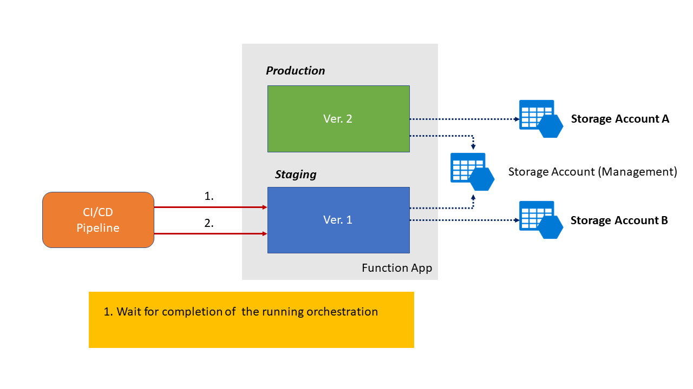
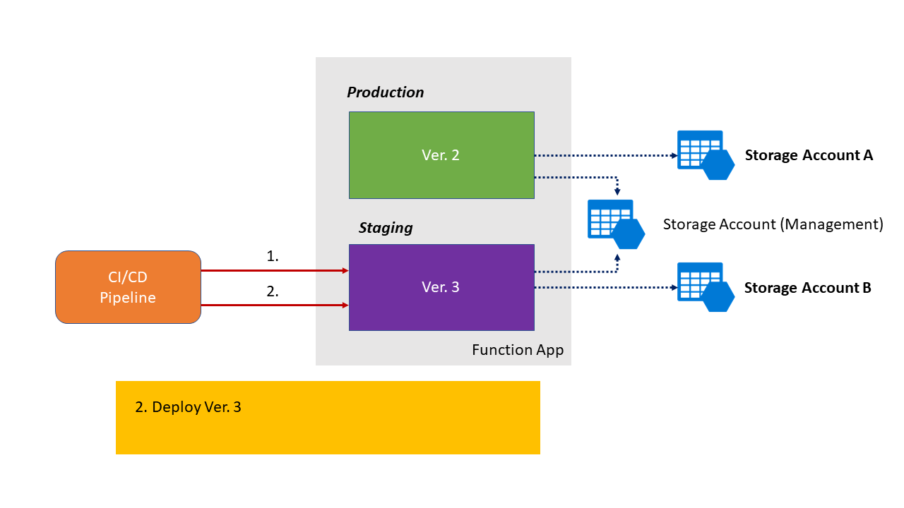
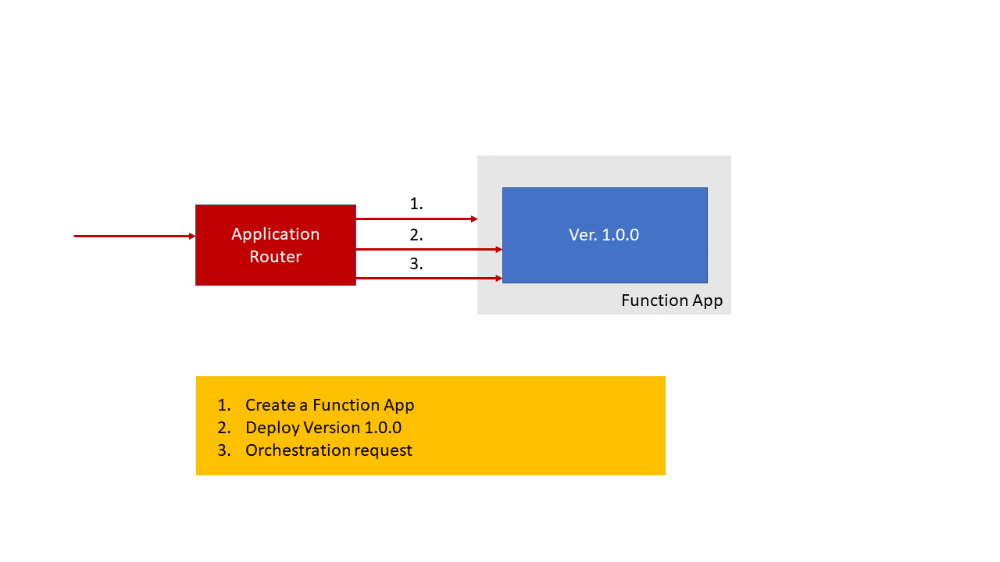
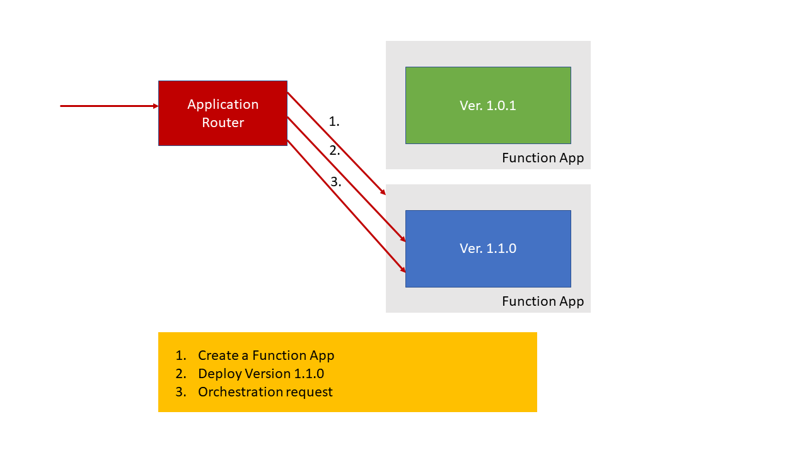

---
title: Zero-downtime deployment for Durable Functions
description: Learn how to enable your Durable Functions orchestration for zero-downtime deployments. 
services: functions
author: tsushi
manager: gwallace
ms.service: azure-functions
ms.topic: conceptual
ms.date: 10/10/2019
ms.author: azfuncdf
#Customer intent: As a Durable Functions user, I want to deploy with zero downtime so that updates don't interrupt my Durable Functions orchestration execution.
--- 

# Zero-downtime deployment for Durable Functions
The [reliable execution model](durable-functions-checkpointing-and-replay.md) of Durable Functions requires that orchestrations be deterministic, which creates an additional challenge to consider when you deploy updates. When a deployment contains changes to activity function signatures or orchestrator logic, in-flight orchestration instances fail. This situation is especially a problem for instances of long-running orchestrations, which might represent hours or days of work.

To prevent these failures from happening, you have two options: 
- Delay your deployment until all running orchestration instances have completed.
- Make sure that any running orchestration instances use the existing versions of your functions. 

For more information about versioning, see [Versioning in Durable Functions](durable-functions-versioning.md).

The following table compares the three main strategies to achieve a zero-downtime deployment for Durable Functions. 

| Strategy |  When to use | Pros | Cons |
| -------- | ------------ | ---- | ---- |
| [Versioning](#versioning) |  Applications that don't experience frequent [breaking changes.](durable-functions-versioning.md) | Simple to implement. |  Increased function app size in memory and number of functions.<br/>Code duplication. |
| [Status check with slot](#status-check-with-slot) | A system that doesn't have long-running orchestrations lasting more than 24 hours or frequently overlapping orchestrations. | Simple code base.<br/>Doesn't require additional function app management. | Requires additional storage account or task hub management.<br/>Requires periods of time when no orchestrations are running. |
| [Application routing](#application-routing) | A system that doesn't have periods of time when orchestrations aren't running, such as those time periods with orchestrations that last more than 24 hours or with frequently overlapping orchestrations. | Handles new versions of systems with continually running orchestrations that have breaking changes. | Requires an intelligent application router.<br/>Could max out the number of function apps allowed by your subscription. The default is 100. |

## Versioning
Define new versions of your functions and leave the old versions in your function app. As you can see in the diagram, a function's version becomes part of its name. Because previous versions of functions are preserved, in-flight orchestration instances can continue to reference them. Meanwhile, requests for new orchestration instances call for the latest version, which your orchestration client function can reference from an app setting.


In this strategy, every function must be copied, and its references to other functions must be updated. You can make it easier by writing a script. Here's a [sample project](https://github.com/TsuyoshiUshio/DurableVersioning) with a migration script.

>[!NOTE]
>This strategy uses deployment slots to avoid downtime during deployment. For more detailed information about how to create and use new deployment slots, see [Azure Functions deployment slots](../functions-deployment-slots.md).

## Status check with slot

While the current version of your function app is running in your production slot, deploy the new version of your function app to your staging slot. Before you swap your production and staging slots, check to see if there are any running orchestration instances. After all orchestration instances are complete, you can do the swap. This strategy works when you have predictable periods when no orchestration instances are in flight. This is the best approach when your orchestrations aren't long-running and when your orchestration executions don't frequently overlap.

### Function app configuration

Use the following procedure to set up this scenario.

1. [Add deployment slots](../functions-deployment-slots.md#add-a-slot) to your function app for staging and production.

1. For each slot, set the [AzureWebJobsStorage application setting](../functions-app-settings.md#azurewebjobsstorage) to the connection string of a shared storage account. This storage account connection string is used by the Azure Functions runtime. This account is used by the Azure Functions runtime and manages the function's keys.

1. For each slot, create a new app setting, for example, `DurableManagementStorage`. Set its value to the connection string of different storage accounts. These storage accounts are used by the Durable Functions extension for [reliable execution](durable-functions-checkpointing-and-replay.md). Use a separate storage account for each slot. Don't mark this setting as a deployment slot setting.

1. In your function app's [host.json file's durableTask section](durable-functions-bindings.md#hostjson-settings), specify `azureStorageConnectionStringName` as the name of the app setting you created in step 3.

The following diagram shows the described configuration of deployment slots and storage accounts. In this potential predeployment scenario, version 2 of a function app is running in the production slot, while version 1 remains in the staging slot.



### host.json examples

The following JSON fragments are examples of the connection string setting in the *host.json* file.

#### Functions 2.x

```json
{
  "version": 2.0,
  "extensions": {
    "durableTask": {
      "azureStorageConnectionStringName": "DurableManagementStorage"
    }
  }
}
```

#### Functions 1.x

```json
{
  "durableTask": {
    "azureStorageConnectionStringName": "DurableManagementStorage"
  }
}
```

### CI/CD pipeline configuration

Configure your CI/CD pipeline to deploy only when your function app has no pending or running orchestration instances. When you're using Azure Pipelines, you can create a function that checks for these conditions, as in the following example:

```csharp
[FunctionName("StatusCheck")]
public static async Task<IActionResult> StatusCheck(
    [HttpTrigger(AuthorizationLevel.Function, "get", "post")] HttpRequestMessage req,
    [OrchestrationClient] DurableOrchestrationClient client,
    ILogger log)
{
    var runtimeStatus = new List<OrchestrationRuntimeStatus>();

    runtimeStatus.Add(OrchestrationRuntimeStatus.Pending);
    runtimeStatus.Add(OrchestrationRuntimeStatus.Running);

    var status = await client.GetStatusAsync(new DateTime(2015,10,10), null, runtimeStatus);
    return (ActionResult) new OkObjectResult(new Status() {HasRunning = (status.Count != 0)});
}
```

Next, configure the staging gate to wait until no orchestrations are running. For more information, see [Release deployment control using gates](/azure/devops/pipelines/release/approvals/gates?view=azure-devops)


Azure Pipelines checks your function app for running orchestration instances before your deployment starts.


Now the new version of your function app should be deployed to the staging slot.



Finally, swap slots. 

Application settings that aren't marked as deployment slot settings are also swapped, so the version 2 app keeps its reference to storage account A. Because orchestration state is tracked in the storage account, any orchestrations running on the version 2 app continue to run in the new slot without interruption.


To use the same storage account for both slots, you can change the names of your task hubs. In this case, you need to manage the state of your slots and your app's HubName settings. To learn more, see [Task hubs in Durable Functions](durable-functions-task-hubs.md).

## Application routing

This strategy is the most complex. However, it can be used for function apps that don't have time between running orchestrations.

For this strategy, you must create an *application router* in front of your Durable Functions. This router can be implemented with Durable Functions. The router has the responsibility to:

* Deploy the function app.
* Manage the version of Durable Functions. 
* Route orchestration requests to function apps.

The first time an orchestration request is received, the router does the following tasks:

1. Creates a new function app in Azure.
2. Deploys your function app's code to the new function app in Azure.
3. Forwards the orchestration request to the new app.

The router manages the state of which version of your app's code is deployed to which function app in Azure.



The router directs deployment and orchestration requests to the appropriate function app based on the version sent with the request. It ignores the patch version.

When you deploy a new version of your app without a breaking change, you can increment the patch version. The router deploys to your existing function app and sends requests for the old and new versions of the code, which are routed to the same function app.


When you deploy a new version of your app with a breaking change, you can increment the major or minor version. Then the application router creates a new function app in Azure, deploys to it, and routes requests for the new version of your app to it. In the following diagram, running orchestrations on the 1.0.1 version of the app keep running, but requests for the 1.1.0 version are routed to the new function app.



The router monitors the status of orchestrations on the 1.0.1 version and removes apps after all orchestrations are finished.  

### Tracking store settings

Each function app should use separate scheduling queues, possibly in separate storage accounts. If you want to query all orchestrations instances across all versions of your application, you can share instance and history tables across your function apps. You can share tables by configuring the `trackingStoreConnectionStringName` and `trackingStoreNamePrefix` settings in the [host.json settings](durable-functions-bindings.md#host-json) file so that they all use the same values.

For more information, see [Manage instances in Durable Functions in Azure](durable-functions-instance-management.md).


## Next steps

> [!div class="nextstepaction"]
> [Versioning Durable Functions](durable-functions-versioning.md)

