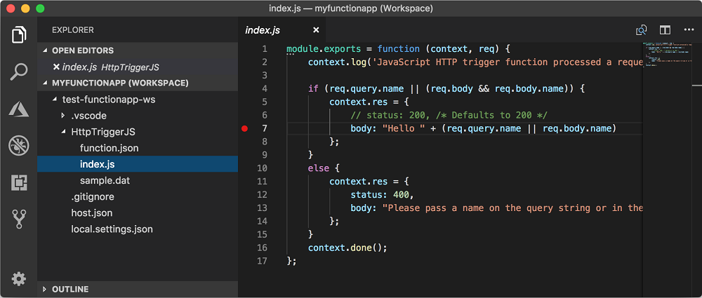

# Create your first durable function in JavaScript

*Durable Functions* is an extension of [Azure Functions](../functions-overview.md) that lets you write stateful functions in a serverless environment. The extension manages state, checkpoints, and restarts for you.

In this article, you learn how to use the Visual Studio Code Azure Functions extension to locally create and test a "hello world" durable function.  This function will orchestrate and chain together calls to other functions. You then publish the function code to Azure.


## Prerequisites

To complete this tutorial:

* Install [Visual Studio Code](https://code.visualstudio.com/download).

* Make sure you have the [latest Azure Functions tools](../functions-develop-vs.md#check-your-tools-version).

* On a Windows computer, verify you have the [Azure Storage Emulator](../../storage/common/storage-use-emulator.md) installed and running. On a Mac or Linux computer, you must use an actual Azure storage account.

* Make sure that you have version 8.0 or a later version of [Node.js](https://nodejs.org/) installed.

[!INCLUDE [quickstarts-free-trial-note](../../../includes/quickstarts-free-trial-note.md)]

[!INCLUDE [functions-install-vs-code-extension](../../../includes/functions-install-vs-code-extension.md)]

[!INCLUDE [functions-create-function-app-vs-code](../../../includes/functions-create-function-app-vs-code.md)]

## Create a Starter Function

1. From **Azure: Functions**, choose the Create Function icon.

    

1. Select the folder with your function app project and select the **HTTP trigger** function template.

    

1. Type `HttpStart` for the function name and press Enter, then select **Anonymous** authentication.

    

    A function is created in your chosen language using the template for an HTTP-triggered function.

    

1. Replace index.js with the below JavaScript:

    ```javascript
    const df = require("durable-functions");
    
    module.exports = async function (context, req) {
        const client = df.getClient(context);
        const instanceId = await client.startNew(req.params.functionName, undefined, req.body);
    
        context.log(`Started orchestration with ID = '${instanceId}'.`);
    
        return client.createCheckStatusResponse(context.bindingData.req, instanceId);
    };
    ```

1. Replace function.json with the below JSON:

    ```JSON
    {
      "bindings": [
        {
          "authLevel": "anonymous",
          "name": "req",
          "type": "httpTrigger",
          "direction": "in",
          "route": "orchestrators/{functionName}",
          "methods": ["post"]
        },
        {
          "name": "$return",
          "type": "http",
          "direction": "out"
        },
        {
          "name": "starter",
          "type": "orchestrationClient",
          "direction": "in"
        }
      ],
      "disabled": false
    }
    ```

We've now created an entry-point into our Durable Function. Let's add an orchestrator.

## Create an Orchestrator Function

1. From **Azure: Functions**, choose the Create Function icon.

    

1. Select the folder with your function app project and select the **HTTP trigger** function template. Since you'll be replacing this code, the trigger itself doesn't matter.

    

1. Type `OrchestratorFunction` for the function name and press Enter, then select **Anonymous** authentication.

    

1. Replace index.js with the below JavaScript:

    [!code-json[Main](~/samples-durable-functions/samples/javascript/E1_HelloSequence/index.js)]

1. Replace function.json with the below JSON:

    [!code-json[Main](~/samples-durable-functions/samples/javascript/E1_HelloSequence/function.json)]

We've added an orchestrator to coordinate activity functions. Let's now add the referenced activity function.

## Create an Activity Function

1. From **Azure: Functions**, choose the Create Function icon.

    

1. Select the folder with your function app project and select the **HTTP trigger** function template. Since you'll be replacing this code, the trigger itself doesn't matter.

    

1. Type `SayHello` for the function name and press Enter, then select **Anonymous** authentication.

    

1. Replace index.js with the below JavaScript:

    [!code-javascript[Main](~/samples-durable-functions/samples/javascript/E1_SayHello/index.js)]

1. Replace function.json with the below JSON:

    [!code-json[Main](~/samples-durable-functions/samples/csx/E1_SayHello/function.json)]

We've now added all components necessary to start off our orchestration and chain together activity functions.

## Test the function locally

Azure Functions Core Tools lets you run an Azure Functions project on your local development computer. You're prompted to install these tools the first time you start a function from Visual Studio Code.  

1. Install the durable-functions npm package by running `npm install durable-functions` in the root directory of the function app.

1. On a Windows computer, start the Azure Storage Emulator and make sure that the **AzureWebJobsStorage** property of local.settings.json is set to `UseDevelopmentStorage=true`. On a Mac or Linux computer, you must set the **AzureWebJobsStorage** property to the connection string of an existing Azure storage account. You create a storage account later in this article.

1. To test your function, set a breakpoint in the function code and press F5 to start the function app project. Output from Core Tools is displayed in the **Terminal** panel. If this is your first time using Durable Functions, the Durable Functions extension is installed and the build might take a few seconds.

1. In the **Terminal** panel, copy the URL endpoint of your HTTP-triggered function.

    

1. Paste the URL for the HTTP request into your browser's address bar, and see the status of your orchestration.

1. To stop debugging, press Shift + F1.

After you've verified that the function runs correctly on your local computer, it's time to publish the project to Azure.

[!INCLUDE [functions-create-function-app-vs-code](../../../includes/functions-sign-in-vs-code.md)]

[!INCLUDE [functions-publish-project-vscode](../../../includes/functions-publish-project-vscode.md)]

## Test your function in Azure

1. Copy the URL of the HTTP trigger from the **Output** panel. The URL that calls your HTTP-triggered function should be in the following format:

        http://<functionappname>.azurewebsites.net/api/<functionname>

1. Paste this new URL for the HTTP request into your browser's address bar. You should get the same status response as before when using the published app.

## Next steps

You have used Visual Studio Code to create and publish a JavaScript durable function app.

> [!div class="nextstepaction"]
> [Learn about common durable function patterns](durable-functions-overview.md)