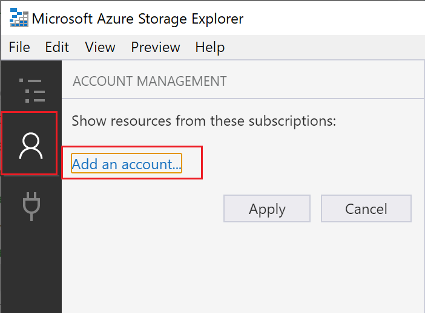
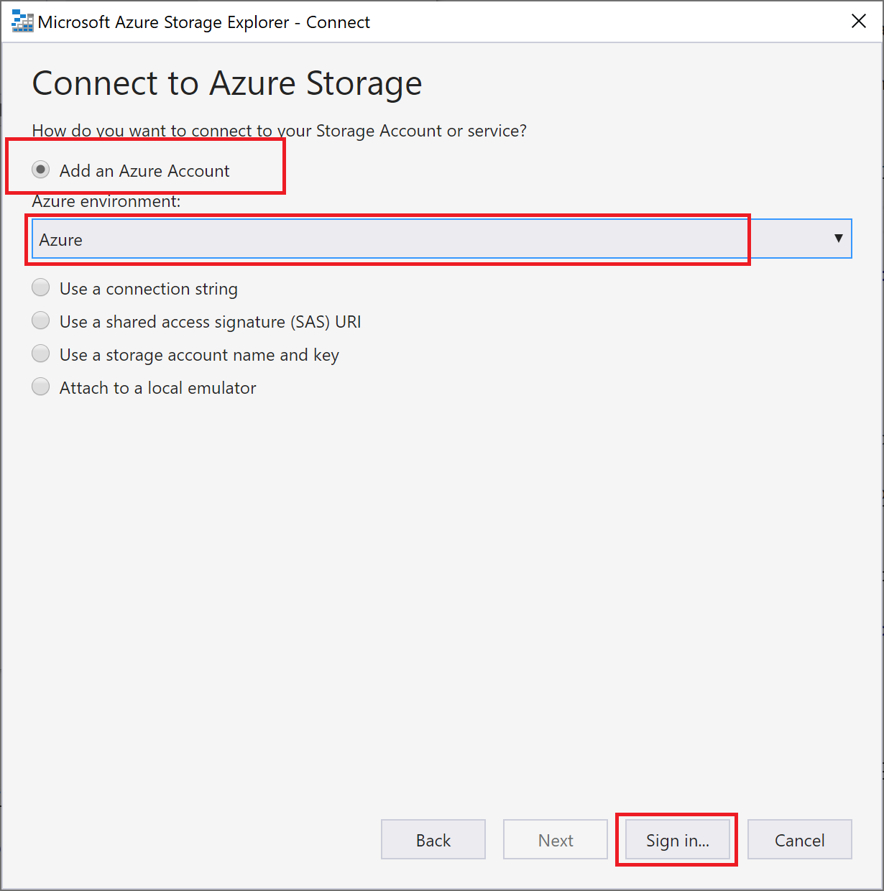
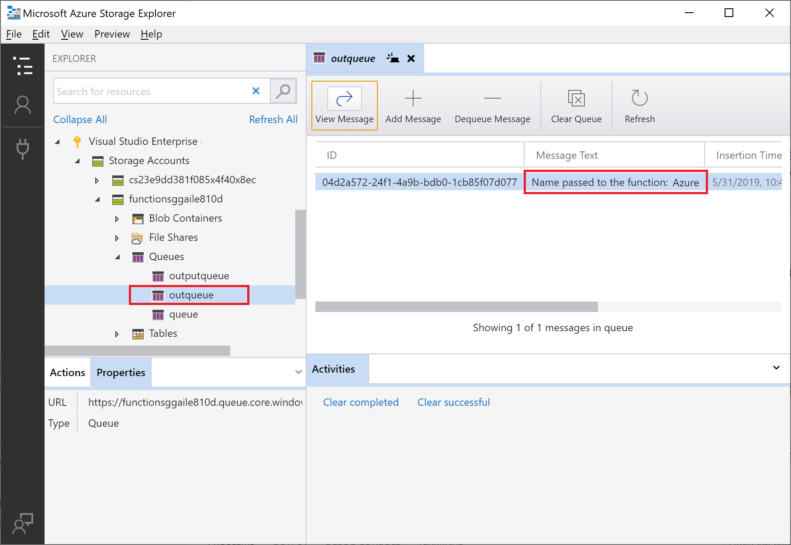

# Connect Azure Functions to Azure Storage using Visual Studio Code

[!INCLUDE [functions-add-storage-binding-intro](../../includes/functions-add-storage-binding-intro.md)]

This article shows you how to use Visual Studio Code to connect the function you created in the [previous quickstart article](functions-create-first-function-vs-code.md) to Azure Storage. The output binding that you add to this function writes data from the HTTP request to a message in an Azure Queue storage queue. 

Most bindings require a stored connection string that Functions uses to access the bound service. To make it easier, you use the Storage account that you created with your function app. The connection to this account is already stored in an app setting named `AzureWebJobsStorage`.  

## Configure your environment

Before you start this article, you must meet the following requirements:

* Install the [Azure Storage extension for Visual Studio Code](https://marketplace.visualstudio.com/items?itemName=ms-azuretools.vscode-azurestorage).

* Install [Azure Storage Explorer](https://storageexplorer.com/). Storage Explorer is a tool you'll use to examine queue messages generated by your output binding. Storage Explorer is supported on macOS, Windows, and Linux-based operating systems.

::: zone pivot="programming-language-csharp"
* Install [.NET Core CLI tools](https://docs.microsoft.com/dotnet/core/tools/?tabs=netcore2x).
::: zone-end

* Complete the steps in [part 1 of the Visual Studio Code quickstart](functions-create-first-function-vs-code.md). 

This article assumes that you are already signed in to your Azure subscription from Visual Studio Code. You can sign in by running `Azure: Sign In` from the command palette. 

## Download the function app settings

In the [previous quickstart article](functions-create-first-function-vs-code.md), you created a function app in Azure along with the required Storage account. The connection string for this account is stored securely in app settings in Azure. In this article, you write messages to a Storage queue in the same account. To connect to your Storage account when running the function locally, you must download app settings to the local.settings.json file. 

1. Press the F1 key to open the command palette, then search for and run the command `Azure Functions: Download Remote Settings....`. 

1. Choose the function app you created in the previous article. Select **Yes to all** to overwrite the existing local settings. 

    > [!IMPORTANT]  
    > Because it contains secrets, the local.settings.json file never gets published, and is excluded from source control.

1. Copy the value `AzureWebJobsStorage`, which is the key for the Storage account connection string value. You use this connection to verify that the output binding works as expected.

## Register binding extensions

Because you are using a Queue storage output binding, you must have the Storage bindings extension installed before you run the project. 

::: zone pivot="programming-language-javascript,programming-language-typescript,programming-language-python,programming-language-powershell"

[!INCLUDE [functions-extension-bundles](../../includes/functions-extension-bundles.md)]

::: zone-end

::: zone pivot="programming-language-csharp"

With the exception of HTTP and timer triggers, bindings are implemented as extension packages. Run the following [dotnet add package](/dotnet/core/tools/dotnet-add-package) command in the Terminal window to add the Storage extension package to your project.

```bash
dotnet add package Microsoft.Azure.WebJobs.Extensions.Storage --version 3.0.4
```

::: zone-end

Now, you can add the storage output binding to your project.

## Add an output binding

In Functions, each type of binding requires a `direction`, `type`, and a unique `name` to be defined in the function.json file. The way you define these attributes depends on the language of your function app.

::: zone pivot="programming-language-javascript,programming-language-typescript,programming-language-python,programming-language-powershell"

[!INCLUDE [functions-add-output-binding-json](../../includes/functions-add-output-binding-json.md)]

::: zone-end

::: zone pivot="programming-language-csharp"

[!INCLUDE [functions-add-storage-binding-csharp-library](../../includes/functions-add-storage-binding-csharp-library.md)]

::: zone-end

## Add code that uses the output binding

After the binding is defined, you can use the `name` of the binding to access it as an attribute in the function signature. By using an output binding, you don't have to use the Azure Storage SDK code for authentication, getting a queue reference, or writing data. The Functions runtime and queue output binding do those tasks for you.

::: zone pivot="programming-language-javascript"  
[!INCLUDE [functions-add-output-binding-js](../../includes/functions-add-output-binding-js.md)]
::: zone-end  

::: zone pivot="programming-language-typescript"  
[!INCLUDE [functions-add-output-binding-ts](../../includes/functions-add-output-binding-ts.md)]
::: zone-end  

::: zone pivot="programming-language-powershell"

Add code that uses the `Push-OutputBinding` cmdlet to write text to the queue using the `msg` output binding. Add this code before you set the OK status in the `if` statement.

```powershell
# Write the $name value to the queue.
$outputMsg = "Name passed to the function: $name"
Push-OutputBinding -name msg -Value $outputMsg
```

At this point, your function should look as follows:

```powershell
using namespace System.Net

# Input bindings are passed in via param block.
param($Request, $TriggerMetadata)

# Write to the Azure Functions log stream.
Write-Host "PowerShell HTTP trigger function processed a request."

# Interact with query parameters or the body of the request.
$name = $Request.Query.Name
if (-not $name) {
    $name = $Request.Body.Name
}

if ($name) {
    # Write the $name value to the queue.
    $outputMsg = "Name passed to the function: $name"
    Push-OutputBinding -name msg -Value $outputMsg

    $status = [HttpStatusCode]::OK
    $body = "Hello $name"
}
else {
    $status = [HttpStatusCode]::BadRequest
    $body = "Please pass a name on the query string or in the request body."
}

# Associate values to output bindings by calling 'Push-OutputBinding'.
Push-OutputBinding -Name Response -Value ([HttpResponseContext]@{
    StatusCode = $status
    Body = $body
})
```

::: zone-end

::: zone pivot="programming-language-python"

[!INCLUDE [functions-add-output-binding-python](../../includes/functions-add-output-binding-python.md)]

::: zone-end

::: zone pivot="programming-language-csharp"  
[!INCLUDE [functions-add-storage-binding-csharp-library-code](../../includes/functions-add-storage-binding-csharp-library-code.md)]
::: zone-end  

::: zone pivot="programming-language-csharp,programming-language-javascript,programming-language-python"

[!INCLUDE [functions-run-function-test-local-vs-code](../../includes/functions-run-function-test-local-vs-code.md)]

::: zone-end

::: zone pivot="programming-language-powershell"

[!INCLUDE [functions-run-function-test-local-vs-code-ps](../../includes/functions-run-function-test-local-vs-code-ps.md)]

::: zone-end

A new queue named **outqueue** is created in your storage account by the Functions runtime when the output binding is first used. You'll use Storage Explorer to verify that the queue was created along with the new message.

### Connect Storage Explorer to your account

Skip this section if you have already installed Azure Storage Explorer and connected it to your Azure account.

1. Run the [Azure Storage Explorer] tool, select the connect icon on the left, and select **Add an account**.

    

1. In the **Connect** dialog, choose **Add an Azure account**, choose your **Azure environment**, and select **Sign in...**. 

    

After you successfully sign in to your account, you see all of the Azure subscriptions associated with your account.

### Examine the output queue

1. In Visual Studio Code, press the F1 key to open the command palette, then search for and run the command `Azure Storage: Open in Storage Explorer` and choose your Storage account name. Your storage account opens in Azure Storage Explorer.  

1. Expand the **Queues** node, and then select the queue named **outqueue**. 

   The queue contains the message that the queue output binding created when you ran the HTTP-triggered function. If you invoked the function with the default `name` value of *Azure*, the queue message is *Name passed to the function: Azure*.

    

1. Run the function again, send another request, and you'll see a new message appear in the queue.  

Now, it's time to republish the updated function app to Azure.

## Redeploy and verify the updated app

1. In Visual Studio Code, press F1 to open the command palette. In the command palette, search for and select `Azure Functions: Deploy to function app...`.

1. Choose the function app that you created in the first article. Because you are redeploying your project to the same app, select **Deploy** to dismiss the warning about overwriting files.

1. After deployment completes, you can again use cURL or a browser to test the redeployed function. As before, append the query string `&name=<yourname>` to the URL, as in the following example:

    ```bash
    curl https://myfunctionapp.azurewebsites.net/api/httptrigger?code=cCr8sAxfBiow548FBDLS1....&name=<yourname>
    ```

1. Again [view the message in the storage queue](#examine-the-output-queue) to verify that the output binding again generates a new message in the queue.

## Clean up resources

*Resources* in Azure refers to function apps, functions, storage accounts, and so forth. They are grouped into *resource groups*, and you can delete everything in a group by deleting the group.

You created resources to complete these quickstarts. You may be billed for these resources, depending on your [account status](https://azure.microsoft.com/account/) and [service pricing](https://azure.microsoft.com/pricing/). If you don't need the resources anymore, here's how to delete them:

[!INCLUDE [functions-cleanup-resources-vs-code.md](../../includes/functions-cleanup-resources-vs-code.md)]

## Next steps

You've updated your HTTP triggered function to write data to a Storage queue. Next, you can learn more about developing Functions using Visual Studio Code:

> [!div class="nextstepaction"]
> [Develop Azure Functions using Visual Studio Code](functions-develop-vs-code.md)

[Azure Storage Explorer]: https://storageexplorer.com/
