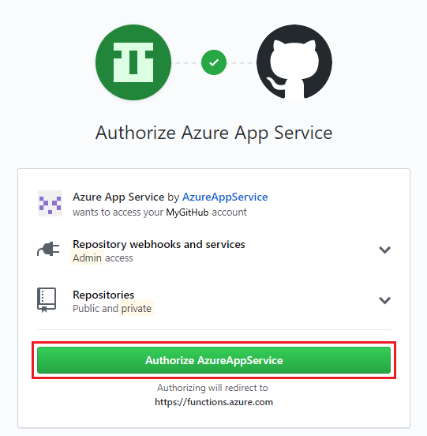

# Continuous deployment for Azure Functions

Azure Functions allows you to deploy your code continuously through [source control integration](functions-deployment-technologies.md#source-control). This enables a workflow where code updates trigger deployment to Azure. If you're new to Azure Functions, get started with the [Azure Functions overview](functions-overview.md).

Continuous deployment is a great option for projects where you're integrating multiple and frequent contributions. It also lets you maintain a single source of truth for your function code. You can configure continuous deployment in Azure Functions from the following source code locations:

* [Azure Repos](https://azure.microsoft.com/en-us/services/devops/repos/)
* [GitHub](https://github.com)
* [Bitbucket](https://bitbucket.org/)

The unit of deployment for Azure functions is the function app. This means that all functions in a function app are deployed at the same time. After continuous deployment is enabled, access to function code in the Azure portal is configured as *read-only*, since the source of truth is set to be elsewhere.

## Requirements for continuous deployment

For continuous deployment to succeed, your directory structure must be compatible the following basic folder structure that Azure Functions expects:

[!INCLUDE [functions-folder-structure](../../includes/functions-folder-structure.md)]

## Set up continuous deployment

Use this procedure to configure continuous deployment for an existing function app. These steps demonstrate integration with a GitHub repository, but similar steps apply for Azure Repos or other source code repositories.

1. In your function app in the [Azure portal](https://portal.azure.com), select **Platform features** > **Deployment center**.

    

2. On the **Deployment Center**, select **GitHub** for **Source Control** > **Authorize**.

    

3. Select **Authorize AzureAppService** > **Continue**.

    

4. Select one of the following build providers:

    * **App Service build service** - best when you don't need a build or if you need a generic build.
    * **Azure Pipelines (Preview)** - best when you need more control over the build. This provider is currently in preview.

    

5. Configure information specific to the source control option you specified. For GitHub, you must provide the **Organization**, **Repository**, and **Branch** where your code lives. Then, select **Continue**.

    

6. Finally, review all details and select **Finish** to complete your deployment configuration.

    

When the process completes, all code from the specified source is deployed to your app. At that point, changes in the deployment source trigger a deployment of those changes to your function app in Azure.

## Deployment scenarios

### Move existing functions to continuous deployment

If you've already written functions in the [Azure portal](https://portal.azure.com) and wish to download the contents of your app before switching to continuous deployment, you should navigate to the **Overview** tab of your function app, and click the **Download app content** button.

> [!NOTE]
> After you configure continuous integration, you can no longer edit your source files in the Functions portal.

## Next steps

> [!div class="nextstepaction"]
> [Best practices for Azure Functions](functions-best-practices.md)
