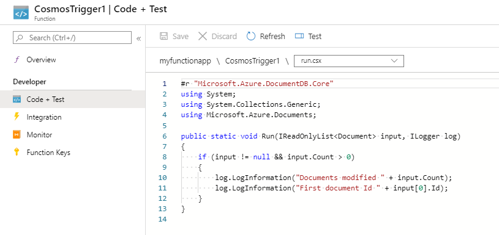
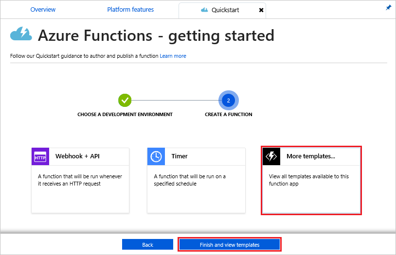
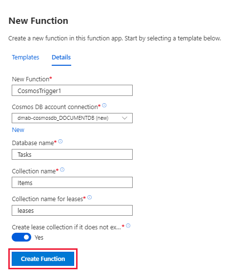
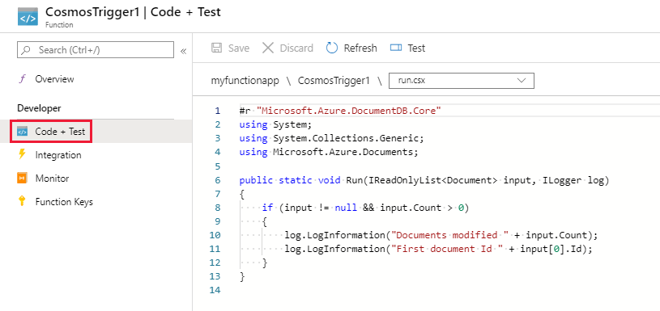
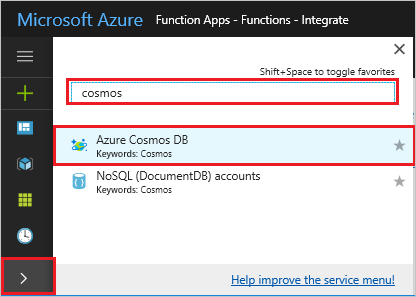

# Create a function triggered by Azure Cosmos DB

Learn how to create a function triggered when data is added to or changed in Azure Cosmos DB. To learn more about Azure Cosmos DB, see [Azure Cosmos DB: Serverless database computing using Azure Functions](..\cosmos-db\serverless-computing-database.md).

## Prerequisites

To complete this tutorial:

+ If you don't have an Azure subscription, create a [free account](https://azure.microsoft.com/free/?WT.mc_id=A261C142F) before you begin.

[!INCLUDE [functions-portal-favorite-function-apps](../../includes/functions-portal-favorite-function-apps.md)]

## Create an Azure Function app

[!INCLUDE [Create function app Azure portal](../../includes/functions-create-function-app-portal.md)]

Next, you create a function in the new function app.

## Create Azure Cosmos DB trigger

1. Expand your function app and click the **+** button next to **Functions**. If this is the first function in your function app, select **Custom function**. This displays the complete set of function templates.

    

2. In the search field, type `cosmos` and then choose your desired language for the Azure Cosmos DB trigger template.

    

3. Configure the new trigger with the settings as specified in the table below the image.

    
    
    | Setting      | Suggested value  | Description                                |
    | ------------ | ---------------- | ------------------------------------------ |
    | **Name** | Default | Use the default function name suggested by the template. |
    | **Collection name** | Items | Name of collection to be monitored. |
    | **Create lease collection if it doesn't exist** | Checked | The collection doesn't already exist, so create it. |
    | **Database name** | Tasks | Name of database with the collection to be monitored. |

4. Select **New** next to the **Azure Cosmos DB account connection** label, and choose an existing Cosmos DB account or **+ Create new**. 
 
    

6. When creating a new Cosmos DB account, use the **New account** settings as specified in the table.

    | Setting      | Suggested value  | Description                                |
    | ------------ | ---------------- | ------------------------------------------ |
    | **ID** | Name of database | Unique ID for the Azure Cosmos DB database  |
    | **API** | SQL (DocumentDB) | This topic uses the document database API.  |
    | **Subscription** | Azure Subscription | Azure Subscription  |
    | **Resource Group** | myResourceGroup |  Use the existing resource group that contains your function app. |
    | **Location**  | WestEurope | Select a location near to either your function app or to other apps that use the stored documents.  |

6. Click **OK** to create the database. It may take a few minutes to create the database. After the database is created, the database connection string is stored as a function app setting. The name of this app setting is inserted in **Azure Cosmos DB account connection**. 

7. Click **Create** to create your Azure Cosmos DB triggered function. After the function is created, the template-based function code is displayed.  

    

    This function template writes the number of documents and the first document ID to the logs. 

Next, you connect to your Azure Cosmos DB account and create the **Tasks** collection in the database. 

## Create the Items collection

1. Open a second instance of the [Azure portal](https://portal.azure.com) in a new tab in the browser. 

2. On the left side of the portal, expand the icon bar, type `cosmos` in the search field, and select **Azure Cosmos DB**.

    

2. Choose your Azure Cosmos DB account, then select the **Data Explorer**. 
 
3. In **Collections**, choose **taskDatabase** and select **New Collection**.

    

4. In **Add Collection**, use the settings shown in the table below the image. 
 
    
 
    | Setting|Suggested value|Description |
    | ---|---|--- |
    | **Database ID** | Tasks |The name for your new database. This must match the name defined in your function binding. |
    | **Collection ID** | Items | The name for the new collection. This must match the name defined in your function binding.  |
    | **Storage capacity** | Fixed (10 GB)|Use the default value. This value is the storage capacity of the database. |
    | **Throughput** |400 RU| Use the default value. If you want to reduce latency, you can scale up the throughput later. |
    | **[Partition key](../cosmos-db/partition-data.md#design-for-partitioning)** | /category|A partition key that distributes data evenly to each partition. Selecting the correct partition key is important in creating a performant collection. | 

1. Click **OK** to create the **Tasks** collection. It may take a short time for the collection to get created.

After the collection specified in the function binding exists, you can test the function by adding documents to this new collection.

## Test the function

1. Expand the new **taskCollection** collection in Data Explorer, choose **Documents**, then select **New Document**.

    

2. Replace the contents of the new document with the following content, then choose **Save**.

        {
            "id": "task1",
            "category": "general",
            "description": "some task"
        }

1. Switch to the first browser tab that contains your function in the portal. Expand the function logs and verify that the new document has triggered the function. See that the `task1` document ID value is written to the logs. 

    

4. (Optional) Go back to your document, make a change, and click **Update**. Then, go back to the function logs and verify that the update has also triggered the function.

## Clean up resources

[!INCLUDE [Next steps note](../../includes/functions-quickstart-cleanup.md)]

## Next steps

You have created a function that runs when a document is added or modified in your Azure Cosmos DB.

[!INCLUDE [Next steps note](../../includes/functions-quickstart-next-steps.md)]

For more information about Queue storage triggers, see [Azure Functions Storage queue bindings](functions-bindings-storage-queue.md).
