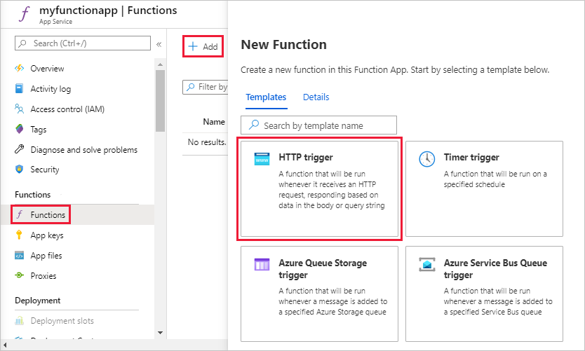
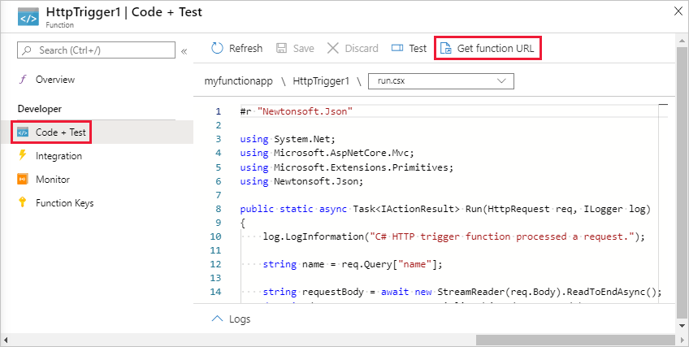

# Create your first function in the Azure portal

Azure Functions lets you run your code in a serverless environment without having to first create a virtual machine (VM) or publish a web application. In this article, you learn how to use Azure Functions to create a "hello world" HTTP triggered function in the Azure portal.

[!INCLUDE [quickstarts-free-trial-note](../../includes/quickstarts-free-trial-note.md)]

If you're a C# developer, consider [creating your first function in Visual Studio 2019](functions-create-your-first-function-visual-studio.md) instead of in the portal. 

## Sign in to Azure

Sign in to the [Azure portal](https://portal.azure.com) with your Azure account.

## Create a function app

You must have a function app to host the execution of your functions. A function app lets you group functions as a logical unit for easier management, deployment, scaling, and sharing of resources.

[!INCLUDE [Create function app Azure portal](../../includes/functions-create-function-app-portal.md)]

Next, create a function in the new function app.

## Create an HTTP triggered function

1. From the left menu of the **Functions** window, select **Functions**, then select **Add** from the top menu. 
 
1. From the **New Function** window, select **Http trigger**.

    

1. In the **New Function** window, accept the default name for **New Function**, or enter a new name. 

1. Choose **Anonymous** from the **Authorization level** drop-down list, and then select **Create Function**.

    Azure creates the HTTP trigger function. Now, you can run the new function by sending an HTTP request.

## Test the function

1. In your new HTTP trigger function, select **Code + Test** from the left menu, then select **Get function URL** from the top menu.

    

1. In the **Get function URL** dialog box, select **default** from the drop-down list, and then select the **Copy to clipboard** icon. 

    

1. Paste the function URL into your browser's address bar. Add the query string value `?name=<your_name>` to the end of this URL and press Enter to run the request. 

    The following example shows the response in the browser:

    

    The request URL includes a key that is required, by default, to access your function over HTTP.

1. When your function runs, trace information is written to the logs. To see the trace output, return to the **Code + Test** page in the portal and expand the **Logs** arrow at the bottom of the page.

   

## Clean up resources

[!INCLUDE [Clean-up resources](../../includes/functions-quickstart-cleanup.md)]

## Next steps

[!INCLUDE [Next steps note](../../includes/functions-quickstart-next-steps.md)]

